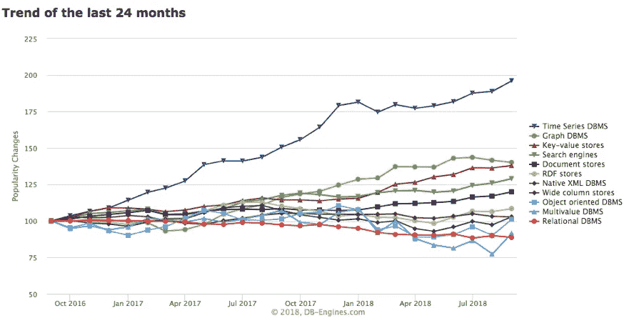
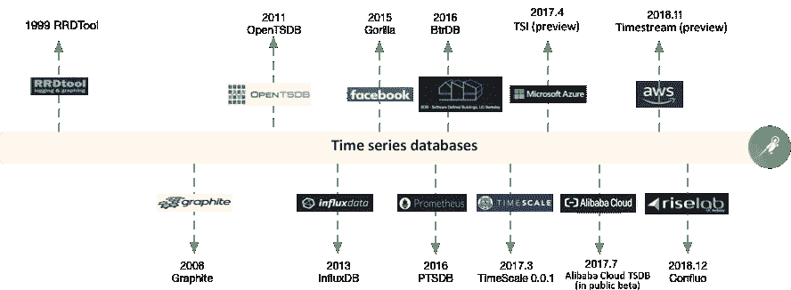
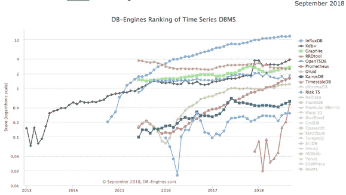

# 什么是时间序列数据库？

> 原文：<https://medium.datadriveninvestor.com/what-are-time-series-databases-a3e847608f91?source=collection_archive---------2----------------------->

*作者焦贤*

纵观人类历史，时间一直是一个有趣的概念。我们经常看到科学和技术中涉及时间使用的有趣应用。在数据时代，时间已经与数据库结合在一起，这就产生了流行的时间序列数据库。

时序数据库本质上是一个具有时间戳属性的垂直数据库。从 2014 年开始，数据库流行度排名网站 DB-Engines 将时间序列数据库作为一个独立的目录进行分类统计，时间序列数据库近年来的增长率在所有数据库分类中排名第一(见下图)。

[](https://www.datadriveninvestor.com/2019/01/25/why-data-will-transform-investment-management/) [## 为什么数据将改变投资管理|数据驱动的投资者

### 有人称之为“新石油”虽然它与黑金没有什么相似之处，但它的不断商品化…

www.datadriveninvestor.com](https://www.datadriveninvestor.com/2019/01/25/why-data-will-transform-investment-management/) 

# 时间序列数据库

时序数据库(TSDB)是一个软件系统，它针对处理时序数据进行了优化，时序数据是由时间(日期时间或日期时间范围)索引的数字数组

以上是维基百科上对时序数据库的定义。它可以分为三个方面:时间序列特征、数据特征和数据库特征。

*   时间序列特征:
*   时间戳:在一般的业务场景下，时间戳主要达到秒和毫秒的精度级别。但是在一些高频采集场景下，比如遥感，时间戳可以达到纳秒量级。
*   时间戳分为 UNIX 系统时间戳和日历，它们支持时区的自动调整。
*   采样频率:一般有两种采样频率。一个是周期性的时间采样频率，比如与服务器性能相关的周期性摘要指标。另一种是离散抽样，比如网站访问。

**数据特征:**

*   数据是按顺序追加的。
*   数据可以是多维相关的。
*   热数据通常以高频率被访问。
*   冷数据需要降维归档。
*   数据主要包括值、状态和事件。

**数据库特性(CRUD)**

*   写入速度稳定，远远大于读取速度。
*   通过时间窗口访问数据。
*   时间序列数据库在一个时间窗口内很少更新和一些覆盖。
*   时序数据库支持批量删除功能。
*   时序数据库具有通用数据库的高可用性、可靠性和可伸缩性。
*   通常，不需要事务处理能力。

# 时间序列数据库发展简史



# 第一代时序数据存储系统

虽然通用关系数据库可以存储时间序列数据，但由于缺乏时间优化(如按时间间隔存储和检索数据),它们不能非常有效地处理时间序列数据。

第一代时间序列数据通常来自监测领域。基于平面文件的简单存储工具是这类数据的首选存储方式。

像 RRDTool 和 Whisper 这样的系统通常处理简单的数据模型，并且具有有限的独立能力。这些系统通常嵌入在监控和警报场景中。

# 基于通用存储的时间序列数据库

随着大数据和 Hadoop 的发展，时间序列数据量开始快速增长，系统服务对处理时间序列数据提出了更多的要求，例如更高的可扩展性。

基于通用存储的专用时序数据库开始出现。时间序列数据库可以按时间间隔高效地存储和处理时间序列数据。这些数据库包括 OpenTSDB 和 KairosDB。

这些时序数据库继承了通用数据库的优点，并利用其特点避免了通用存储的缺点。此外，这些数据库在数据模型和汇总分析方面有许多针对时间序列的创新。

例如，OpenTSDB 继承了 HBase 的宽表，为时间序列设计了偏移存储模型，并使用 salt 来缓解热点问题。

但是，它也有许多缺点，例如低效的全局 UID 机制、聚合数据的不可控加载以及无法处理高基数标记查询。

# 垂直时间序列数据库的诞生

随着 Docker、Kubernetes、微服务等技术的发展，物联网的发展预期越来越强烈。

随着时间的推移，数据不断增长，时序数据是增长最快的数据类型之一。

开发了高性能、低成本的纵向时间序列数据库。具有时序特性的数据存储引擎(InfluxDB 是一个典型的例子)正在出现，并在市场上变得越来越重要。

这些时序数据库通常具有更高级的数据处理能力、更高效的压缩算法和更符合时序数据特征的存储引擎。

例如，InfluxDB 具有基于时间的 TSMT 存储、Gorilla 压缩和窗口功能，如 p99、rate 和自动汇总。

与此同时，由于体系结构中索引的分离，这些数据库仍然面临着时间线扩展、无序或其他类似情况的挑战。

# 时间序列数据库的发展现状

目前，DB-Engines 分别收集和排列时间序列数据库。下图是 2018 年时间序列数据库按受欢迎程度的排名，以及过去五年的变化趋势。



**公有云**

*   AWS 时间流
*   亚马逊在 2018 年 11 月的 AWS re:Invent 上公布了 Timestream(预览版)。时间流适用于物联网、应用运营等场景。
    提供自适应查询处理引擎，快速分析数据，自动汇总、保留、分层、压缩数据。Timestream 用户分别为写入、存储的数据和查询扫描的数据付费，并可以通过这种无服务器服务实现高效管理。

**蔚蓝系列见解**

*   2017 年 4 月，微软发布了时序洞察(preview)，为高度情境化、时序优化的物联网规模数据提供了全托管、端到端的存储和查询解决方案。其强大的可视化功能支持交互式即席数据分析和基于资产的数据洞察。
    此外，该服务支持按数据类型进行暖数据分析和原始数据分析。用户需要为使用的存储和查询单独付费。

**开源项目**

*   OpenTSDB
    OpenTSDB 是一个分布式的、可伸缩的时序数据库。这个数据库的特点是度量和标记等概念，并为时间序列场景设计了一组数据模型。它使用 HBase 作为底层存储，并根据时序场景的特点采用特殊的 rowkey 设计来提高时序数据的聚集和查询能力。
*   普罗米修斯
    普罗米修斯将所有采集到的样本数据按时间顺序存储在内存数据库中，并定期将数据保存到硬盘上。需要远程存储来确保可靠性和可扩展性。
*   InfluxDB
    InfluxDB 是一个独立的开源时序数据库，用 Go 编写。InfluxDB 易于使用，并且没有特殊的环境依赖性。它使用独特的 TSMT 结构来实现高性能读写。商业版提供分布式支持。
*   TimescaleDB
    TimescaleDB 是一个时序 SQL 数据库，它具有指定的模式，并按时间管理表块。TimescaleDB 的底层基于 PostgreSQL。

**学术数据库**

*   BTrDB
    BTrDB 旨在存储高度精确的时间序列数据，并使用“时间分区版本注释写时复制树”的数据结构，为每个时间线创建一棵树。BTrDB 使用版本控制来处理无序场景中的数据。
*   Confluo
    Confluo 采用了一种新的数据结构——原子 MultiLog，并使用了现代 CPU 硬件支持的原子指令集。它同时支持数百万个数据点的高吞吐量并发写入、毫秒级的在线查询和高效利用 CPU 的即席查询。
*   ChronixDB
    ChronixDB 提供基于 Solr 的时间序列存储，并实现独特的无损压缩算法。ChronixDB 可以与 Spark 集成，以实现丰富的时间序列分析功能。

**商业和工业数据库**

*   PI
    PI 是 OSI 软件公司开发的大型实时数据库。它广泛应用于电力、化工和其他行业。PI 采用获得专利的 SDT(摆动门趋势)算法和独特的二次过滤技术，最有效地压缩 PI 数据库中的数据，并显著节省硬盘空间。
*   kdb
    kdb 是 Kx 系统开发的时间序列数据库，主要用于处理与交易相关的数据。kdb 支持流和内存计算，对数十亿条记录的实时分析，以及对 TB 级历史数据的快速访问。
*   Gorilla
    Gorilla 是一个来自脸书的基于内存的时序数据库，它采用了一种新的时序压缩算法。

该算法可以将 16 个字节压缩为平均 1.37 个字节，大小减少了 12 倍。Gorilla 也有用于压缩算法的内存数据结构。Gorilla 允许快速高效地扫描所有数据，同时提供按时间段在单个时间序列中搜索数据的能力。

通过向不同地区的主机写入时序数据，Gorilla 可以容忍单节点故障、网络交换机甚至整个数据中心的故障。

*   投资市场
*   2018 年，时间序列数据库创业公司在投资市场上实现了两次著名的投资。

```
Timescale received the \$12.4M Series A Round financing from Benchmark Capital.
InfluxDB the \$35M and C Round financing from Sapphire Ventures.
```

# 典型时间序列数据库分析

时间序列数据库在过去的两年中发展迅速。全球主要云制造商已经开始关注时间序列生态系统的不同方面，形成独特的解决方案，并开始获得先发优势。

像脸书大猩猩这样优秀的时间序列数据库不仅仅满足他们自身的业务发展需求。在学术上，时间序列数据库领域出现了许多先进技术，将时间序列数据技术推向了一个新的高度。

自 2016 年实施其首个 TDSB 版本以来，阿里巴巴 TSDB 团队已逐步在其内部服务中应用其时间序列数据库，如 DBPaaS 和 Sunfire。经过 2017 年月中的公测，阿里巴巴 TSDB 于 2018 年 3 月底实现商用。

在整个过程中，阿里巴巴 TSDB 不断吸收其他时间序列数据库的各种优势，打开了中国自主开发时间序列数据库的大门。

本系列文章旨在描述当前时序数据库的技术进展。

# 原始资料

[](https://www.alibabacloud.com/blog/what-are-time-series-databases_595165?spm=a2c41.13239896.0.0) [## 什么是时间序列数据库？

### 阿里巴巴 Clouder 2019 年 7 月 31 日 221 作者焦贤纵观人类历史，时间一直是一个耐人寻味的概念…

www.alibabacloud.com](https://www.alibabacloud.com/blog/what-are-time-series-databases_595165?spm=a2c41.13239896.0.0)