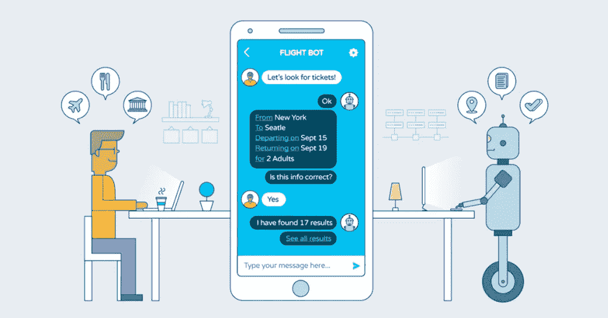

# 聊天机器人在你的业务中有什么用？

> 原文：<https://medium.datadriveninvestor.com/what-are-use-of-chatbot-in-your-business-eafa25c6aac0?source=collection_archive---------9----------------------->

聊天机器人是一个新概念，但它们的受欢迎程度与日俱增。
*“设计用来模拟与人类用户对话的计算机程序，尤其是在互联网上。”*

然而，在过去的几年里，聊天机器人已经有了很大的改进，超越了简单的文本格式，现在还配备了人工智能(AI)和机器学习功能。另外，许多公司已经在有效地使用聊天机器人作为他们客户服务的一部分。

在线聊天机器人可以通过自动化客户支持来节省时间和精力

聊天机器人提供的一些 [**好处**](https://xotiv.com/services/artificial-intelligence.php) :

*   [**订单处理**](https://xotiv.com/services/artificial-intelligence.php)

它广泛用于各种行业的订单处理，以帮助客户处理他们的订单，并帮助跟踪订单，检查客户历史记录。

电子商务行业利用这一点，通过帮助 24*7 全天候查询以及订单和产品相关查询来改善他们的客户体验。通过聊天机器人，他们可以很容易地询问你对这些服务的体验

*   [**数据驱动营销**](https://xotiv.com/services/artificial-intelligence.php)

聊天机器人能够更有效地收集客户的数据。
聊天机器人可以监控你的客户行为，比如他们的购买决定、偏好和他们购买的物品。当你有了你的客户数据，你就可以根据报告轻松地更新你的业务

*   [**可用 24*7**](https://xotiv.com/services/artificial-intelligence.php) **:**

在您的业务中，客户可以随时访问您的服务和任何建议和查询。我相信你们中的大多数人都有过这样的经历:听到一些无聊的声音说“稍等，我们正在联系我们的客服，但他们让你等了很长时间”。

但是在聊天机器人上，你的客户不会面对这种无聊的事情。消费者可以很容易地提出任何问题，他们可以通过你的问题得到解决——答案填入你的数据。

*   **帮你省钱:**

当然，每个人都想节省时间，最重要的是节省金钱。通过聊天机器人，你可以节省很多雇佣客户支持团队解决问题的费用。您可以为您的企业集成聊天机器人，以满足客户的简单查询，并将复杂的查询传递给客户支持代理。

[**使用前沿人工智能解决方案和服务**](https://xotiv.com/services/artificial-intelligence.php)

AI(人工智能)现在达到了一个真正的垂直行业的高度。凭借自然语言处理、语音识别、深度学习和图像识别等广泛的技术，人工智能正在不断加强其整体能力，以简化和统一以人为本的多步骤业务流程。

不断扩展的人工智能能力是由不起眼的初创企业和技术进步提供的广泛技术创新推动的。我们通过开发一系列人工智能解决方案来帮助许多公司，这些解决方案像人类一样思考和学习，具有创新和令人惊叹的功能。

Xotiv Technology 拥有使用先进技术将 AR 与未来和当前的业务模块、第三方应用程序或业务解决方案集成的核心能力。

*原文发布于:*[*https://xotiv . WordPress . com/2018/03/26/why-chatbot-need-for-your-business/*](https://xotiv.wordpress.com/2018/03/26/why-chatbot-need-for-your-business/)