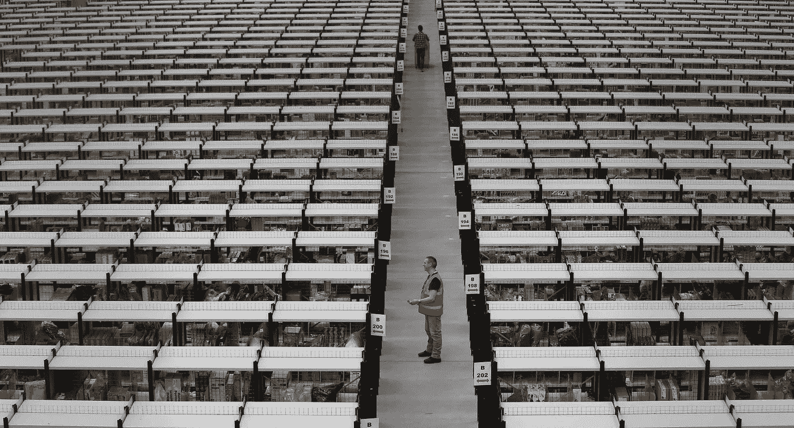

# 当机器做所有的事情时，我们要做什么？

> 原文：<https://medium.datadriveninvestor.com/what-are-we-going-to-do-when-machines-do-everything-73bfb0591b5c?source=collection_archive---------9----------------------->

美国运通诞生于 1850 年，是一家以勤奋著称的运输公司。由于用户体验为他们提供了了解不断增长的市场需求的数据，他们决定成为一家提供旅行支票的公司。很久以后，当第一张信用卡由 [Diners Club](https://www.dinersclub.es/historia) 创建时，他们明白了金融领域为他们提供的巨大机遇。事实上，不知何故，他们并没有停止销售同样的东西，只是与客户的接触点不同。现在，他们开始了一项[非常有趣的职业](https://www.americanexpress.com/us/small-business/openforum/articles/ai-in-business-how-artificial-intelligence-may-benefit-your-company/)，致力于提供与人工智能相关的服务。

角斗士的公司没有做过任何其他公司，无论大小，或多或少都有难度的事情。适应不断变化的时代，但从现有技术的管理和当代客户的需求的知识。有趣的是，现在许多销售特定产品的公司很可能会提供极具革命性的服务。[我的工作是](https://www.marcvidal.net/transformacion-digital)寻找新的商业模式，从数字化转型中创新，在所有决定面对内部颠覆的公司中。出于这个原因，你将让我，在我下面突出显示的清单上，列出由 cognized '[When Machines Do Everything](https://www.cognizant.com/when-machines-do-everything)'小组出版的书，制定一个关于新的商业模式、工作或公司类型的产生的游戏，包括接近科幻小说的游戏，以便看看我们现在能够在多大程度上接受重新思考一切的需要。以下是这本书描述的 21 个想法中的 16 个:

1.现在从事市场调研的公司应该成为 **'** [**数据侦探**](https://www.marcvidal.net/blog/2018/4/3/el-da-que-supimos-que-nos-manipulaban-y-el-mundo-post-facebook) **'。**他们将分析来自所有类型物联网设备的数据，为其他公司提供基于数据的信息。他们的供应商将是 Alexa 和公司。

2.公司现在致力于任何类型的娱乐，将来将需要**’**[**的专业人士**](https://www.marcvidal.net/blog/2017/11/28/las-pensiones-del-futuro-dependen-de-la-transformacin-digital-de-nuestra-economa)**‘行者/空谈家】的**类型。这项工作是为了未来，由于生物技术，人们比以往任何时候都活得更长，并且有很大一部分人口是老年人。需要有人倾诉的老年人。

3.提供能源服务或管道服务的公司在未来很可能成为 **'** [**智能城市分析师**](https://www.marcvidal.net/blog/2017/11/15/smart-cities-cambiar-el-verbo-crecer-por-optimizar) **'** ，因为对于城市将排放的数十亿数据，有必要用可用的传感器来收集它们，但最重要的是，保持这些数据的价值，并知道如何根据需要修改它们收集的数据。

4.今天的房地产开发商和建筑公司或许应该朝着类似于 [**虚拟空间建筑商**](https://www.marcvidal.net/blog/realidad-virtual-inteligencia-artificial-y-automatizacin-google-mueve-ficha) 的方向发展，根据人类的需求精心设计，但却是在不存在的环境中。计算这些空间应该和我们实际需要的非常不同。一个虚拟空间的成功将依赖于与在一个类比的地方统治完全不同的东西。

5.旅行社在未来可能会成为一种虚拟体验的创造者，成为所谓体验经济的先驱。我们谈到了这样一个事实，即旅行社可以是一个具有丰富想象力的作家，能够为没有时间或传统旅行能力的客户创造论点和独特的空间。

6.未来的体育馆可能需要一名专业人员，当我们看到大量使用一些应用程序来塑造形体时，我们已经可以想象到这一点。我们谈一谈他们应该如何转换成一种**’**[**的虚拟谋士对肉体的委身**](https://www.marcvidal.net/blog/el-deporte-que-ms-crece-en-el-mundo-es-digital-la-oportunidad-de-liderar-un-sector-en-expansin)**’。**为此，用户将访问他们的生命体征、日常日程、饮食等。这些中心将永远遵守所有健康的戒律。许多公司将来会要求其他工作的候选人提供这种信息节奏，或者不会。未来的健身客户将允许活动跟踪器和身体活动承诺顾问，以保持他们在日常战斗中的动力，以实现健身。

7.未来的健康中心将会有很大的变化。至少是流动护理、初次接触或基本援助。这些组织将需要人工智能 **'** [**的技术协助**](https://www.marcvidal.net/blog/2017/1/16/los-datos-y-la-transformacin-digital-del-sector-salud-ante-el-reto-de-la-privacidad) **'** 。患者不会去看医生，IA 协助的医疗技术人员会在您知道需要他们之前出现在您的门前。他们都将使用软件根据专家系统进行诊断，他们甚至会在便携式机器人系统的帮助下进行小手术，而不需要任何学位。

8.如果你在你的公司从事任何形式的商业工作，你知道你的日子是有限的。未来是预测性销售和与营销有关的一切自动化。甚至一些创造性的方面也岌岌可危。但是，现在大量产生的、不能在公司之间出售的数据怎么办？脸书不能再把你的数据卖给亚马逊了。因此，当 **'** [**需要一个个人数据中介**](https://www.marcvidal.net/blog/2017/7/18/la-privacidad-y-los-datos-personales-de-salud-el-desafo-propuesto-por-el-d-lab-del-mobile-world-capital)**来监督和商业化客户的这些个人数据，以便他可以为其获取数据时，一个新的工作就诞生了。**

**9.一旦城市中禁止人类驾驶的车辆流通，自动驾驶汽车将会走上街头。这将比一些人预期的更快发生，而且将主要发生在城市道路和高速公路上。总有一天，在任何地方。当这种情况发生时一切都无法在车辆的自主控制下进行，一种由智能系统辅助的 **'** [**自动驾驶车辆**](https://www.marcvidal.net/blog/2017/2/3/el-ser-humano-al-que-se-le-prohibir-conducir-ya-ha-nacido) **'** 驾驶员将必不可少。司机将需要指挥和管理道路和街道，以确保它们按照智能系统的预测得到正确管理。**

**10.有一天我们进入服装店买衣服，但没有衣服，我们将体验未来制造的礼物。一点一点地，数字商务正在强加它的规则。我们会去购物中心看那里没有的东西，但我们可能能够感觉到，触摸到，并得到供应商的实际帮助。这些对话、感觉和数据将直接进入一个虚拟裁缝那里，他将很快为你提供一件产品。**

**11.退一步说，银行的未来很奇怪。在不久的将来，不适应这种截然不同关系的银行业专业人士将会经历一段艰难的时期。在一个实体货币将会消失的世界里，与新银行或 iBanks 相关的加密货币和小额信贷支付将会增长，虚拟财务管理顾问的需求将会增加，虚拟财务管理顾问将几乎每时每刻都在参与，就像一些金融科技公司现在正在做的那样，但服务将会个性化。理财顾问将是一种人类应用程序。**

**12.将来会出现医疗问题。我们的身体不容易克服的局限性。人们的寿命会比以往任何时候都长，但记忆力和其他与大脑有关的健康保健问题的进步将很难与大脑处于同一水平。我们将需要能够通过用我们自己的记忆创造虚拟空间来保存我们的记忆的公司。今天的公证员应该变成虚拟记忆的**'******'**。****

****13.在所有类型的公司中，你都需要一种非常特殊的专业人士。它与某个特定部门无关，事实上，有趣的是会有公司提供这项服务。我说的经理还是 **'** [**人机关系经理**](https://www.diariodemallorca.es/mallorca/2018/03/21/vidal-trabajo-quitar-robot-alguien/1297858.html) **'** 。工作的未来取决于人类和机器的合作程度。在不久的将来，团队经理将负责发现机器的优势和人类的优势，并将它们结合起来，形成一个更具生产力的工作团队。****

****15.保险公司已经知道他们的未来岌岌可危。降低产品成本的工业模式的出现是巨大的。风险场景中的虚拟培训、无事故自动驾驶汽车、消除运输问题的 3D 打印、修改传统保险价值链的区块链等。这就是为什么，在这么多与信任的关系中，这些公司必须提供一种新的服务， **'** [**受信任的董事**](https://www.marcvidal.net/blog/2017/2/10/la-transformacion-digital-seguros-insurtech) **'** 这种新服务提供了用户或客户在虚拟时代所需的透明度，以及数字货币之外的风险缺失。****

****16.传统咨询公司也不会持续太久。我们非常乐意告诉别人如何面对中断。原来那也是经过这里的。对于商业分析工作，有必要学习以完全不同的方式进行管理。在不久的将来，顾问们将负责将信息的量子处理与机器学习结合起来，以更好、更快地解决现实世界的商业问题。最终目标将永远是建立能够从数据中学习的智能系统。因此，未来的顾问必须非常了解所有这些假设，当然，还需要一些数学知识。****

****17.我们知道，那些负责人力资源的人也应该接受算法，记者面临着理解他们真正角色的挑战，那些负责营销的人或任何认为自己不可触及的人都将受到触动。其中，有两个很有意思的职责。采购经理和总经理。前者将无法克服一个算法的计算效率，决定买什么更好，怎么买，在什么基础上买。后者将无法建立比商业数据分析和人工智能模型更具战略性的标准。迟早，两者都需要提供一种机器无法取代的能力:伦理。被称为 **'** [**道德采购主管**](https://www.marcvidal.net/blog/2016/4/19/quixote-el-software-que-ensea-tica-a-un-robot) **'** 或**'道德总监'的公司或专业人士将被要求**。当大公司决定根据道德而不是利润来做决定时，这份工作就派上了用场。****

****我相信你能想到更多，但是这些新的职业可以开始回答这个问题，**当机器做所有的事情时，我们将做什么？******