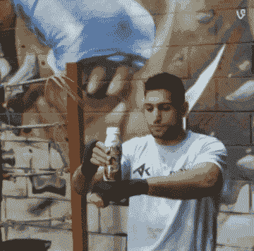

# 你愿意为了什么而奋斗？

> 原文：<https://medium.datadriveninvestor.com/what-are-you-willing-to-struggle-for-7592c79026db?source=collection_archive---------45----------------------->

有什么比把 10，000 小时或 10 年奉献给你的手艺更重要？**你练习的方式。**

你愿意忍受怎样的痛苦？你可以根据一个人的成就来定义他。也许定义一个人更好的方法是看他愿意忍受什么。可以说，最成功的人经历的痛苦最多。他们喜欢疼痛。他们喜欢这个过程。

Me on stage at Trees with my band Hathor Rising

# 享受我自己痛苦的过程

你喜欢什么过程？例如，我是一名作家和音乐家。我愿意每周日花 5-8 个小时练习乐队。我做这个已经很多年了。确切地说，过去三年，快四年了。我去录音室花了 40 个小时录制我的专辑，并向制作人提供我希望歌曲听起来如何的意见。

我喜欢在我的乐队成员和我们的音乐上投入时间、金钱和情感。作为一名音乐人的工作不仅仅是创作出令人敬畏的音乐，组织演出，和新老歌迷合影。音乐家的奋斗也是关于为彼此做饭，在汽车上互相帮助，给予鼓励，以及其他因素。

# 科比之前的 800 投

我听说科比在 2012 年有一个特别的教练，名叫罗伯特。他被请来帮助科比进行训练。看完《卡萨布兰卡》后，罗伯特正要昏昏欲睡时，科比在凌晨 3:30 打来电话..这位篮球传奇人物问他是否打扰了罗伯特，他需要一些帮助。时钟指向凌晨 4 点 15 分

令教练惊讶的是，科比在早上 5 点就已经汗流浃背了。给教练留下深刻印象的是，在回到酒店休息之前，教练让科比进行了一个半小时的锻炼。训练员应该在上午 11 点回到法庭

当罗伯特到达时，他称赞科比那天早上的训练进行得很顺利。然后他问科比什么时候停止训练。“停什么？”，科比说。事实证明，即使在他的教练离开后，科比也从未停止过训练。科比从早上 4:30 到 11:00 进行训练，然后和其他队员一起训练！他在他的训练师之前开始了他的一天**，最重要的是，**他必须完成 800 次投篮才能继续。**科比从早上 7 点练到 11 点，进行那 800 次跳投。**

# 科比必须完成的 800 次投篮非常重要，因为他不仅仅是没有目标的盲目练习。

I’m sure this guy focuses on developing skill rather than punching aimlessly

> 精通你的手艺不仅仅是关于你如何花多少时间练习，还取决于你如何练习。要变得更好，看看他们领域中最优秀的人是如何实践的。

*原载于 2018 年 10 月 1 日*[*【steemit.com】*](https://steemit.com/steemit/@katanahaley/what-are-you-willing-to-struggle-for)*。*