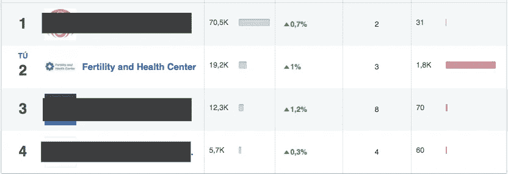
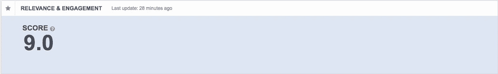
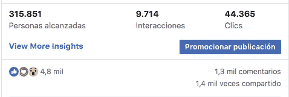
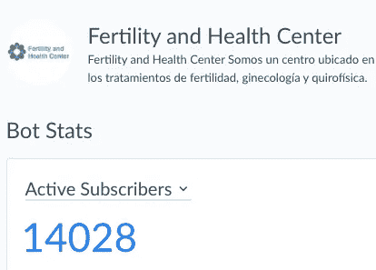
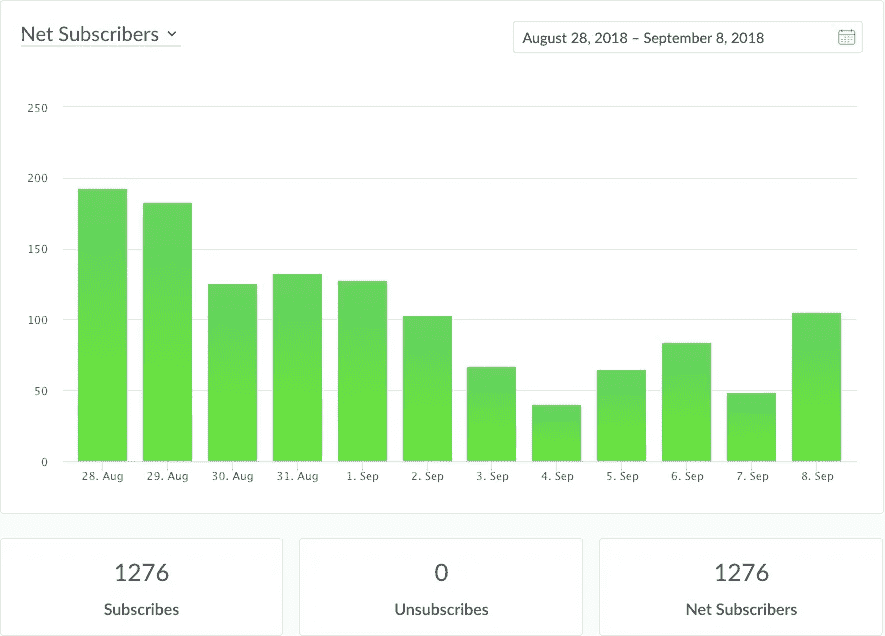
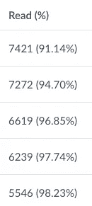

# 人工智能对你的销售意味着什么

> 原文：<https://medium.datadriveninvestor.com/what-artificial-intelligence-means-to-your-sales-7cfa2dc21150?source=collection_archive---------28----------------------->

## 学习如何应用人工智能来增加你的销售。

在我们的公司 OMOCHI IT，我们在流程的每个方面都使用人工智能，主要集中在销售方面。因为有很多关于人工智能的文章，你可以在未来利用它，但你今天就可以应用它。让我们看一个真实的案例，我们利用人工智能将一家几乎破产的公司转变为加勒比海地区的第一大公司，从每月 8 名患者(市场平均水平为 8-12 名)到每月+100 对新人。
我们压倒了我们的市场竞争对手，平均每月的患者数量是他们的 14 倍，通过我们的客户获取和保留战略，我们系统地获得了 1500%到 3000%的投资回报率

为了成为加勒比地区人类生育市场的第一公司，我们遵循了三个原则

## 你们公司要不要把 AI 应用到销售上？[通过我们公司的 WhatsApp](http://bit.ly/contact-omochi) 或我的 [Linkedin 个人资料](https://www.linkedin.com/in/emiliano-potignano/)联系我们。

## #1 关注有用的东西，定义重要的单一指标

大多数营销公司关注的是“虚荣心指标”(即关注者数量、覆盖范围和页面点赞数)，而不是什么能提供真正的价值(即互动、线索生成、销售)

# 热门人工智能文章:

> [1。人工智能、神经网络、机器学习、深度学习的备忘单&大数据](https://becominghuman.ai/cheat-sheets-for-ai-neural-networks-machine-learning-deep-learning-big-data-678c51b4b463)
> 
> [2。数据科学简化第 1 部分:原理和过程](https://becominghuman.ai/data-science-simplified-principles-and-process-b06304d63308)
> 
> [3。开始构建实时 API 基础设施](https://becominghuman.ai/getting-started-with-building-realtime-api-infrastructure-a19601fc794e)
> 
> [4。AI & NLP 工作坊](https://becominghuman.ai/ai-nlp-workshop-7bc121986d61)

如果你不与你的公众互动，并且内容与你的受众不相关，那么页面点赞和发布频率就毫无意义。

> 大多数网络和营销机构为美观而设计，很少或根本不关注企业和客户的目标。

> 我们最近的一个帖子有 1.3 千条评论，这意味着 1.3 千条线索只需 200 美元，其中至少有 100 条线索将在未来 2 个月内协助我们的生育中心，因此，至少有 10 万 MXN 仅在预约中，没有通过花费我们 3.6 千 MXN 的活动获得的收入。不考虑 IFV 成本，最低投资回报率为 3300%

人工智能迭代内容并快速找到与特定细分市场的标题、文本和图像最相关的组合，在超过 70%和 10/10 20%的情况下获得最低 8/10 的相关性分数，这是我们的关键优势之一，因为我们知道我们是与观众最相关的内容之一，这使我们的竞争对手很难与我们竞争。

One of our latest posts has 1.3K comments, that means 1.3K leads for only 200 USD, of these leads, at least 100 will assist to our Fertility Center on the next 2 months, so, is at least 100K MXN only in appointments, without on revenue obtained by a campaign that costs us 3.6K MXN . Without count IFV costs, that makes a minimum ROI of 3300%

## 你们公司要不要把 AI 应用到销售上？[通过我们公司的 WhatsApp](http://bit.ly/contact-omochi) 或我的 [Linkedin 个人资料](https://www.linkedin.com/in/emiliano-potignano/)联系我们。

## #2 顶级公司在其网站和营销活动中进行实验

在开展我们的活动时，我们使用实验技术和人工智能来分析获得的数据，并获得强大的洞察力以进行迭代，从而衡量这些变化的影响。运行测试并测量它们的结果，您只关注有效的，并快速丢弃无效的。我们运行由人工智能支持的数百个广告的组合和集合，因此该算法总是优化我们的细分，并帮助我们在几分钟内完成人类可能需要几周或几个月才能完成的事情，这使我们比竞争对手具有压倒性优势

> “能够快速找出哪些有效，哪些无效，这可能意味着生存与灭绝的区别。”—哈尔·瓦里安，谷歌首席经济学家

这意味着如果你使用人工智能来进行实验，你将处于一个独特的位置。你的竞争对手将需要数年时间来完成你在一周或更短时间内可以完成的事情，因为你可以进行数百或数千次实验，如果你的竞争对手不使用人工智能，他们每周将进行多达 7-10 次测试，如果没有分析数据的工具，将很难获得可操作的见解。

## 你们公司要不要把 AI 应用到销售上？[通过我们公司的 WhatsApp](http://bit.ly/contact-omochi) 或我的 [Linkedin 个人资料](https://www.linkedin.com/in/emiliano-potignano/)联系我们。

> 你的竞争对手需要几年时间才能完成你一周或更短时间就能完成的事情。

## #3 进行频繁的、渐进的改变。

一开始，我们专注于每次增加一个功能。起初，我们开始设置脸书机器人(你可以使用一个更符合你的需求和知识的，有很多)。使用机器人，我们开始以一种非常有效的方式抓住订户，仅在六个月内收集了超过 14，000 人的数据，参与度高，每个人都来自一个细分市场，我们的内容从 8/10 到 10/10 相关，所以我们在每个广播中都有非常高的阅读率和点击率。

为了快速响应我们的客户，提取数据并自动回复消息，我们使用基于自然语言对话的[人机交互](https://en.wikipedia.org/wiki/Human%E2%80%93computer_interaction)技术，因此我们平均每月有超过 100 对夫妇，每月有超过 3000 条线索(自动成为订户)，平均每天有 100 条线索，约会日历自动排序，在我们的脸书页面上有 97%的回答率，我们只使用一个人在人工智能和机器人的帮助下实现了所有这些！

> 每月+100 对夫妇，每月超过 3000 条线索(自动成为订户)，平均每天 100 条线索，约会日历自动排序，在我们的脸书页面上有 97%的回答率，我们只用一个人在人工智能和机器人的帮助下实现了所有这些！

Read rate of a minimum of 91%! How much is the Read Rate of you Mail List?

## 你们公司要不要把 AI 应用到销售上？[通过我们公司的 WhatsApp](http://bit.ly/contact-omochi) 或我的 [Linkedin 个人资料](https://www.linkedin.com/in/emiliano-potignano/)联系我们。

访问我们的网站: [https//www.omochi](https://www.omochi.it) 。它