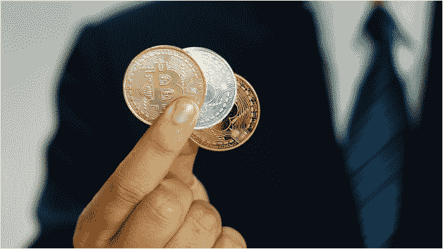

# 比特币经纪人不会告诉你的事

> 原文：<https://medium.datadriveninvestor.com/what-bitcoin-brokers-wont-tell-you-4902f70cf128?source=collection_archive---------8----------------------->

Photo by [Toefotofreepik](https://www.freepik.com/toefotofreepik) on [Freepik](https://www.freepik.com/premium-photo/businessman-wearing-suit-is-showing-bitcoins-his-hand_3887938.htm#page=2&query=bitcoin+get+rich&position=23)

有没有加密货币交易所向你提出一个听起来好得令人难以置信的提议？

你从遇到的经纪人那里购买比特币时，有人向你承诺过异常高的回报吗？

 [## 科罗拉多州正在成为亲加密法规|数据驱动投资者的领导者

### 科罗拉多州已经成为区块链公司的滋生地和避风港。新任命的…

www.datadriveninvestor.com](https://www.datadriveninvestor.com/2019/03/22/colorado-is-emerging-as-a-leader-in-pro-crypto-regulations/) 

你最近有没有想过是否也应该开始交易加密货币？

事实是，如果你一直在一遍又一遍地问自己是否应该投资加密货币，这仅仅意味着你的问题的答案是否定的——你不应该投资加密货币！

为什么？因为很明显你没有足够的关于密码世界的知识。

也许你只是在社交媒体上看到了一些关于它的帖子，或者从你的朋友那里听说了它。也许你听说有人从中赚了些钱，你觉得这是个好主意。

问题是，当你从试图推广加密货币的经纪人或朋友那里听说加密货币时，你开始认为这是一项业务，你也可以这样做。有些人开设虚假交易所，带着庞氏骗局来找你，引诱你从他们那里购买比特币。他们会告诉你，这是一个巨大的商机，你可能会开始认为你可以做这个“生意”，因为它看起来很简单。

好吧，让我告诉你，加密货币交易不是一门生意。这仅仅是一种投资，就像外汇交易一样。

如果你不知道什么是外汇交易，用非常非常简单的术语来说，就是你以一定的汇率(希望是低汇率)买入一种货币，然后你以一定的汇率(希望是更高的汇率)卖出。仅此而已。你低买高卖。这就是你如何在外汇交易中赚钱。

一个正在经营的企业可以通过货币兑换来赚钱，也就是说企业可以产生大量的美元收入。企业主会看到什么时候是持有一定数量美元的好时机，或者什么时候美元可能会下跌，以便他可以出售一些美元并兑换成加元。他可以这样做来支付公司费用。但他不会从差价中赚钱。他通过外汇交易所做的一切都是为了更有效地利用他的商业资本。他不是想从中赚钱。他经营的生意正在为他赚钱。

不幸的是，许多加密货币经纪人会以相反的方式告诉你这个故事。

说到钱，你只需要知道三个技巧:赚钱、保管和倍增。如果你一开始就没有东西可以乘，你怎么能从中赚更多的钱呢？那样你不会变得富有。你应该只投资外汇和加密交易，只要你能承受得起损失。

你要做的第一件事就是集中精力赚钱，让你的收入最大化。当你收益最大化的时候，假设你不是每次都吹掉就好了，那你就把大部分留着积累起来，然后再拿出一部分来投资。这样，你就能投资于可持续发展的东西——能给你带来丰厚回报的东西。

你需要做的第一件事是培养一项高收入技能。你需要有一套能让你持续赚钱并给你可持续收入的技能。

如果你盲目投资一个比特币，你会拥有比特币，但你仍然无法支付你的账单！你还是不能把食物放在桌子上。为了谋生，你需要一个持续的收入流，让你靠它生活。你需要有挣钱的能力。你需要定期赚钱来支付你的账单。否则，你只是在猜测。你甚至没有投资。你只是推测。

最危险的事情是如果你在投机，你认为你在做生意。我不同意外汇或加密交易是一项业务。充其量是推测。这不是生意。

进行投机并认为你试图以此谋生是非常愚蠢的。你不可能像那样发财。

当然，有些人可以也确实靠交易密码谋生。但这不是一时兴起。这不是一个快速致富的策略。他们只有在仔细研究和彻底了解技术和趋势后才开始赚钱。他们用几个月甚至几年的时间做研究，然后利用他们高收入的技能慢慢积累。他们不会只是遇到一个加密货币经纪人就一夜暴富。

如果有人承诺你一夜之间赚很多钱，下面是他们的计划是如何运作的。他们会说服你投资他们正在出售的比特币或其他替代货币。如果你成为他们的首批投资者之一，他们会用新投资者存入的钱向你支付首批款项。这个计划给你留下了深刻的印象，会鼓励你对他们进行更多的投资。很快，当他们堆积了太多的支出，他们会带着所有的钱逃跑。

所以，如果你在寻求一些你认为会让你一夜暴富的建议，这意味着你可能在这个问题上还没有做足够的研究。这让你很容易成为一个无意义的传销的受害者。这意味着你还没有做好投资加密货币的准备，不管你得到了多么花哨的方案。你根本不能指望它为你赚钱。

你唯一能指望赚钱的就是你自己。如果你自己没有赚钱的能力，任何生意都不会让你赚钱。如果你不做功课，无论你投资什么都不会让你赚钱。唯一能指望为你赚钱的人就是你自己。

*原载于 2019 年 11 月 8 日*[*【https://opinined.com】*](https://opinined.com/what-bitcoin-brokers-wont-tell-you/)*。*