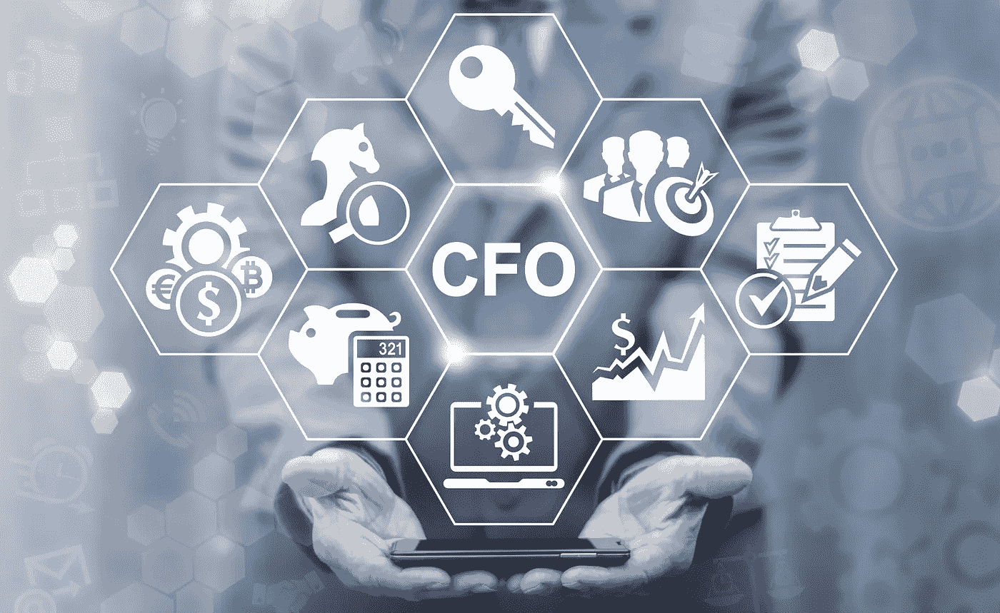

# 一个活生生的 CFO 能给一个小公司提供什么 AI 做不到的？

> 原文：<https://medium.datadriveninvestor.com/what-can-a-living-breathing-cfo-offer-a-small-company-that-ai-cannot-377a291d8f04?source=collection_archive---------9----------------------->

## 答案很复杂，但这是一场势均力敌的比赛

每个公司都需要一个有才华的首席财务官。但不是每个公司都能找到或负担得起，尤其是初创公司和羽翼未丰的企业。这就是为什么如此多的企业，无论大小，都过于依赖他们的会计师，不仅要监控和分析账簿，还要制定和执行财务战略。

这些企业希望他们的注册会计师是他们的首席财务官，他们也想吃他们的蛋糕。事情并不总是那么顺利。

但现在我们有了人工智能技术，它正在颠覆和改善各种规模的企业处理会计和财务的方式。像芝加哥自己的发条人工智能这样的公司正在打破界限，利用机器学习不仅处理传统的会计任务，而且实际上创造了我所说的“数字首席财务官”，专门针对现金不足或无法聘请顶级首席财务官的小公司。

事实证明，机器学习让平凡的会计琐事变得轻松，从监控现金流到维护监管合规性，再到建立财务预测——所有这些都基于过去和当前的公司和行业数据。

假设人工智能可以做这么多事情，并有望做更多事情，那么从今天开始，公司将有太多艰难而有趣的问题需要探索。

 [## 今年值得关注的 5 大人工智能趋势|数据驱动的投资者

### 预计 2019 年人工智能将取得广泛的重大进展。从谷歌搜索到处理复杂的工作，如…

www.datadriveninvestor.com](https://www.datadriveninvestor.com/2019/02/19/artificial-intelligence-trends-to-watch-this-year/) 

你对你的首席财务官有多满意？或者，注册会计师，视情况而定？即使你对你的首席财务官满意，他或她能使用一些备份吗？最有趣的是，人工智能最终能取代你的公司对首席财务官的需求吗？

在我的[播客](https://podcasts.apple.com/us/podcast/meet-the-company-building-robot-cfos/id1483479206?i=1000459921232)中，我们与嘉宾 Fady Hawatmeh,“发条人工智能”的创始人兼首席执行官一起探索所有这些领域和更多内容。

当我问 Hawatmeh 他的公司是干什么的时，他说，“本质上，它是每个小企业主都需要的软件，在那里它与你的会计系统集成。这是在建立你的财务预测。它为您提供了您需要关注的公司整体健康状况的指标。它每周都会跟踪你的现金流。”

那只是好东西的一点味道。在提供 CPA 和 CFO 类服务方面，人工智能和机器学习大有可为。以下是我们在播客中涉及的一些领域。

**小型企业:**机器学习使传统的会计任务变得轻松，包括根据可靠的公司数据以及经过验证的行业数据，监控账簿并报告已经发生的事情、实时发生的事情以及未来可能发生的事情。对于一家小公司来说，这种服务是无价的，可以让 CEO 根据需要或期望担任 CEO/CFO。

**大企业**:对于老牌企业来说，人工智能机器学习提供了更强大的工具，不仅有助于处理会计和财务繁重的工作，从电子表格到可操作的模型，更重要的是让有才华的首席财务官专注于财务战略、应对和愿景。我喜欢称之为“释放大脑空间”

**监管**:我是一名喜欢合规和风险管理的书呆子律师。这是我的重点，这是我的整个职业生涯。我发现持续自动化和机器学习的有趣之处在于，它消除了一些会计师在准备和提交财务数据时使用的“艺术性”，回归到了合理记账的“科学”层面。人工智能软件消除了人为错误(和恶意意图)，并将管理风险、降低风险、控制现金流动性头寸、维持合同要求、避免违反贷款契约等所需的所有资金和财务数据汇集在一起。

我们能自动化的越多越好。

那么，还剩下什么？一个活生生的 CFO 能给一个小公司提供什么 AI 做不到的？

> “真正的首席财务官在公司的运营中根深蒂固，数字就是数字，但首席财务官能够利用这些数字影响公司的运营方式。”哈瓦特说。

我同意。

就目前而言，财务战略、反应和愿景是最适合人类的技能组合。

为了…现在。

达拉·塔尔科夫斯基。企业家、作家、演说家、母亲|打造新事物；联合创始人[@ actuate law](https://actuatelaw.com/)\[@ quointec](http://quointec.com/)