# 关于基于性别的社会结构，数据科学能揭示什么？

> 原文：<https://medium.datadriveninvestor.com/what-can-data-science-reveal-about-the-gender-based-structure-of-society-44ed4b606b58?source=collection_archive---------25----------------------->

**摘要:**这是对[先前对社会中普遍存在的迈尔斯-布里格斯人格类型的分析](https://medium.com/@Anandavala/what-can-data-science-reveal-about-the-structure-of-society-b26ff16f9ca1)的扩展，将性别差异包括在内。这揭示了群体中群体的相同层级结构，每个群体都具有个性属性的特征组合。然而，这些群体因性别差异的不同模式而有所改变，因此每个性别都有自己的等级结构，与其他性别完全不同。还对数据进行了分析，以深入了解女性和男性的适应情景和进化路径，以及性别差异。

这种类型的分析可以揭示鼓励和沮丧力量的细节，通过这些力量，选择过程决定了我们所观察到的类型的分布。如果对不同人群的数据进行分析，这种方法可以洞察不同社会的细微结构，并能够进行详细的交叉比较。

# 介绍

上一篇分析[数据科学能揭示社会结构的什么？](https://medium.com/@Anandavala/what-can-data-science-reveal-about-the-structure-of-society-b26ff16f9ca1)介绍了这种分析方法，并将其应用于所有人群。这里，我们将类似的方法应用于特定性别的数据。本报告采用了与前一份报告类似的格式；复制等效结果，并扩展到包括性别信息。关于这里使用的方法和概念的概述，请参考上一份报告。

注:前面的分析使用了两个来源的平均患病率数据，没有性别差异。对于这一分析，使用了不同的数据源，即来自 statistical Brain 的 [2017 年数据，其中包含单独的总患病率、女性患病率和男性患病率统计数据。由此我们也可以计算出性别差异。](https://www.statisticbrain.com/myers-briggs-statistics/)

从这些数据中也可以学到很多东西；出现了非常清晰和有意义的模式。

当按人口百分比对这些类型进行分类时，前一份报告中确定的四个群体出现了，但不太清楚。见下图。两种类型在绿色 __TP 和蓝色 __FP 组之间交换，也在蓝色 __FP 和 gold _S_J 组之间交换。这些值具有重叠的误差容限，因此这并不重要。

# 按总患病率排序的类型:

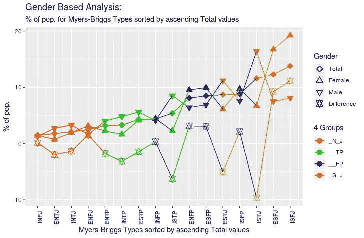

左边的类型是最罕见的，右边的是最普遍的。最平滑的曲线(因为我们按这些值排序)是总人口中每种类型的患病率值。与之接近的是男性和女性的价值观。下面的线是性别差异(女性——男性)。

我们可以按这些分类，例如

# 按性别差异分类的类型:

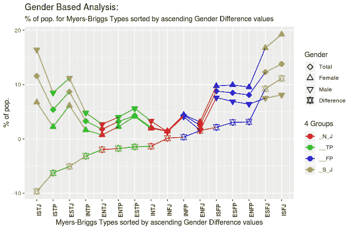

性别差异被计算为“女性——男性”。因此，在左翼，负值意味着女性更不被鼓励，而男性更被鼓励接受某些类型(ISTJ、ISTP 等)。在右边，女性更受鼓励，而男性则不太受鼓励去接受某些类型(ISFJ、ESFJ 等)。在靠近中心的地方，这些类型的人(INFJ、INTJ、INFP 等)在压力上几乎没有性别差异。

由此我们看到:

1.  红新泽西州类型的人不会受到太多基于性别的压力，无论性别如何，他们都同样受到劝阻。
2.  绿色思维类型(所有思维)被鼓励用于男性，但不用于女性。
3.  蓝色 __FP 类型(所有感觉)鼓励女性而非男性。
4.  gold _S_J 型被一分为二，男性被鼓励成为 ISTJ 或 ESTJ(都在思考)，女性被鼓励成为 ISFJ 或 ESFJ(都在感受)。

由此有一个清晰的模式:

*   作为一个直觉判断者，男女都一样不被鼓励。
*   女人被鼓励去感受而不是去思考。
*   男人被鼓励去思考而不是去感受。
*   这些影响调整了四个群体的基本模式，然而它仍然清晰地显示出来。

# 按女性患病率排序的类型

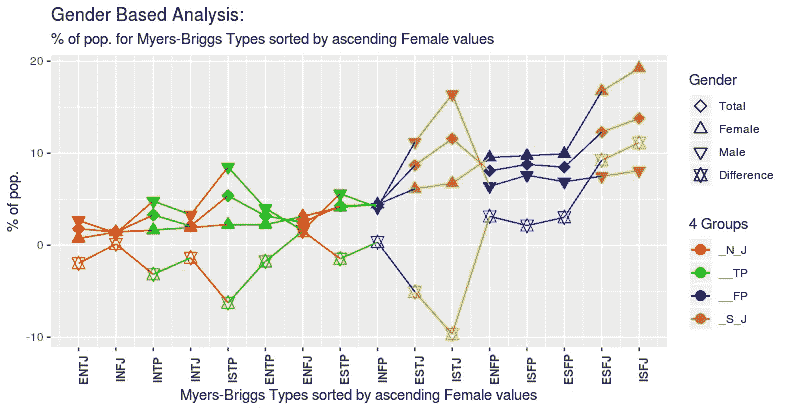

左边是女性最罕见的类型，右边是最普遍的类型。这四个组有些混淆，但仍然可以清楚地看到。

# 按男性患病率排序的类型

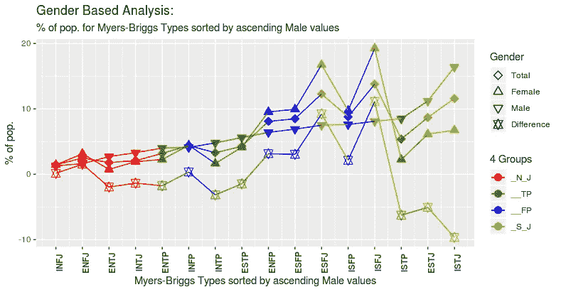

左边是男性最罕见的类型，右边是最普遍的类型。这四个组有些混淆，但仍然可以清楚地看到。

# 聚类分析

# 总人口的聚类:

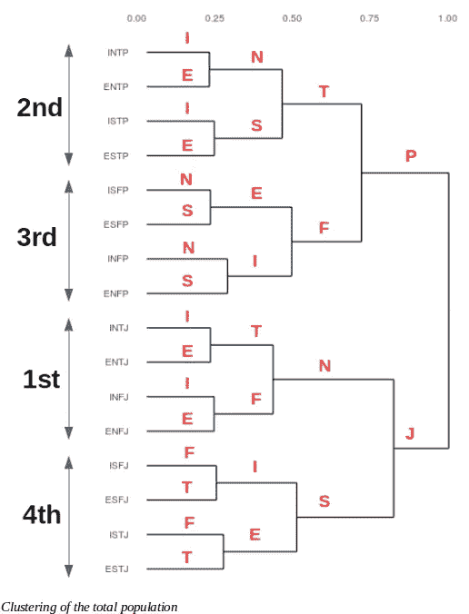

这显示了与前一份报告相同的四个组，我们再次发现组内组的等级结构:

如前一份报告所述，这意味着整个社会分为两个群体，感知者和判断者。

感知者分为感觉者和思考者。

裁判分为直觉裁判和感觉裁判。给我们四个组，如上图所示进一步划分。

这一次，我们还可以使用女性、男性以及性别差异(女性—男性)的患病率数据进行高尔聚类分析。

# 妇女的聚集:

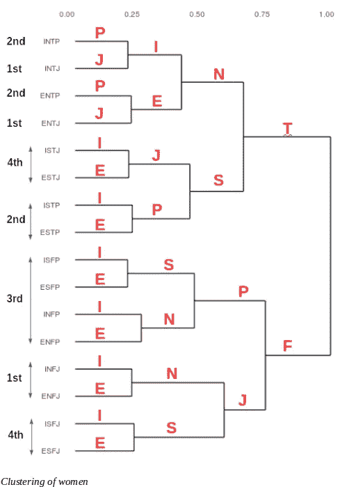

这意味着女性被分为两个群体，感受者和思考者。

触角分为感知者和判断者。

思考者分为直觉者和感觉者。

给我们四个组:

*   **感觉感知者**分为直觉者和感应者，每一种又分为内向者和外向者。
*   **感觉判断者**分为直觉型和感应型，每种又分为内向型和外向型。
*   **思维直觉**分为内向者和外向者，每个人又分为感知者和判断者。
*   **思维传感器**分为感知者和判断者，每一个又分为内向者和外向者。

# 男人的聚集:

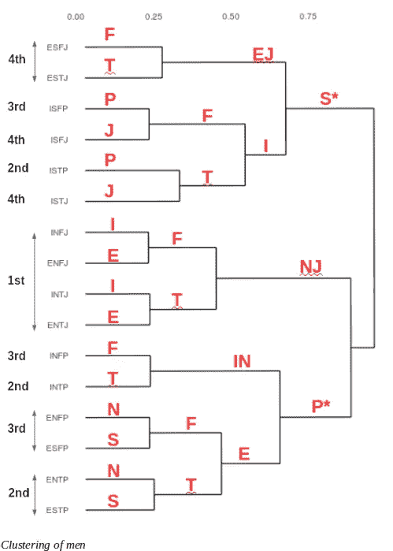

这个有点搞混了；即并非所有分组都是完整的，这些分组都标有“*”。“S*”分支(右上)包含除两种(左下)以外的所有传感类型。类似地,“P*”分支(右下)包含了除了两种(左上)以外的所有感知类型。

这意味着男人被分成三组:1)除了那些外向感知者之外的感知者，包括那些内向感知者；2)内向判断者；3)除了那些内向感知者之外的感知者，包括那些外向感知者。

第一组(S*)分为外向的评委和内向的评委。

第二组(新泽西州)分为触角和思想家。

第三组(P*)分为内向直觉型和外向直觉型。

给我们六个组，如上图所示进一步划分。

# 性别差异的聚类:

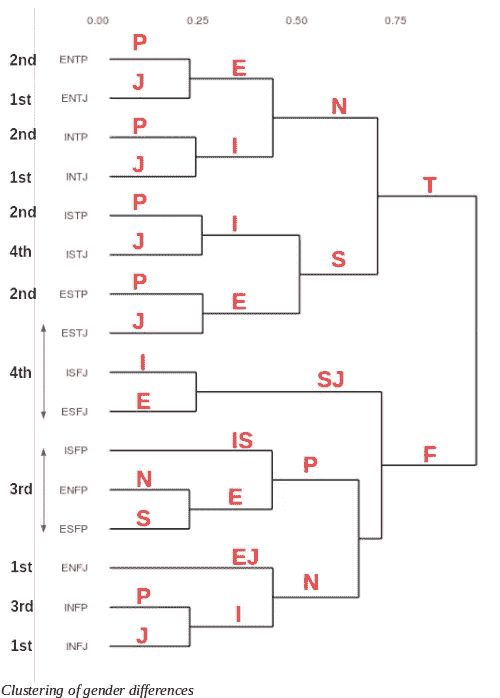

所有的分组都是完整的，但是它仍然有一点不规则的结构。

这意味着就性别差异而言，不同的人格类型可以分为两类，感受者和思考者。

触角分为三组；1)感官判断，2)感知者，3)直觉。

思考者分为直觉者和感觉者。

给我们五个组，如上图所示进一步划分。

# 进一步分析:

与之前的报告类似，我们将在这里研究适应场景和进化路径，但这次包括性别。

简单回顾一下:**适应场景**是指我们面临以某种方式(或某种组合)适应的挑战，例如内向或外向，直觉或观察，感觉或思考，感知或判断，或某种混合。例如，由“INFX”指示的场景指示 INF_ type(内向、直觉触角)正在适应感知或判断。当这些适应场景形成序列时，我们得到**进化路径**。

为了说明这一点，下面我展示了从未定义的 _ _ _ _→E _ _→E _ F _→E _ FJ→ENFJ 的演变细节，即路径=“E”，“F”，“J”，“N”。

在之前的报告中，我打印了一个数据表，每一行代表一种适应，在这个例子中，首先是变得外向，然后是感觉，然后是判断，最后是直觉。打印输出提供了更多的细节，但图表有助于显示性别之间的关系。因此这次我沿着一条路径画出了累积选择差异。由此我们看到，根据性别的不同，每个适应都有不同的压力，从而导致进化路径。

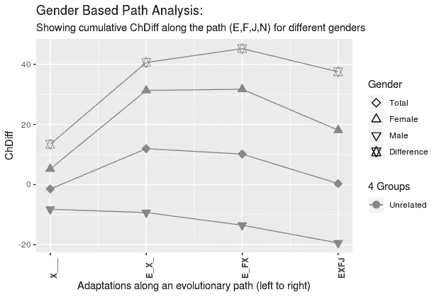

同样的进化路径因性别不同而受到不同的对待:

*   对每个人来说都是中性的(累积差异= 0.34)，
*   对于女性来说，这是非常鼓励的(累计差异= 18.1)，
*   对于男性，这是非常不鼓励的(累积差异= -19.4)，
*   有很大的性别差异(累积差异= 37.5)，这意味着女性比男性更倾向于走这条进化之路。

# MBS: 108 种可能的适应情景

为了深入了解所有可能的适应情景以及每种情景基于性别的流行程度/偏好，我们以两种不同的方式对它们进行了分类，然后绘制了这些值。

# 占人口的百分比

## 按总人口排序的适应情景分组行动计划:

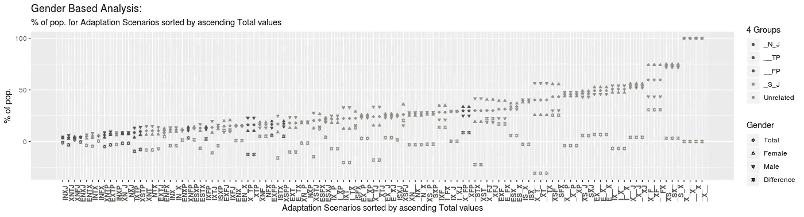

## 按性别差异分类的适应情景分组行动计划:

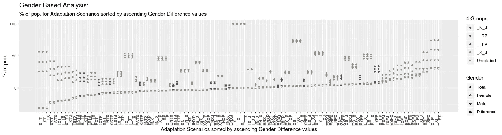

# 选择差异

## 按总人口排序的适应情景差异:

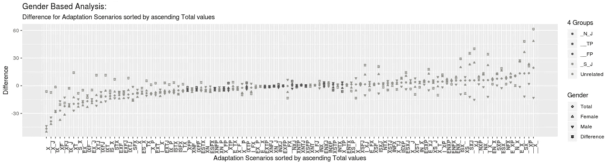

## 按性别差异排序的适应情景差异:

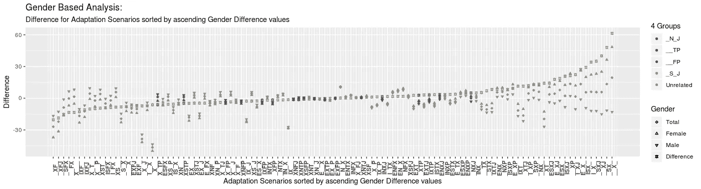

# 人口压力

## 按总人口排序的适应情景的 DP:

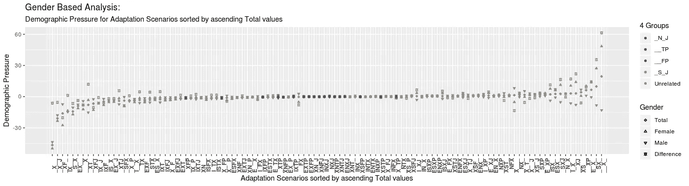

## 按性别差异分类的适应情景的 DP:

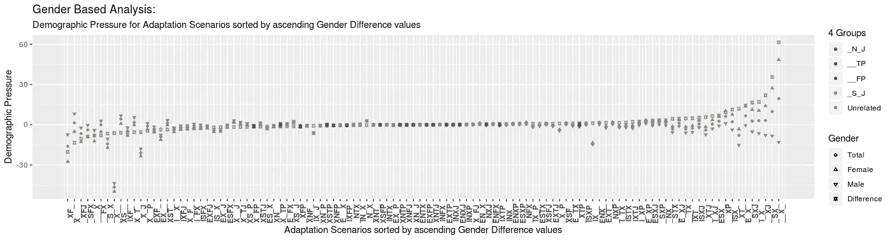

# 目标压力

## 按总人口排序的适应情景的 TP:

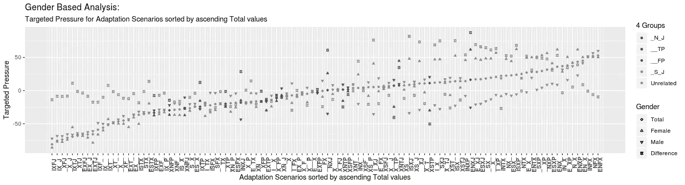

## 按性别差异分类的适应情景的 TP:

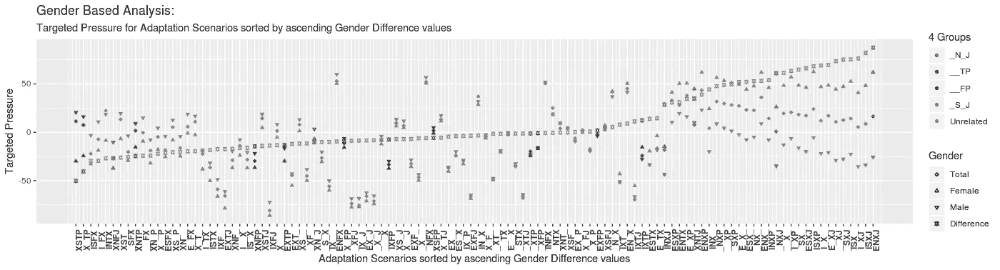

# 选择差异最多和最少的改编有哪些？

下面的图从左到右突出显示了六个最负压力、最小压力和最正压力的适应。

# 总人口差异:

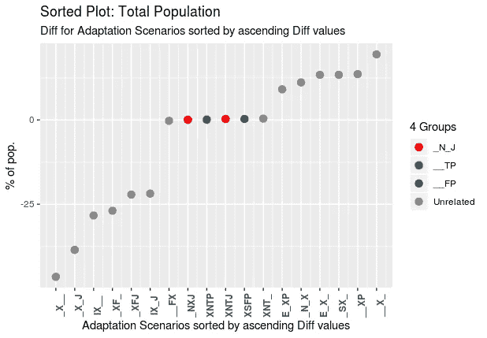

在左边，我们看到反对直觉和感知的强大压力，特别是反对法官或内向的人。

在中间，我们很少看到关于内向或外向的压力，特别是对于直觉思维者。

在右边，我们看到感受和思考的适度压力，特别是对于感知者和传感器。

# 女性差异:

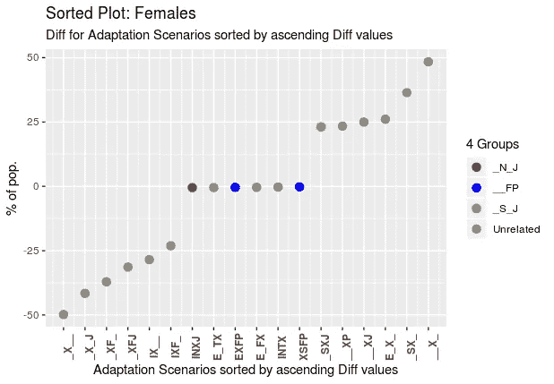

在左边，我们看到反对直觉和感觉的强大压力，特别是反对法官或触角。

在中间，如果一个人是外向的感觉感知者，我们很少看到关于直觉或感知的压力，或者很少看到感知或判断一个人是否是外向的感觉者的压力。

在右边，我们看到强烈的感受和反对思考的压力，特别是对于敏感者和外向者。

# 男性差异:

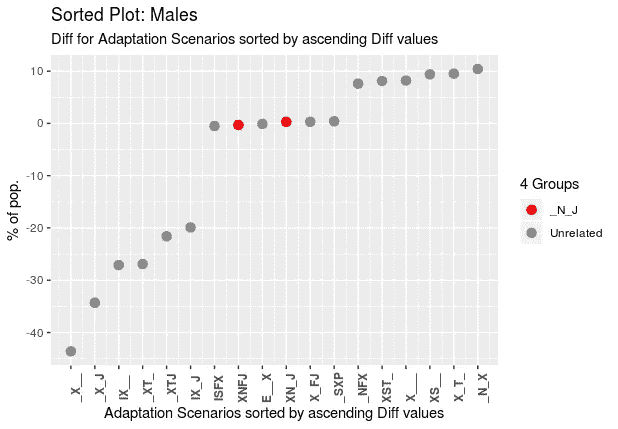

在左边，我们看到反对直觉和感知的强大压力，特别是反对法官或内向的人。

在中间，如果一个人是一个直觉判断者，我们看到关于内向或外向的压力很小，或者感知或判断一个人是否外向的压力很小。

在右边，我们看到直觉感知而不是判断的适度压力，或者内向的适度压力，特别是对于思考者和传感器。

# 性别差异不同:

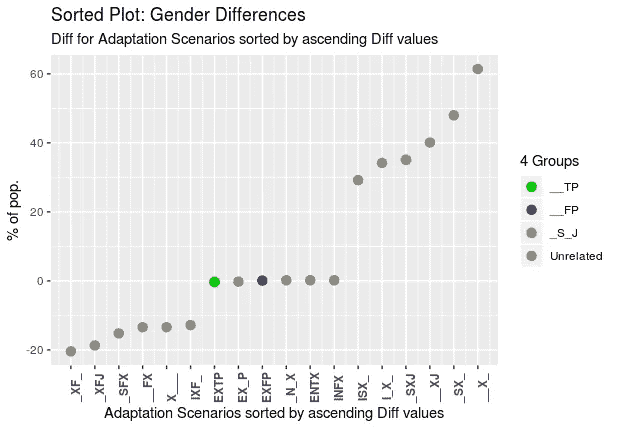

在左边，我们看到对女性直觉和感知的压力相对更大，特别是对女性感觉者或感觉法官的压力。

在中间，如果一个人是外向的感觉感知者，我们看到关于直觉或感知的压力的性别差异很小，或者如果一个人是直觉者，我们看到感知或判断的压力的性别差异很小。

在右边，我们看到女性感受和反对她们思考的压力更大，特别是对于传感器和法官。

这也适用于男性，对女性的压力越大，对男性的压力就越大，反之亦然。

# 有哪些针对性压力最大和最小的改编？

即哪些小群体压力大，哪些大群体压力小？

下面的图从左到右突出显示了六个最负压力、最小压力和最正压力的适应。

# 总人口的 TP:

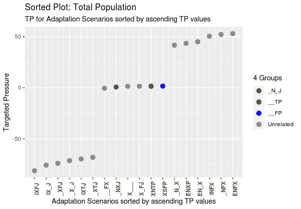

在左边，我们看到反对直觉和感知的强大压力，特别是反对内向的感觉判断者或内向的判断者。

在中间，我们看到对于任何人来说，特别是对于感觉判断者或直觉思维感知者来说，关于内向或外向的压力很小。

在右边，我们看到强烈的压力，要求感知和反对判断，特别是直觉的感觉。

# 女性 TP:

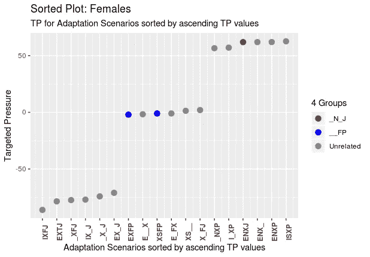

在左边，我们看到反对直觉和感知的强大压力，特别是反对内向的感觉判断者或外向的思考判断者。

在中间，如果一个人是感觉感知者，我们看到关于内向或外向的压力很小，或者如果一个人是外向的触角，我们看到感知或判断的压力很小。

在右边，我们看到感受和思考的强大压力，特别是对于内向的感知者和外向的直觉感知者。

# 男士 TP:

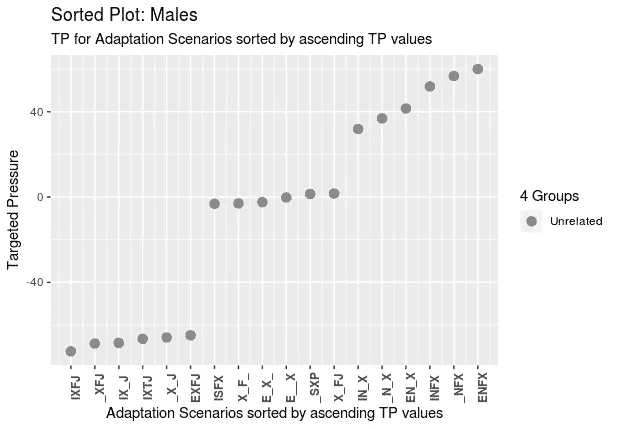

在左边，我们看到反对直觉和感知的强大压力，特别是反对内向的感觉判断者或感觉判断者。

在中间，如果一个人是外向的，我们看到关于感知或判断，或感觉或思考的压力很小。

在右边，我们看到强烈的压力，要求感知和反对判断，特别是直觉的感觉。

# 就性别差异而言:

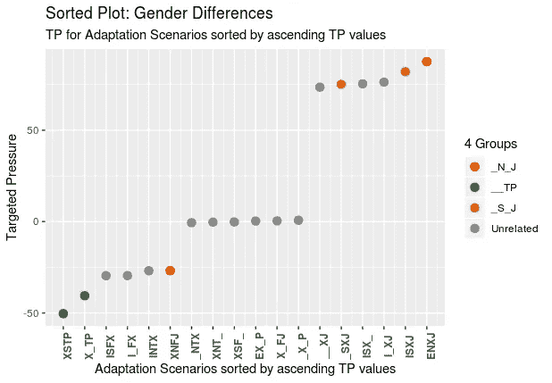

在左边，我们看到相对更强的压力，反对内向的女性感知思考的法官，或者反对内向的女性感知感觉的人。

在中间，如果一个人是外向的感知者，我们看到关于直觉或感知的压力的性别差异很小，或者如果一个人是感知触角或直觉思考者，我们看到内向或外向的压力很小。

在右边，我们看到女性感受到的压力更大，尤其是外向的直觉判断者或内向的感觉判断者。

男人也是如此。

# 所有路径:384 种可能的 4 步进化路径

每个路径以未定义的“__”开始，以完全定义的结尾，例如“ESTP”。我们之前看到过这样的例子，进化路径“E，F，J，N”。

为了深入了解所有可能的 4 步进化路径以及每条路径的流行程度/偏好，我们对它们进行了分类，然后绘制了值。

# 占人口的百分比

## 按总人口排序的进化路径分组:

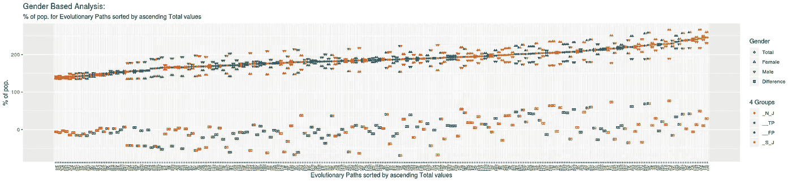

## 按性别差异排序的进化路径分组:

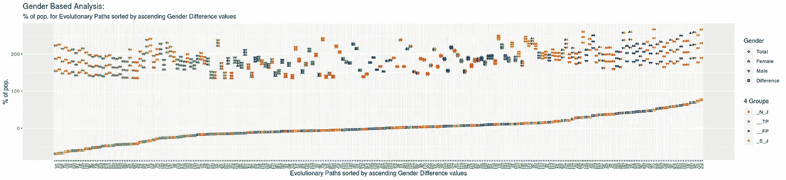

# 选择差异

## 按总人口排序的进化路径差异:

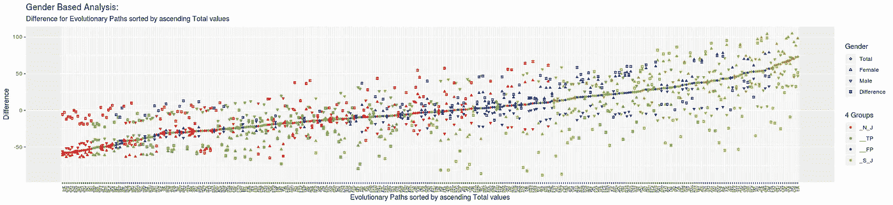

## 按性别差异排序的进化路径差异:

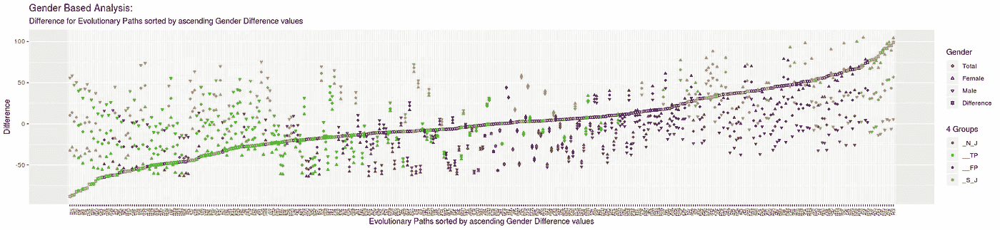

# 人口压力

## 按总人口排序的进化路径的 DP:

## 按性别差异排序的进化路径的 DP:

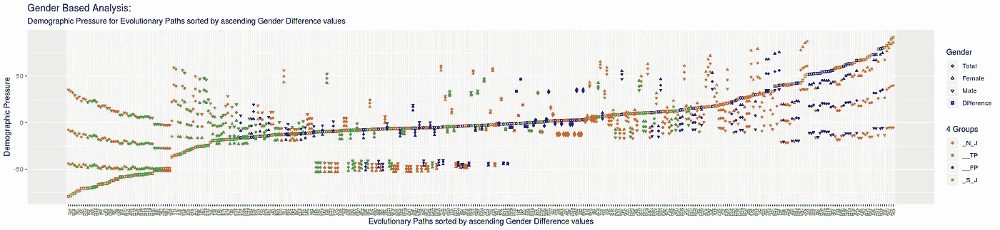

# 目标压力

## 按总人口排序的进化路径的 TP:

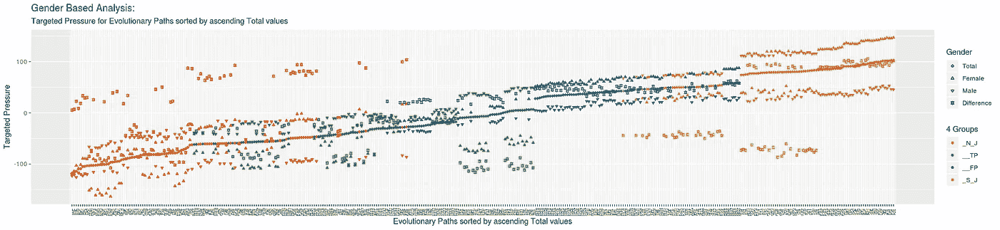

## 按性别差异排序的进化路径的 TP:

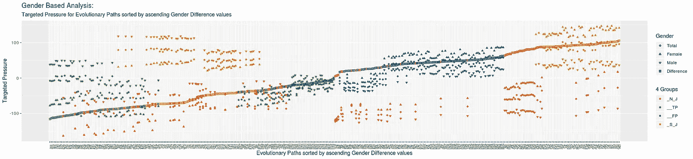

在上面的情节中呈现了许多信息，具有有趣的特征和模式。然而，我将留待将来的分析来深入探讨这一点。

# 选择差异最大和最小的 4 步进化路径是什么？

下面的图从左到右突出显示了六个最负压力、最小压力和最正压力的适应。

# 总人口的路径差异:

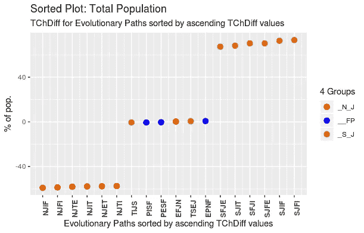

在左翼，我们看到通往 INFJ、ENTJ 和 INTJ 的道路面临强大压力。

在中间，我们看到通向 ESFP、ENFJ、ISFP、ESTJ、ISTJ 和 ENFP 的路径压力很小。

在右边，我们看到通往 ISFJ 和 ESFJ 的道路压力很大。

# 女性道路不同:

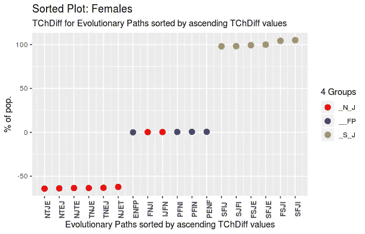

在左翼，我们看到通往 ENTJ 的道路面临强大的压力。

在中间，我们看到通往 INFJ、ENFP 和 INFP 的道路压力很小。

在右边，我们看到通往 ISFJ 和 ESFJ 的道路面临非常大的压力。

# 男性路径不同:

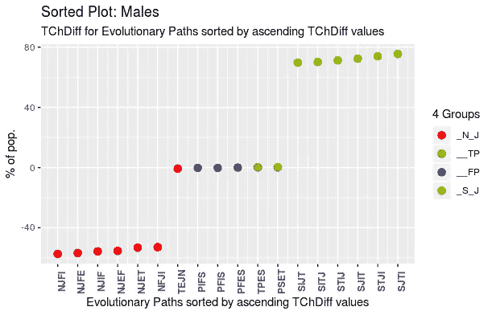

在左翼，我们看到通往 INFJ 和 ENFJ 的道路面临强大压力。

在中间，我们看到通向 ISFP、ESFP、ESTP 和 ENTJ 的路径压力很小。

在右边，我们看到通往 ISTJ 的道路面临非常大的压力。

# 就性别差异而言，路径不同:

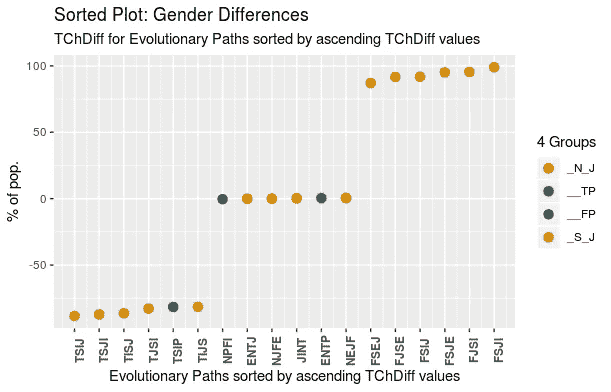

在左翼，我们看到更大的压力迫使女性走上通往 ISTJ 和 ISTP 的道路。

在中间，我们看到在通往 ENFJ、INTJ、ENTJ、ENTP 和 INFP 的道路上，性别差异很小。

在右边，我们看到妇女面临更大的压力，要她们走上通往 ISFJ 和 ESFJ 的道路。

男人也是如此。

# 目标压力最大和最小的 4 步进化路径是什么？

下面的图从左到右突出显示了六个最负压力、最小压力和最正压力的适应。

# 总人口的路径 TP:

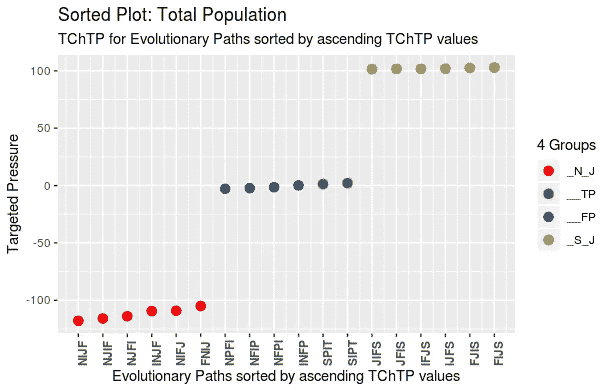

在左翼，我们看到通往 INFJ 的道路面临强大的压力。

在中间，我们看到通往 INFP 和 ISTP 的道路压力很小。

在右边，我们看到通向 ISFJ 的路径面临强大的压力。

# 面向女性的路径 TP:

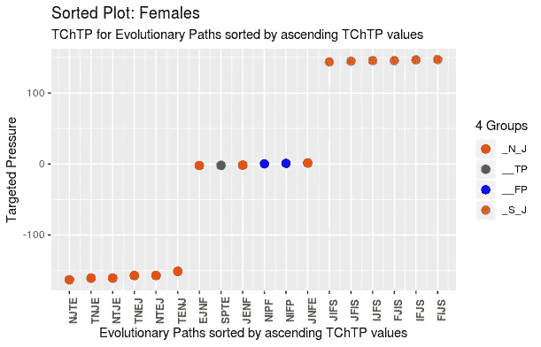

在左翼，我们看到通往 ENTJ 的道路面临强大的压力。

在中间，我们看到通往 ENFJ、INFP、ESTP 和 ENFJ 的道路压力很小。

在右边，我们看到通向 ISFJ 的路径面临强大的压力。

# 男子路径 TP:

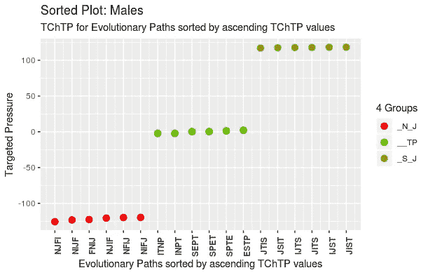

在左翼，我们看到通往 INFJ 的道路面临强大的压力。

在中间，我们看到通向 ESTP 和 INTP 的路径压力很小。

在右边，我们看到通往 ISTJ 的道路面临强大的压力。

# 性别差异方面的路径 TP:

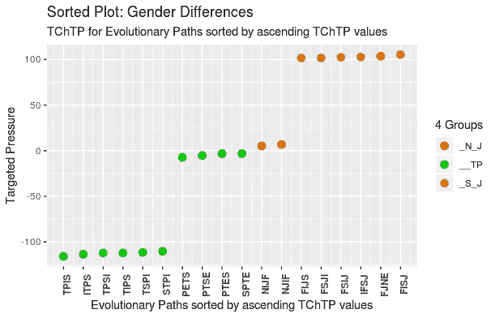

在左翼，我们看到了更大的压力，要求女性走上通往 ISTP 的道路。

在中间，我们看到在通向 ESTP 和 INFJ 的道路上，性别差异很小。

在右边，我们看到妇女面临更大的压力，要她们走上通往 ISFJ 和 ENFJ 的道路。

男人也是如此。

# 一些更长的进化路径:

## 物流学家 ISTJ 通过 12 个改编步骤成为主角 ENFJ

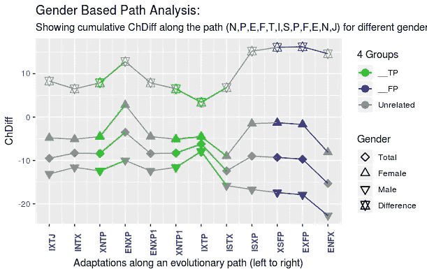

女性中立，男性不鼓励。

## 倡导者 INFJ 通过 12 个适应步骤成为执行 ESTJ

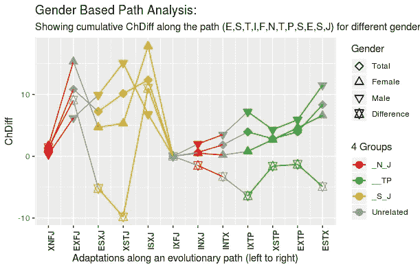

鼓励女性，更鼓励男性。

## 总人口和男性中最沮丧的类型:
倡导者 INFJ 在 12 个适应步骤中始终是倡导者

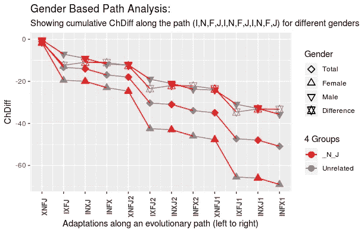

## 女性最气馁的类型:
指挥官 ENTJ 在 12 个适应步骤中仍然是指挥官

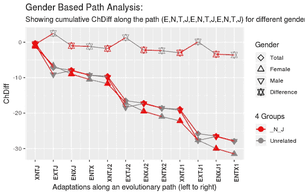

## 总人口和女性最受鼓舞的类型:
辩护人 ISFJ 在 12 个适应步骤中始终是辩护人

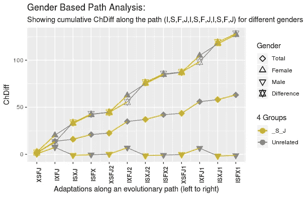

## 最受男性鼓励的类型:
后勤人员 ISTJ 在 12 个适应步骤中一直是后勤人员

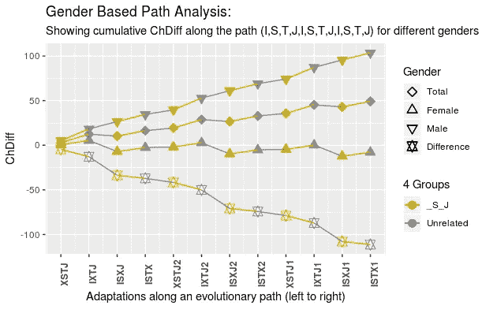

## 在 _N_J 群内循环

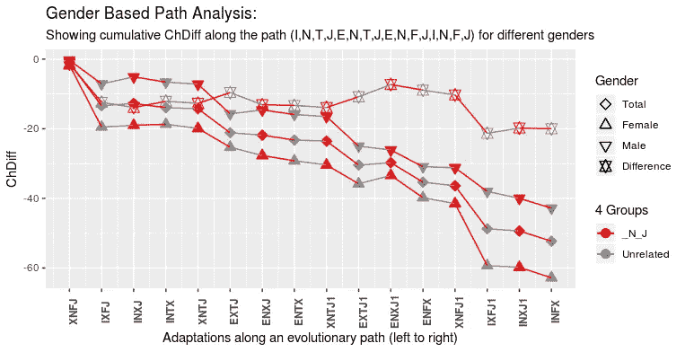

## __TP 组内循环

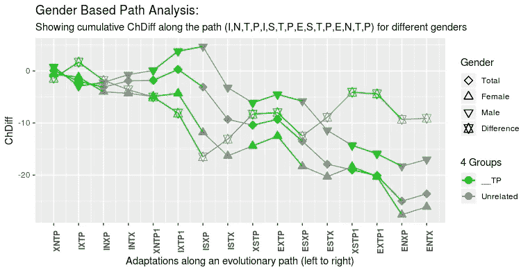

## __FP 组内的循环

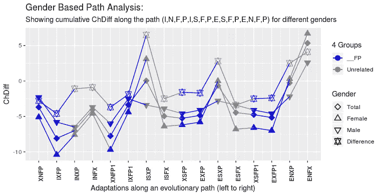

## 在 _S_J 组内循环

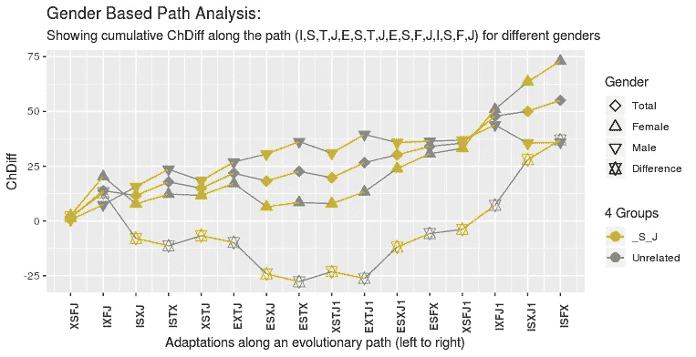

# 结论:

可以看到明显不同的力量作用于男人和女人，一般来说，鼓励女人去感受，男人去思考，同样也不鼓励直觉判断。

这种差异模式有很多细节，可以从上述结果中推断出来。然而，这些细节的讨论留待以后。

这种类型的分析可以揭示鼓励和沮丧力量的细节，通过这些力量，选择过程决定了我们在不同人群中观察到的类型分布。

这意味着不同的条件可以导致不同的鼓励和沮丧模式，随着时间的推移，导致不同的分布。

可以对来自不同人群的数据进行这种分析，从而深入了解不同社会的结构，并进行详细的交叉比较。

# 未来分析:

可以结合使用以下方法进行分析:

*   排序，
*   高尔距离聚类，
*   相关聚类，
*   检查子组的子设置，
*   包括人口统计数据，
*   按社会经济地位、年龄等分析，
*   模型拟合，
*   正式测试假设，
*   类型之间相互作用的网络分析，
*   检查/模拟在对立和合作文化中出现的分布(即与 [SSD](http://fbl.me/SSD) 整合)，
*   等等…

注:相关数据和代码可在 https://github.com/anandavala/mba
T3 获得

具体来说，文件:[reproduct-article-tables-with-gender . r](https://github.com/anandavala/mba/blob/master/src/reproduce-article-tables-with-gender.r)再现了该报告中的所有情节(以及更多)。

