# 关于社会的结构，数据科学能揭示什么？

> 原文：<https://medium.datadriveninvestor.com/what-can-data-science-reveal-about-the-structure-of-society-b26ff16f9ca1?source=collection_archive---------28----------------------->

**摘要:**对 Myers-Briggs 人格类型在社会中的流行程度的分析揭示了群体中群体的等级结构，每个群体都具有人格属性的特征组合。还对数据进行了分析，以便深入了解适应情景和演变路径。

这种类型的分析可以揭示鼓励和沮丧力量的细节，通过这些力量，选择过程决定了我们所观察到的类型的分布。如果对不同人群的数据进行分析，这种方法可以洞察不同社会的细微结构，并能够进行详细的交叉比较。

这是系列文章的第一部分，第二部分是:[数据科学能揭示什么样的社会性别结构？](https://medium.com/@Anandavala/what-can-data-science-reveal-about-the-gender-based-structure-of-society-44ed4b606b58)

# 介绍

对每种人格类型在社会中的流行程度的探索性分析(使用迈尔斯-布里格斯 [MBTI](https://www.myersbriggs.org/my-mbti-personality-type/mbti-basics/home.htm?bhjs=0) )产生了有趣的结果。

事实证明，我们可以从这些数据中学到很多东西，并且出现了非常清晰和有意义的模式！！

首先，当按人口百分比对这些类型进行分类时，出现了四个组:

1.  最少的 4 个都是直觉判断( [_N_J](http://anandavala.info/16Types/_N_J/) )，合计 10.0%
2.  接下来的 4 个都是思维感知者( [__TP](http://anandavala.info/16Types/__TP/) )，合计 16.7%
3.  接下来的 4 位都是感觉知觉者( [__FP](http://anandavala.info/16Types/__FP/) )，合计 27.5%
4.  最普遍的 4 个都是感觉法官( [_S_J](http://anandavala.info/16Types/_S_J/) )，合计 45.8%

注意:单击上面的掩码(例如 _N_J)查看每个组的详细信息。

数据来源于一本旧的 MBTI 手册&心理类型应用中心，更多的资料将很快添加进来。

**以下是按 AP(所有来源的平均人口百分比)排序的所有人格类型:**

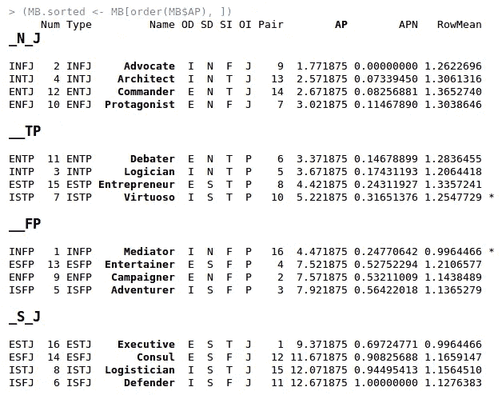

注*:中间两行已被交换以适应分组。这些值具有重叠的误差容限，因此可以交换。

为了深入了解一系列人格类型以及每种类型的流行程度，我们可以对它们进行分类，然后绘制出它们的值。

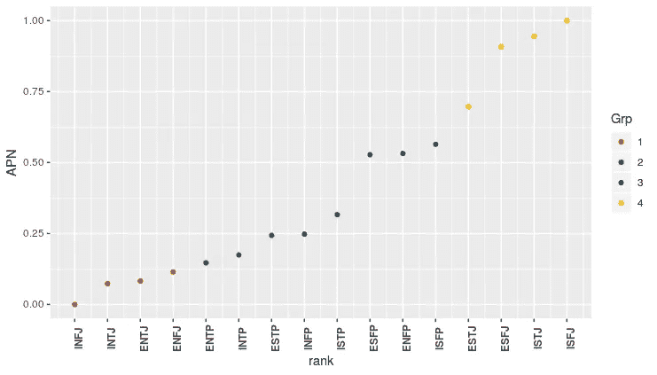

Plot of the sorted spectrum of normalised prevalence values for all Myers-Briggs types.

上面我们可以看到不同的层次或步骤。两个最普遍的四人组(在右边)有三个人在一条线上，第四个人要低得多。

下面的高尔聚类分析进一步证实了四个组的集合，我们还发现组内有组的层次结构:

Gower based clustering of Myers-Briggs frequency data.

这意味着整个社会分为两个群体，感知者和判断者。

感知者分为感觉者和思考者。

裁判分为直觉裁判和感觉裁判。

**这给了我们四组:**

1.  **的直觉判断者**被分为感觉者和思考者，两者又被分为内向者和外向者。
2.  **思维感知者**被分为直觉者和感知者，两者又被分为内向者和外向者。
3.  感受者分为内向者和外向者，然后又分为直觉者和感觉者。
4.  感觉判断者分为内向者和外向者，然后又分为感觉者和思考者。

具有最大整体结构意义的区别是在感知和判断之间；它将人口一分为二。

整体结构意义最小的区别在内向者和外向者之间；它只在小组中起作用。

从数据中出现的总体模式揭示了不同群体的存在，这些群体具有个性属性的特征组合。

但是，从这些数据中还可以学到很多东西…

# 进一步分析:

该数据测量每种类型的人口百分比，由此我们可以计算每种个性属性或组合的百分比表示。

我们可以就此打住，或者我们可以考虑为什么分布会有这种形式。我们并不确切知道是什么原因导致某些类型比其他类型更普遍，但我们仍然可以查看数据，不仅仅是“普遍程度”，还有“偏好”。

在这种情况下，社会结构是由自然、后天培养、文化还是其他可以想象的因素造成的并不重要。这可能是一种被崇拜或禁忌的存在方式，或者是很容易或很难获得，或者是一种更好或更差的进化适应环境，或者是或多或少的致命或扩张性的，等等。或者，这种分布可能会受到这些类型由于各自的特性以及这些特性如何产生共鸣或冲突而彼此相处的特定方式的影响。

在不假设任何特殊原因的情况下，我们可以假设存在某种选择过程，我们发现的类型分布是随着时间的推移选择过程的结果。从这些数据中，我们可以深入了解选择过程的结构；即它鼓励什么和不鼓励什么。

还有一个假设，即选择过程是持续的，即人格类型不是固定不变的，也不是严格的类别；它们是可能性空间中的参照点。

这意味着我们都面临着**适应场景**，在这些场景中，我们面临着以某种方式(或某种组合)适应的挑战，例如，变得内向或外向，直觉或感知，感觉或思考，感知或判断，或某种混合。例如，由“INFX”指示的场景指示 INF_ type(内向、直觉触角)正在适应感知或判断。

我们不同的一面出现在不同的环境中，在不同的人周围，在不同的心情下，面对不同的环境，暴露在不同的文化规范中，等等。随着年龄的增长，我们也会随着时间的推移而改变，并受到我们经历的影响。

现在可以对总体流行/偏好数字进行分析，以提供关于所有可能的适应情景的信息，以及衡量选择过程对这种情景的劝阻或鼓励程度。

当这些适应情景形成序列，即**进化路径**时，我们通过人格类型或存在方式(根据迈尔斯-布里格斯模型)的空间洞察各种进化路径的详细偏好。

这里描述的分析框架是在 R 中构建的，现在有三个主要数据集:

*   **MB** : 16 种迈尔斯-布里格斯性格类型。
*   **MBS** : 108 种适应场景。
*   **所有路径** : 384 条进化路径(从全部未定义到全部已定义 4 步)。

注意:可以单独检查任意长的进化路径，但是只有 4 步路径作为一个数据集被完整地绘制出来(目前)。

## 快速示例

为了说明这一点，下面我展示了从未定义的 _ _ _ _→E _ _→E _ F _→E _ FJ→ENFJ 的进化细节，即进化路径=“E”，“F”，“J”，“N”。

下面每一行代表一种适应，在这种情况下首先变得外向，然后感觉，然后判断，最后直觉。

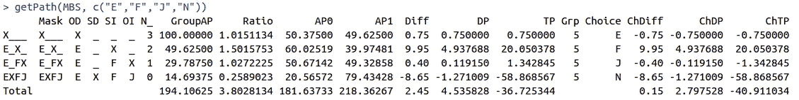

感兴趣的列有:

*   **GroupAP** 是一个子组所代表的总体的百分比(多个数据源的平均值)。
*   **选择**是被选中的改编。
*   **ChDiff** 是由于自适应导致的百分比差异，
*   **ChDP** 是对人口压力的一种度量，即由于人口比例的改变而对社会产生的总影响。
*   **ChTP** 是一种目标压力的测量方法，通过选择过程聚焦在子群上——当特定的适应具有较大影响时，该值较大，且仅适用于一小部分人群。

负值表示稀有；对选拔过程感到沮丧。

正值表示流行；受到选拔过程的鼓舞。

# MBS: 108 种可能的适应情景

为了深入了解所有可能的适应情景以及每种情景的流行程度/偏好，我们对它们进行了分类，然后绘制出数值。

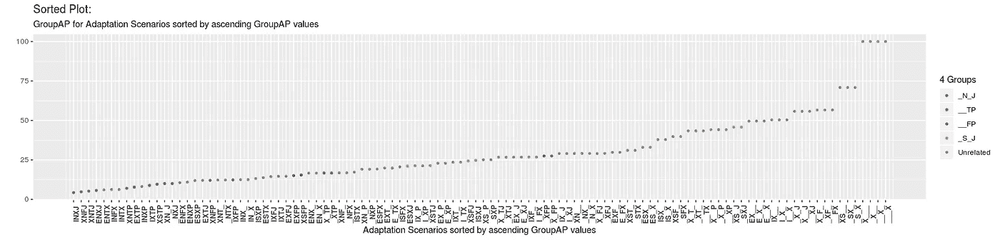

Plot of the sorted spectrum of group prevalence values for all adaptation scenarios.

有四种适应适用于每个人(在右边)，随后流行率下降几个步骤，然后是一个长期稳定的下降。

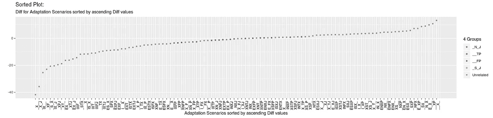

Plot of the sorted spectrum of choice difference values for all adaptation scenarios.

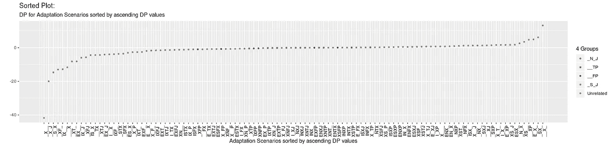

Plot of the sorted spectrum of demographic pressure values for all adaptation scenarios.

Plot of the sorted spectrum of targeted pressure values for all adaptation scenarios.

在上面的三个图中，在中间的等级中，我们看到等级和选择适应的影响之间存在相当线性的关系。然而，也有适应经历非线性(立方？)气馁(左边)和鼓励(右边)。沮丧的力量大约是鼓励的两倍。

# 最不鼓励和鼓励的改编是什么？

即具有最高的绝对选择差异。

MBS 根据选择的绝对差值( **Diff** )以百分比排序:

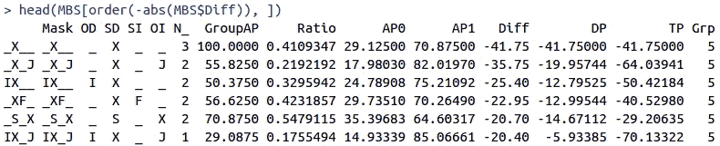

这意味着强大的压力阻碍直觉，鼓励感知，尤其是阻碍直觉判断、内向直觉和感觉直觉。

逐行:

*   所有人都强烈反对直觉，而鼓励感知。
*   强烈反对法官凭直觉判断，而鼓励他们凭感觉判断。
*   内向的人不鼓励直觉，而鼓励感知。
*   不鼓励触角靠直觉，而鼓励靠感觉。
*   不鼓励传感器成为感知者，而鼓励传感器做出判断。
*   内向的法官不鼓励凭直觉，而鼓励凭感觉。

注意:要阅读这些 MBS 数据集，您需要理解此分析中使用的约定。Diff、DP 和 TP 的上述值的符号指极性的阴方面。因此，大的负值表示对阴和对阳的强大压力，而大的正值表示对阴和对阳的强大压力，零值表示没有压力(50 / 50 平衡)。

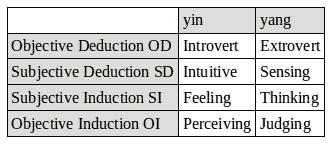

The Myers-Briggs to yin / yang mapping convention used in the code.

# 有哪些选择差异最小的改编？

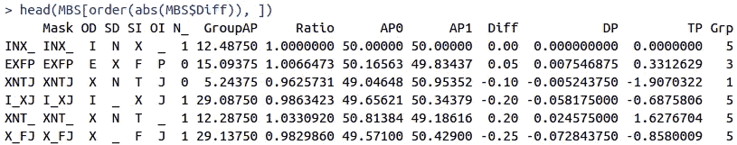

对于每一种适应(在面具中用“X”表示)，来自选择过程的压力很小。两种情况各占一半。

逐行:

*   如果你是一个内向的直觉者，无论你想什么或感觉什么都没有压力。
*   如果你是一个外向的感觉者，无论你是直觉还是感知，几乎没有压力。
*   如果你是一个直觉思维的法官，那么你外向而不是内向的压力很小。
*   如果你是一个内向的法官，你只有轻微的压力去思考而不是去感受。
*   如果你是一个直觉思维者，那么你外向而非内向的压力很小。
*   如果你是一个感觉判断者，那么你外向而不是内向的压力很小。

# 有哪些针对性压力最大的改编？

即哪些小群体承受着强大的压力？

MBS 按影响选择的目标压力( **TP** )排序:

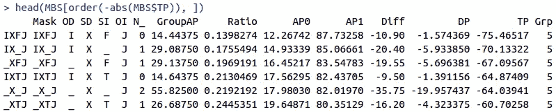

逐行:

*   内向的情感法官强烈反对凭直觉，而鼓励凭感觉。
*   内向的法官强烈反对凭直觉，而鼓励凭感觉。
*   强烈反对感情法官凭直觉，而鼓励他们凭感觉。
*   内向型思维的法官强烈反对凭直觉，而鼓励凭感觉。
*   强烈反对法官凭直觉判断，而鼓励他们凭感觉判断。
*   思考型法官强烈反对凭直觉，而鼓励凭感觉。

# 有哪些针对性压力最小的改编？

即哪些大群体承受的压力很小？

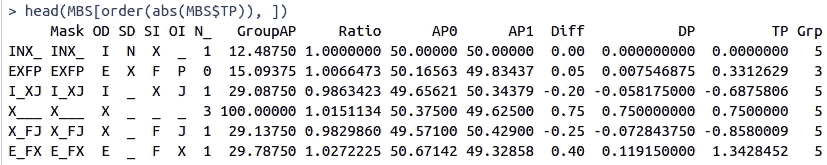

逐行:

*   内向的直觉同样可能是感觉或思考。
*   外向的感觉感知者更倾向于直觉而不是感知。
*   内向的法官更倾向于思考而不是感觉。
*   每个人外向的可能性只比内向的稍微大一点。
*   感觉法官外向的可能性只比内向的稍微大一点。
*   外向的感觉者成为感知者的可能性仅略高于判断者。

# 所有路径:384 种可能的 4 步进化路径

每个路径以未定义的“__”开始，以完全定义的结尾，例如“ESTP”。为了深入了解所有可能的 4 步进化路径以及每条路径的流行程度/偏好，我们对它们进行了分类，然后绘制了值。

Plot of the sorted spectrum of total group prevalence values for all 4 step evolutionary paths.

在中间，等级和流行率之间的关系是相当线性的，变成非线性的(二次？)在两端，最沮丧(左)和最受鼓舞(右)的路径都有自己的曲线。

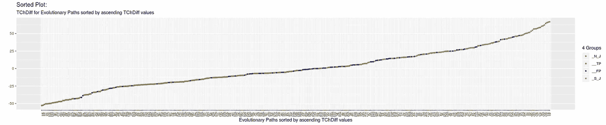

Plot of the sorted spectrum of total choice difference values for all 4 step evolutionary paths.

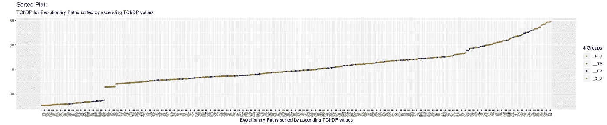

Plot of the sorted spectrum of demographic pressure values for all 4 step evolutionary paths.

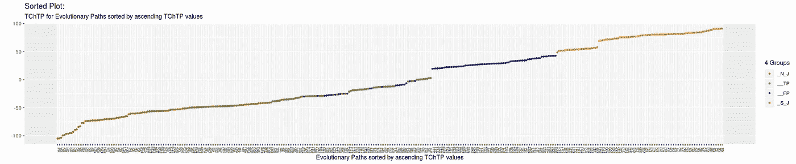

Plot of the sorted spectrum of normalised total targeted pressure values for all 4 step evolutionary paths.

在上面的三个图中，类似于早期的适应情景，在中间等级中，我们看到等级和选择进化路径的影响之间存在相当线性的关系。然而，有些路径会经历非线性的沮丧(左边)和鼓励(右边)。在人口压力谱中也有不连续性，在目标压力谱中有一个尖角。沮丧和鼓励的力量现在大致相等。

# 最不鼓励和鼓励的(4 步)进化途径是什么？

即具有最高的绝对总选择差异。

allPaths 根据选择顺序引起的总人口百分比绝对变化进行排序( **TChDiff** ):

## 最令人沮丧的道路(就选择差异而言):

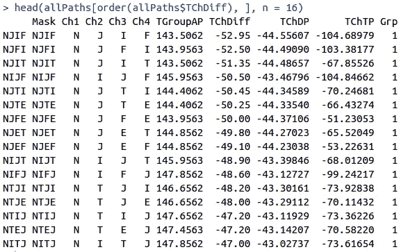

## 最令人气馁的途径(就目标压力而言):

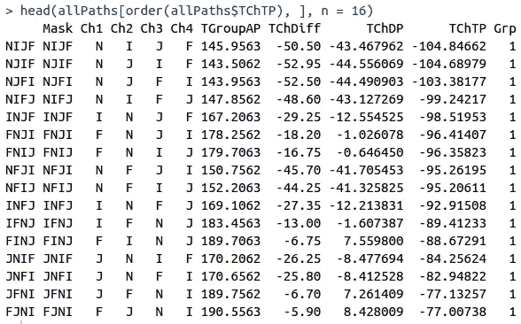

## 最受鼓励的途径(就选择差异而言):

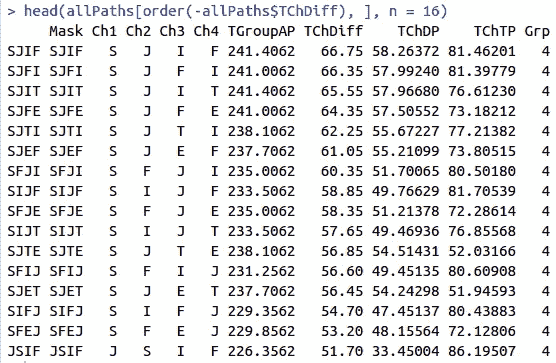

## 最受鼓励的途径(就目标压力而言):

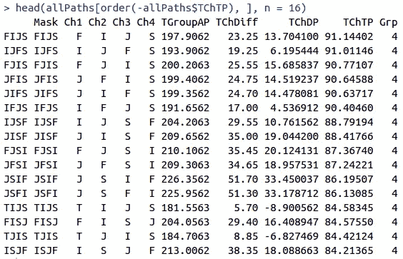

## 最小压力路径(就选择差异而言):

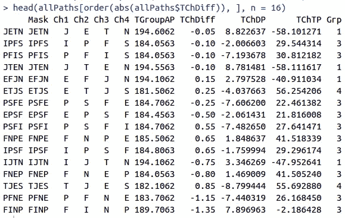

## 最小压力路径(就目标压力而言):

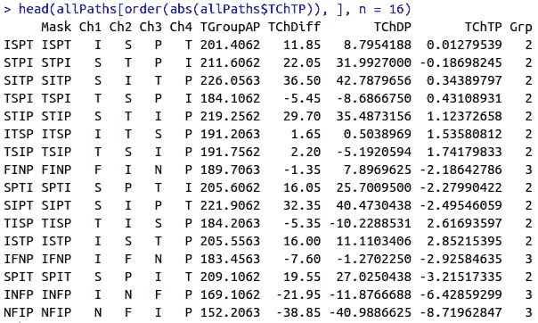

# 一些更长的进化路径:

## 气馁:后勤专家 ISTJ 通过 12 个适应步骤成为主角 ENFJ

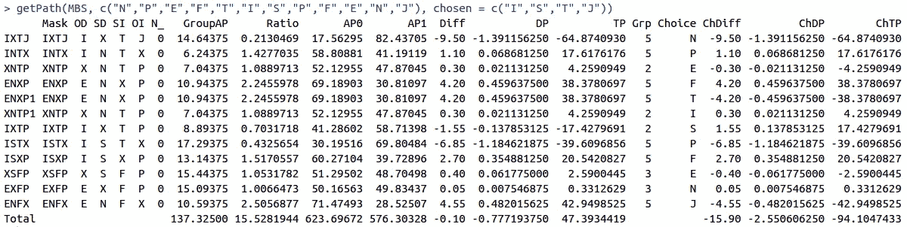

底线右边的总数都表明:
对这条进化道路的强大压力。

## 鼓励:倡导者 INFJ 通过 12 个适应步骤成为执行 ESTJ

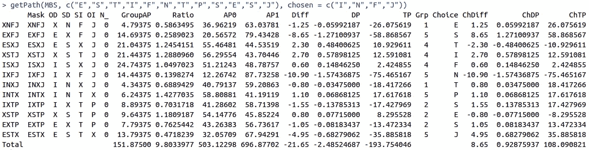

底线右边的总数都表明:
有利于这条进化道路的强大压力。

## 最沮丧的:倡导者 INFJ 在 12 个适应步骤中一直是倡导者

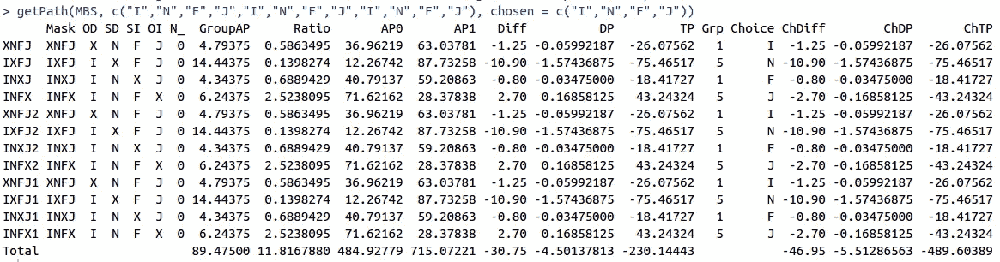

底线右边的总数都表明:
反对这条进化道路的非常强大的压力。

## 最受鼓舞的:后卫 ISFJ 在整个 12 个适应步骤中都是后卫

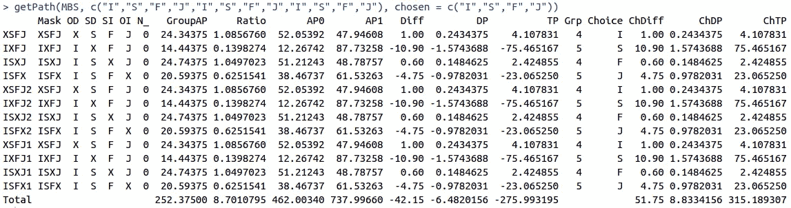

底线右边的总数都表明:
非常强大的压力有利于这条进化道路。

## 在 _N_J 群内循环

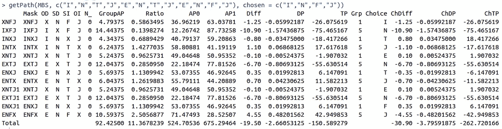

底线右边的总数都表明:
反对这条进化道路的强大压力。

## __TP 组内循环

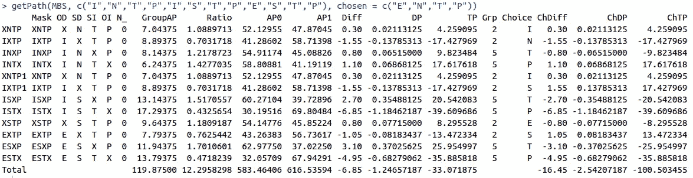

底线右边的总数都表明:
对这条进化道路的中等压力。

## __FP 组内的循环

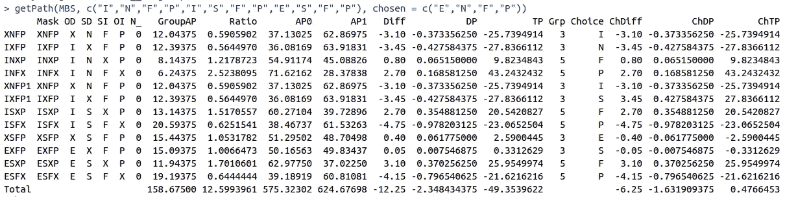

底线右边的总数都表明:
对这条进化道路的轻微压力。

## 在 _S_J 组内循环

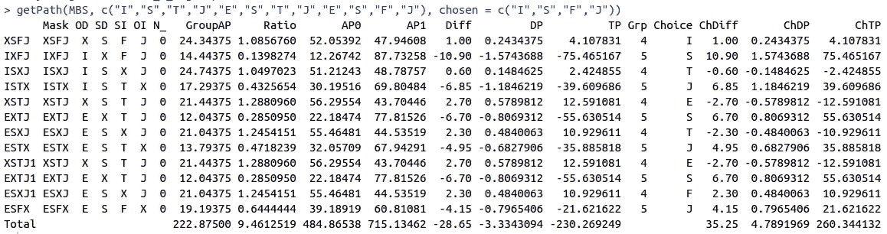

底线右边的总数都表明:
有利于这条进化道路的强大压力。

# 结论:

这种类型的分析可以揭示鼓励和沮丧力量的细节，通过这些力量，选择过程决定了我们在不同人群中观察到的类型分布。

这意味着不同的条件可以导致不同的鼓励和沮丧模式，随着时间的推移，导致不同的分布。

可以对来自不同人群的数据进行这种分析，从而深入了解不同社会的结构，并进行详细的交叉比较。

这一分析将在第 2 部分继续:[数据科学能揭示什么样的社会性别结构？](https://medium.com/@Anandavala/what-can-data-science-reveal-about-the-gender-based-structure-of-society-44ed4b606b58)

# 未来分析:

可以结合使用以下方法进行分析:

*   排序，
*   高尔距离聚类，
*   相关聚类，
*   检查子组的子设置，
*   包括人口统计数据，
*   按性别、社会经济地位等进行分析，
*   模型拟合，
*   正式测试假设，
*   类型之间相互作用的网络分析，
*   检查/模拟敌对和合作文化中出现的分布(即与 [SSD](http://fbl.me/SSD) 整合)，
*   等等…

注:相关数据和代码可在:
[https://github.com/anandavala/mba](https://github.com/anandavala/mba)获得

特别是，文件:[reproducte-article-tables . r](https://github.com/anandavala/mba/blob/master/src/reproduce-article-tables.r)再现了该报告中的所有情节(以及一些其他情节)。