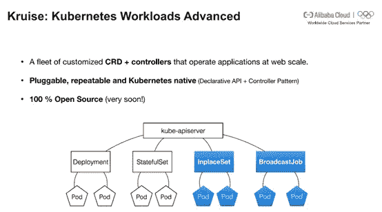

# 我们能从 Twitter 迁移到 Kubernetes 中学到什么

> 原文：<https://medium.datadriveninvestor.com/what-can-we-learn-from-twitters-move-to-kubernetes-e611d9e66676?source=collection_archive---------10----------------------->

*章雷，阿里云容器平台的员工工程师，Kubernetes 项目的联合维护者*

众所周知， [Twitter](https://twitter.com/?spm=a2c41.13239673.0.0) 已经决定将 Twitter 的基础设施从 Mesos 转移到 [Kubernetes](https://kubernetes.io/?spm=a2c41.13239673.0.0) 。但是在这个重大决定的背后，是什么样的原因和动机在支持 Twitter 基础设施的这一重大改变呢？

# 云时代基础设施面临的新挑战

事实上，在互联网技术场景下，工程师在成熟技术基础上搭建的基础设施永远是领先的非云互联网厂商的首选。因此，相对成熟高效的 Mesos 项目在很多情况下已经被大规模部署在生产中。

 [## Twitter 算法是如何工作的&更多...数据驱动的投资者

### 我们去拿护照吧。获取关于技术、金融、工作场所、生产力等方面的每日信息。跟我来…

www.datadriveninvestor.com](https://www.datadriveninvestor.com/2019/03/19/how-does-the-twitter-algorithm-work-more/) 

然而，随着云计算的普及和基于云的容器化基础设施项目(如 Kubernetes)的兴起，这种传统的互联网基础设施开始显示出其年龄，与 Kubernetes 相比，这是一种效率低得多的解决方案:

1.  多样化和专业化的存储系统大大增加了传统基础架构的复杂性。让我们来看看这个问题的实质。与传统技术架构中的单存储系统假设相比，云时代的软件架构允许用户利用多种存储选项。以阿里云为例，它在公有云上为用户提供了 10 多个存储服务系统，更不用说大量更具体的解决方案了。随着互联网公司基础设施和软件规模的不断发展和扩大，基于互联网的软件有了更加精细化和专业化的存储需求。再举一个例子，在 Twitter，本地持久卷这种非典型的存储选择，由于其性能和成本之间的平衡水平提高，已经逐渐成为主流解决方案。作为 CSI(容器存储接口)的作者，Kubernetes 社区拥有成熟的本地 PV 机制。此外，Kubernetes 可以通过使用其标准接口以及 PVs 和 PVCs 来帮助用户解决连接到许多其他不同存储服务的问题。这显然是至关重要的，因为互联网软件架构往往更加复杂，并针对多个云。
2.  内部流程编排不符合云原生趋势。云时代的一个重要技术发展趋势是软件生命周期将逐渐向在云中出生和成长的模式靠拢。这意味着支持软件的核心基础设施项目不可避免地需要朝着“充分利用云”的原则发展。不幸的是，在许多互联网公司的编排系统中，云从未成为整个基础设施的一等公民，也许是因为它们是在很久以前发布的，对于 Mesos Aurora 来说也是如此。相比之下，Kubernetes 自第一次发布以来就一直倡导声明式 API、容器设计模式和控制器模式等概念。这些概念是 Kubernetes 社区为帮助用户以可伸缩、可复制和自动化的方式在云上实现软件开发、交付和维护所做的重大努力。如今，这些顶级架构设计概念和最佳实践在开发人员社区中被统称为云原生。这是 Kubernetes 和其他竞品项目最大的区别。
3.  传统的多云和多集群管理的成本仍然很高，并且预计在可预见的未来会快速增长。在传统的互联网架构中，自建数据中心和基础设施是整个软件系统的首要假设。云更像是一种应急资源，用于应对流量突发期间的流量高峰。在云充当辅助角色的情况下，多云和多集群不太可能成为整个架构的重中之重。这使得多个云和集群的功能成为底层资源共享层的责任，并导致这些功能与更重要的应用程序开发、交付和维护系统没有直接关联。这种设计解决方案可能在短时间内有效。但从长远来看，由于上层应用本身形式不同，迭代频繁，维护和迭代成本往往会失控。此外，这种设计的另一个缺点是，它将基础设施推向了多活动的技术深渊，这实际上远远超出了 90%以上的互联网公司的技术能力。随着云原生架构的流行，每个云上的无数集群逐渐成为应用程序基础架构中的新规范。这为多云和多集群管理带来了新的突破性思路:如果基于 Kubernetes 构建、设计和实现软件，多云和多集群将自然成为应用基础设施中包含的能力。随着越来越多的服务需要在多云和多集群环境中交付，组织倾向于将其架构更改为 Kubernetes，因为它从根本上提供了在多个云上快速交付应用程序的“捷径”。这个事实也适用于 Twitter 的情况。

# 世界级互联网公司采用的云原生技术

不难看出，Twitter 转向 Kubernetes Native 背后的主要技术因素是通过利用 Kubernetes 的核心概念及其可扩展性，在大规模和定制需求与社区标准之间实现平衡。

这种方式也是阿里巴巴在社区中提倡的。2018 年，阿里巴巴加入了谷歌、脸书、LinkedIn、优步、网飞和 Pinterest 等众多领先的互联网公司，在硅谷推出了每月一次的网络规模 Meetup，阿里巴巴也在硅谷分享了一些活动和 Meetup。Twitter 还邀请了阿里云容器平台团队的工程师作为小型发布会(或 meetup)的特邀嘉宾，包括李想、章雷和何建。谷歌 Kubernetes 团队的技术工程经理 Jago Macleod 也受邀参加了此次会议。

在大会上，阿里云容器平台团队透露，在接下来的一个月内，阿里云将公布阿里云长期致力于的 Kubernetes Workloads Advanced 项目 Kruise 的源代码。 [Kruise](https://www.alibabacloud.com/blog/kubecon-2019-alibaba-cloud-hands-on-workshop-highlights_595071?spm=a2c41.13239673.0.0) 充分利用 Kubernetes 中的声明式 API 和控制器模式，为互联网场景下的容器化应用提供重要的就地更新功能。它还允许用户拥有更细粒度的业务发布策略。Twitter、Pinterest 和网飞等许多公司将合作参与这一创新的云原生工作管理项目。

Kubernetes 不断增加的规模和性能是 Twitter 从旁观者变成采纳者的另一个技术原因。Jago Macleod 在演讲中提到了谷歌和阿里巴巴在该领域正在进行的研究和合作。最近，[两家公司的工程师都在尝试为 k8s](https://github.com/kubernetes/kubernetes/pull/75474?spm=a2c41.13239673.0.0) 中的大量手表操作添加书签。这允许这些监视操作的创建者在重启后只跟踪书签之外的少量历史更改。在某些情况下，Kubernetes API 服务器的性能甚至可以提高 40 倍。

# Kubernetes:以应用为中心的高速公路

随着互联网业务的快速增长，该公司的基础设施软件团队很快开始超出其预期的规模界限，但投资回报率并没有相应增加。

随着云计算和云原生的日益流行，过去的内部基础设施软件开发和架构设计正在发生微妙的变化。有了 Kubernetes 平台项目标准，许多互联网公司已经有能力以相对较低的成本将其基础设施迁移到云中。更重要的是，有了 Kubernetes 标准层，集成本身不必像网飞和 AWS 那样，在互联网公司和云服务提供商之间的牢固绑定关系上实现。相反，Kubernetes 保留了内部开发的大部分优势，还支持多集群管理和云能力的充分利用。在一家互联网公司的 AWS 工程师全部成为 k8s 工程师后，这个优势会更加明显。

很容易看出，Kubernetes 以应用为中心，将云、应用开发者和基础设施软件团队连接在一起。这个“高速公路”项目的通信、连接和交付能力为 Twitter 等快速变化的互联网公司决定其基础设施和架构的未来发展提供了有意义的参考。这种变化允许像 Twitter 这样业务快速增长的商业组织维持一个仅由几十名成员组成的基础架构团队。

# 结论

Twitter 从最初采用 Mesos 到现在使用 Kubernetes Native 的转变再次证明了 Kubernetes 已经成为容器编排的行业标准。更重要的是，Twitter 对云原生的拥抱有望为云原生技术在生产中的大规模实施提供一个经典的学习模型。

阿里巴巴在云原生生态系统上投入了大量的技术资源，并被其他全球领先的互联网公司，包括脸书、LinkedIn、优步、网飞和 Pinterest，以及 Twitter，视为在生产中大规模实施云原生技术的重要领导者。随着云计算变得越来越流行，传统的互联网技术架构开始出现许多问题。特别是现在，随着 Kubernetes 等基于云的容器基础设施项目的兴起，越来越多的国际企业开始思考如何通过使用云和云原生技术的力量来拥抱开源生态系统和开放技术标准，以及如何为具有强大迭代能力的基于云的数字未来做好准备。

# 原始资料

 [## 我们能从 Twitter 迁移到 Kubernetes 中学到什么

### 阿里巴巴容器服务 2019 年 7 月 29 日 4，833 由阿里云容器平台和…

www.alibabacloud.com](https://www.alibabacloud.com/blog/what-can-we-learn-from-twitters-move-to-kubernetes_595156?spm=a2c41.13239673.0.0)