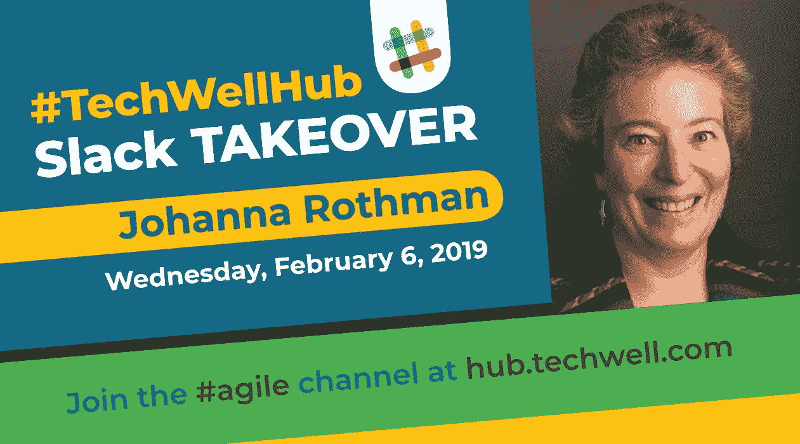

# 敏捷行业面临哪些挑战？与约翰娜·罗斯曼的松散收购

> 原文：<https://medium.datadriveninvestor.com/what-challenges-is-the-agile-industry-facing-a-slack-takeover-with-johanna-rothman-b2299156edb9?source=collection_archive---------14----------------------->

作者:欧文·戈蒂默

整个软件社区的思想领袖将接管 TechWell 中心一天，介绍他们自己，回答问题，并参与对话。

Johanna Rothman 是敏捷软件开发领域的传奇人物，拥有 20 多年的经验。这位“务实的经理”主持了我们的第二次 Slack 接管，引发了一些颇有见地的讨论。以下是来自 Hub 的一些最有用、最具信息性的对话。

# 敏捷行业如今面临着哪些挑战？

当今敏捷行业面临的挑战是什么，你如何应对这些挑战— @Kelly M

技术总是在变化，随着变化而来的是逆境。无论我们在某方面有多少专业知识，我们都面临着持续的挑战，必须学会适应才能继续成长。@johannarothman 分享了她的三大敏捷挑战:

1.  技术卓越。如果我们没有卓越的技术，我们就不能“走得快”。
2.  稳定的，完全有能力的团队。我们需要学习如何一起工作，我们需要学习产品，我们需要创造工作的自动化/系统。
3.  卓越管理。管理者需要学会管理项目组合，这样他们就不会陷入资源效率的思考中。

为了应对这些挑战，Johanna 建议帮助开发人员和测试人员一起创造技术优势。我们可以教开发人员如何编写测试作为他们工作的一部分，我们也可以教测试人员如何阅读代码以理解代码中的决策点。

# 我们应该如何管理那些试图领导敏捷转型却没有足够广泛经验的人？

*“在管理那些试图领导你的组织转型的人方面，你有什么建议吗？这些人没有足够广泛的经验，也没有体现出应该从敏捷中获得的价值观(例如，尊重、透明等)。)并且过于专注于使用一种工具(比如 scrum)，——@ Michelle Vaughn*

敏捷方法有助于满足业务需求，所以管理试图领导敏捷转型的人的第一步是弄清楚这些需求是什么。问他们需要什么，然后找出让他们达到目的的最佳策略。@johannarothman 认为敏捷方法实际上并不能让你“更快、更好、更便宜”，而且 Scrum 通常不是答案。

@johanterink 附和 Johanna，指出“Scrum 不是银弹。”相反，Scrum 是一个有可能帮助你实现目标的框架，但是你可以使用 Scrum(或者另一个框架)来实现最终的商业目标。

Johanna 还指出，奖励系统可能会阻碍成功的转型，因为“太多的经理被激怒，无法**而不是**活在敏捷思维中。”

# 怎样写作才能在不断的学习中获得最大的价值？

“我需要在 LinkedIn 或 Medium 上发表一篇文章，介绍我的成果和学习情况。顺便说一句，在通过短文进行持续学习和反思的过程中，你认为哪一个或其他什么更有价值？”—@维克·巴尔塔什

写作是一种很好的反思方式。当你把一个问题、一个解决方案或者一个总结写在纸上时，你可以从新的角度看待障碍或者巩固成功的习惯。

@johannarothman 写东西有几个原因:教点东西，学点东西，建立反思的实践。写作可以帮助你更好地理解发生了什么和你学到了什么。

Johanna 也建议为自己写作，字面意思。她建议先写自己的博客，然后在 LinkedIn 或 Medium 等其他平台上分享你的想法。或者为一个网站(比如 agileconnection.com 的[)写作，这个网站付钱给你并允许你以后在你的网站上转贴你的作品。](https://www.agileconnection.com/)

# 如何才能创造出更高质量的用户故事？

*“我们敏捷转型面临的挑战之一是需求(故事)的格式和质量。这些故事仍然只是基于水平组件(前端、后端、集成)创建的技术任务。我们的 POs 很难像垂直切片一样创建真实的用户故事。在某些情况下，即使创建了一个“垂直”需求，它也是一部史诗，而不是一个故事。进一步的分割让我们回到按组件分割史诗。你对如何在这方面做得更好有什么建议吗？”— @Ana*

创建高质量的用户故事可以帮助敏捷团队更加高效地工作。然而，要让团队正确地格式化、编写和计划需求是一个挑战。@johannarothman 列出了五条有用的建议:

1.  定义各种用户角色
2.  记住开发人员和测试人员也是用户
3.  考虑一下最低可能是多少
4.  使用 Jeff Patton 的*用户故事映射*书来思考特定用户的产品之旅
5.  重新培训。阿宝一个人写不了所有的故事，阿宝也不应该。在我看来，认为你可以在敏捷环境中隔离出一个特定的角色是不明智的。

# 延伸阅读…

*   [*创造你成功的敏捷项目*](https://pragprog.com/book/jragm/create-your-successful-agile-project)
*   [*管理您的项目组合*](https://pragprog.com/book/jrport2/manage-your-project-portfolio-second-edition)
*   [平衡创新、承诺、&反馈循环:总结](https://www.jrothman.com/mpd/agile/2019/01/balance-innovation-commitment-feedback-loops-summary/)
*   [目标&问责制 vs 责任&自主权，第 2 部分](https://www.jrothman.com/mpd/2018/07/objectives-accountability-vs-responsibility-autonomy-part-2/)
*   [资源效率与流动效率，第五部分:流动如何改变一切](https://www.jrothman.com/mpd/agile/2015/09/resource-efficiency-vs-flow-efficiency-part-5-how-flow-changes-everything/)
*   [敏捷团队:不要使用快乐指标，测量团队士气](https://medium.com/the-liberators/agile-teams-dont-use-happiness-metrics-measure-team-morale-3050b339d8af)
*   [帮助经理可视化他们的问题](https://www.jrothman.com/mpd/2018/12/help-managers-visualize-their-problems/)
*   [工资成本和项目人工成本](https://www.jrothman.com/mpd/agile/2010/03/wage-cost-and-project-labor-cost/)
*   [*从混乱到成功的分布式敏捷团队*](https://leanpub.com/geographicallydistributedagileteams)
*   [我们试过棒球，但没用](http://ronjeffries.com/xprog/articles/jatbaseball/)
*   [什么是最小:思考最小可行实验](https://www.jrothman.com/mpd/2017/01/whats-minimum-thinking-about-minimum-viable-experiments/)
*   [*用户故事映射*](https://www.amazon.com/User-Story-Mapping-Discover-Product/dp/1491904909/ref=asc_df_1491904909/?tag=hyprod-20&linkCode=df0&hvadid=312091457223&hvpos=1o1&hvnetw=g&hvrand=15541122117219347145&hvpone=&hvptwo=&hvqmt=&hvdev=c&hvdvcmdl=&hvlocint=&hvlocphy=1027188&hvtargid=pla-433523004851&psc=1&tag=&ref=&adgrpid=62820903995&hvpone=&hvptwo=&hvadid=312091457223&hvpos=1o1&hvnetw=g&hvrand=15541122117219347145&hvqmt=&hvdev=c&hvdvcmdl=&hvlocint=&hvlocphy=1027188&hvtargid=pla-433523004851)

# 你如何参与 TechWell Hub Slack 收购？

我们正忙于安排专家接管 TechWell 中心，并与社区分享他们的想法，并计划在二月份再进行两次接管:

接下来:迦娜·雷夫勒| 2 月 21 日

甲板上:迈克·伯顿| 2 月 28 日

加入位于[hub.techwell.com](http://hub.techwell.com/)的 TechWell Hub，与@JohannaRothman、@JannaLoeffler 以及我们全球软件社区的其他人联系。希望在那里见到你！

## 来自 DDI 的相关故事:

 [## 数据科学和软件工程哪个更有前途？-数据驱动型投资者

### 大约一个月前，当我坐在咖啡馆里为一个客户开发网站时，我发现了这个女人…

www.datadriveninvestor.com](https://www.datadriveninvestor.com/2019/01/23/which-is-more-promising-data-science-or-software-engineering/)