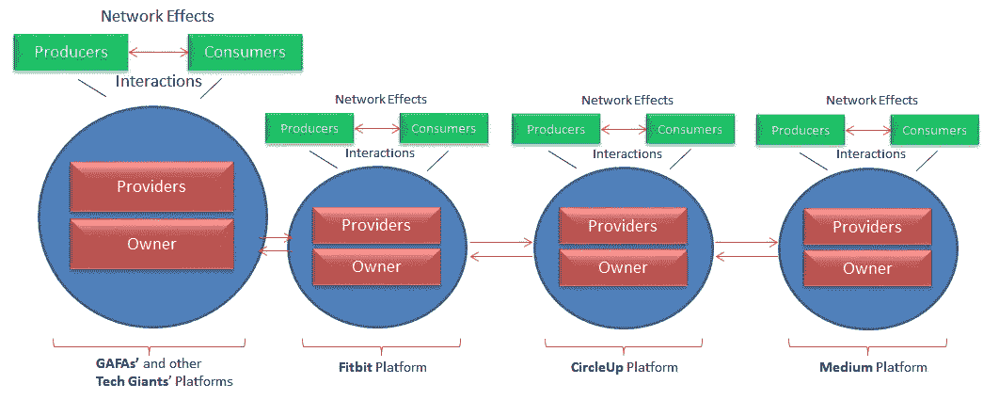
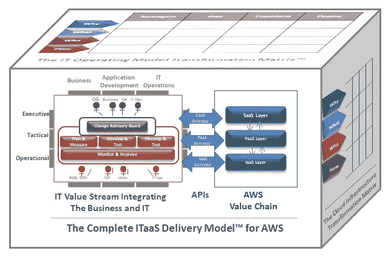

# 首席信息官迫切需要从 2019 年巴黎 AWS 峰会中学到什么

> 原文：<https://medium.datadriveninvestor.com/what-cios-should-urgently-learn-from-paris-aws-summit-2019-181ce4022360?source=collection_archive---------6----------------------->

Credit: Amazon Web Services

L 上周，我参加了巴黎 2019 AWS 峰会，这是我四年来第三次参加；2015 年在巴黎，2017 年在伦敦，今年又在巴黎。AWS 峰会是激动人心的时刻，它们将技术专家聚集在一起，进行联系、合作并了解 AWS。

亚马逊一如既往地做大事；从云和 DevOps 到人工智能、物联网和数据科学等各种技术的培训课程，涉及数百家初创企业、亚马逊合作伙伴网络所有成员的令人难以置信的创新解决方案演示，以及欧洲增长最快的 20 家公司的证词。太令人激动了。

> **我们正在见证全球化网络经济的成熟，它正在改变公司开展业务的方式，推动新的 IT 服务交付模式。这就是数字颠覆！**

然而，与大多数参观者和参与者相反，我的心不在这些令人难以置信的技术突破上；我在质疑一件很少有 IT 领导者关注的事情:**亚马逊的平台商业模式**。它使公司成为世界上最大的市场，对公司如何开展业务以及如何提供 It 服务产生了影响。IT 界很多人对这些变化充耳不闻。

 [## 敏捷管理:好的、坏的、丑陋的|数据驱动的投资者

### 公司不断重塑自己，以获得或保持竞争优势和市场份额。这是…

www.datadriveninvestor.com](https://www.datadriveninvestor.com/2019/03/26/agile-management-the-good-the-bad-and-the-downright-ugly/) 

教育考试服务中心(ETS)首席信息官丹·韦克曼是少数几个公开讨论这个问题的 IT 领导者之一；引用作者抱怨道& Johnson，
*商业价值的聚集者和创造者不再是公司供应链或价值链，而是网络生态系统。价值已经从创造产品和服务转移到促进外部生产者和消费者之间的联系，*”他恰当地问道，“*有哪个行业不是如此？*

丹是对的，正如我的书《打破现状——从 IT 现代化到数字竞争力》中的这张图片所示，我们都在见证一个全球化的网络经济是如何围绕谷歌、苹果、脸书和亚马逊(GAFA)以及其他亚洲科技巨头的平台商业模式构建的。

Network economy as engendered by the GAFA — Credit: Philippe Abdoulaye

最简单地说，平台是一种由在线市场支持的商业模式，它创造了涉及三个参与者的价值:*平台所有者*，它促进提供服务的*提供商*和购买服务的*消费者*之间的商业交易。*社区*的概念及其相关的*网络效应*有助于理解亚马逊是如何颠覆行业的。网络效应是指一项服务被使用得越多，它对用户的价值就增加得越多。

我观察到的是，亚马逊利用其品牌的全球价值——*客户痴迷*、*发明并简化*、*坚持最高标准*、*想得更大*、*交付结果*——来吸引不同行业的供应商和消费者，并将他们分成盈利社区。
通过亚马逊合作伙伴网络(APN)大规模雇佣创新提供商，在社区内形成了一种动态竞争，这不仅降低了价格，还带来了多样化的产品和服务目录，进而增加了消费者的订阅量，提高了他们的忠诚度，并确保了持续的收入。亚马逊的网络效应就是这么来的！

重要的是要知道，网络经济作为数字商业的基础正在扩展；它扰乱了行业，并给企业带来了新的挑战，包括用数字产品升级产品和服务组合以保持竞争力，削减成本(资本支出和 OPEX)以提高价格竞争力，提高运营速度以响应任何市场变化，以及实施保持客户忠诚度并确保持续收入的功能。
无论你是从事教育还是金融服务，需要解决的重要问题是:(1)你与行业内领先平台企业竞争的**数字战略，(2)你的 IT 价值流的**优化**，以及(3)你如何利用**云基础设施**来竞争。**

这些问题是首席信息官们当前的首要任务吗？首席信息官们是否意识到，为了帮助企业竞争，他们必须改进他们的云迁移愿景和战略？老实说，我不知道，今天的云实践令人困惑！

> 今天的 AWS 实践不适合日益增长的数字竞争的挑战；它们是 IT 为 IT 考虑的 IT 解决方案。只有使用 AWS 价值链作为将业务和 IT 整合到高 ROI 云运营模式中的手段的功能才会有所帮助。

IT 存在的理由是帮助企业实现业务目标，如市场份额增加、收入增长、品牌价值提升等。我们可以诚实地说，今天的云实践可能有助于企业在不断扩张的网络经济中竞争吗？诚实的回答是，它们是不完整的。

今天的 AWS 实践反映了 IT 组织对日益激烈的数字竞争毫无准备；它们是云迁移的临时方法，为特定的 IT 问题(如存储容量增加、应用程序成本削减或加快 IT 运营)提供即时解决方案。它们没有带来切实的商业价值！

事实是，使用 AWS 云作为整合业务的一种手段的总体情况是缺乏的；只要这种情况持续下去，今天的 AWS 云将仍然是 IT 为 IT 而不是为业务考虑的 IT 解决方案。

为了帮助企业在网络经济中取得成功，云实践者，特别是 AWS 工程师必须通过解决成功的*数字组织*的三个维度，将他们的实践提升到一个新的水平:IT 价值流、云服务和云基础设施:

The Complete ITaaS Delivery Model**™** for AWS — Credit: Philippe Abdoulaye

我为 AWS 开发的完整 ITaaS 交付模型最近在 [BAIP 技术和弹性大会](https://www.youtube.com/channel/UC9NZlGkVcDIH3SsH8Zba5fA)上展示，该模型基于这样一种信念，即使用 AWS 价值链(AWS SaaS、PaaS 和 IaaS 服务的集合)作为其 IT 的延伸，可能会交付具体的业务价值。

被当今的云实践者所忽视的 IT 价值流结合了组织、运营和 IT 运营优化的最佳实践—敏捷、精益、ITIL —来交付实际的业务价值。
AWS 价值链是一组 AWS 服务，它们被改造成**云运营模式**，专门用于帮助企业满足网络经济的要求。我将在下一篇文章中讨论完整的面向 AWS 的 ITaaS 交付模型。

关键的一点是，围绕 GAFA 和亚洲科技巨头构建的网络经济不是虚构的，而是残酷的现实，它正把成千上万毫无准备的公司踢出业务。请记住，尽管在云和 DevOps 方面进行了大量投资，而且这些大师们也提出了建议，但*玩具反斗城*、*玖熙控股*、 *Bon-Ton Stores* 、*雷明顿*、*东南杂货商*和*顶级市场*在 2018 年申请破产。

如果你是一家企业，而你的 AWS 云并没有提供切实的业务优势，问问你自己，“*为什么不利用 AWS 价值链作为我的 IT 的延伸？*“如果你是参与项目的顾问，问问你自己，”*为什么不通过实施 AWS 价值链作为客户 IT 的延伸来产生影响呢？*”

[立即参加 Philippe Abdoulaye 的在线研讨会，深入了解如何通过 DevOps 获得业务收益。](https://www.udemy.com/devops-business-benefits/?couponCode=DEVOPS4FREE)04/20 前免费。