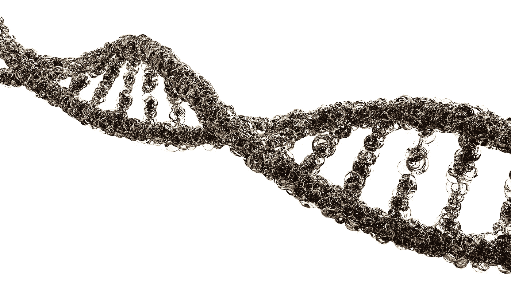
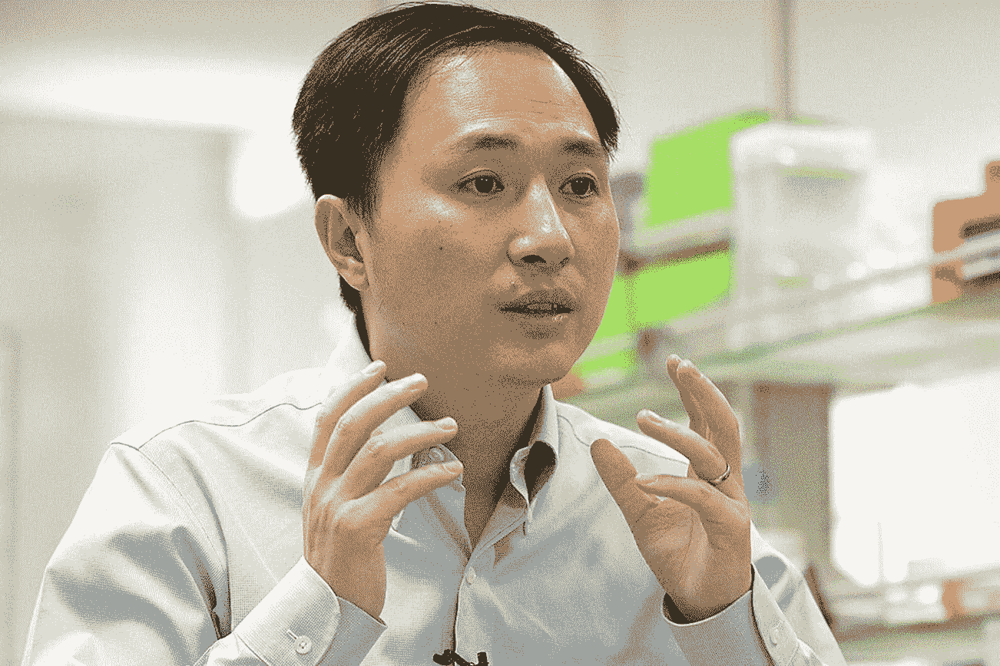

# CRISPR“设计师”婴儿对未来社会意味着什么

> 原文：<https://medium.datadriveninvestor.com/what-crispr-designer-babies-mean-for-the-future-of-society-a9d20d783f31?source=collection_archive---------16----------------------->

*为什么设计婴儿的危险先例必须激发行动的呼声*

By [LionFive](https://pixabay.com/en/users/LionFive-6666742/) [Pixabay](https://medium.com/u/a640208c527a?source=post_page-----a9d20d783f31--------------------------------)

> 这篇文章的主题与中国出生的双胞胎女孩的基因组被使用 CRISPR-Cas9 编辑的说法有关，未经证实，也没有经过科学界的审查或同行审查。没有科学数据向公众公布。在这个时候，关于这个有争议的问题的一切都是基于何建奎未经证实的说法。这篇文章试图扩展已经写好的信息，而不是报道这个故事本身的新闻。

大约 24 小时前，[中国南方科技大学副教授何建奎](http://www.sustc-genome.org.cn/for_public.html)在他的 YouTube 页面上传了[五段视频](https://www.youtube.com/channel/UCn_Elifynj3LrubPKHXecwQ)。在书中，他描述了双胞胎女孩露露和娜娜的出生。这对双胞胎是涉及七对中国夫妇的试验的一部分。在所有这些夫妇中，父亲是艾滋病毒阳性，母亲不是。何博士声称，在胚胎阶段，露露和娜娜的基因组都是使用 CRISPR-Cas9 进行修改的。特别是， *CCR5* 基因被移除，该基因编码一种与人体免疫缺陷病毒(HIV)摄入宿主细胞有关的受体。这项研究是在明显保密的情况下进行的，许多医学专家质疑这项研究是否必要或安全，特别是考虑到已经有了防止艾滋病毒从父母传染给孩子的既定方法。

这一说法是在 2015 年由中国研究员黄俊九领导的《蛋白质杂志》发表的一篇关于基因组编辑人类胚胎的报告之后提出的。这份先前的报告是在从生育诊所获得的非存活人类胚胎中进行的。黄用 CRISPR-Cas9 系统注射了 86 个胚胎，其中 71 个胚胎存活，54 个进行了基因测试，只有 28 个按照预期进行了修改。该团队停止了研究项目，因为他们觉得该方法仍然“太不成熟”。

现在，何医生自报了一个极不道德的做法。这项研究没有按照学术协议、国际科学协议或学术机构的任何监督进行。相反，这项工作是与一家私人生育诊所合作进行的。

何医生[在他的实验室网站上发布了一份“治疗性辅助生殖技术的伦理原则”清单](http://www.sustc-genome.org.cn/for_public.html)，其中包括“怜悯有需要的家庭”和“只针对严重疾病，绝不虚荣”，这是一种传达伦理道德意识的空洞努力。

在列出的“原则”中，没有一条能抵消已经发生的重大伦理飞跃。在这个例子中被删除的基因 *CCR5* ，很可能不是减轻艾滋病毒从父母到孩子传播的最安全的方法，因此对露露和娜娜的风险很可能超过了其他可能被利用的医疗实践的好处。

发布 YouTube 视频后，这个故事被[麻省理工科技评论](https://medium.com/u/defe73a9b0ba?source=post_page-----a9d20d783f31--------------------------------)和[美联社新闻](https://apnews.com/4997bb7aa36c45449b488e19ac83e86d?utm_content=buffer3dee8&utm_medium=social&utm_source=twitter.com&utm_campaign=buffer)转载。在最初消息发布后的几个小时里，其他新闻媒体争相加入这场争论，有时还会提供令人沮丧和担忧的先见之明。在《卫报》的一篇文章中，苏格兰爱丁堡大学的生物伦理学家 Sarah Chan 博士称何博士的说法“有严重的伦理问题”

何博士目前正在接受中国南方科技大学的调查。该大学声称“它并不知道这个研究项目，而且这位名叫何建奎的学者自 2 月份以来一直在无薪休假。”

在加州大学伯克利分校今天发布的一份声明中，CRISPR-Cas9 的共同发明人 Jennifer Doudna 呼吁何博士“全面解释他们与全球共识的决裂，即目前不应继续应用 CRISPR-Cas9 进行人类生殖系编辑”。张峰的实验室是第一个使用 CRISPR-Cas9 编辑人类细胞 DNA 的实验室，他表达了类似的担忧，敦促暂停基因编辑胚胎。

无论何的说法是否属实，它们都严重违反了 2015 年第一届人类基因组编辑国际峰会期间达成的国际科学协议。

He Jiankui

何宣布这一消息的时机也并非偶然。今天，第二届人类基因组编辑国际峰会在香港开幕，包括詹妮弗·杜德纳、张峰、刘中达和诺贝尔奖获得者戴维·巴尔的摩在内的许多知名人士出席了会议。何博士定于明天在峰会上发言。

在香港的峰会上，中国科学家已经谴责了何博士的行为，指出“何博士所做的不仅仅是修改体细胞或种系基因组，而是为了增强而修改种系基因组。这是一种最没有道德合理性和可接受性的做法”。他们进一步指出，已经存在预防艾滋病毒感染的实用方法，为此目的使用基因组编辑类似于用大炮射鸟。

目前很清楚的是，何博士所做的独立的、未经规范的、未经证实的声明引起了科学家和患者的严重关注。在这个节骨眼上，考虑接下来会发生什么可能是有先见之明的。科学界今天做出的决定可能会对生殖系编辑的未来产生重大影响。

## **超越伦理，进入立法**

在第一届人类基因组编辑国际峰会上，由于科学方法的不确定性，研究人员同意不进行人类胚胎基因组编辑。2017 年，何博士在冷泉港实验室发表演讲时提到，当时在体外受精方法中使用 CRISPR-Cas9 很少产生“脱靶效应”，但只有一部分胚胎内的细胞被成功编辑。此外，科学家尚未研究 CRISPR 编辑对人类的长期影响。

虽然伦理准则对于制定有意义的政策来规范 CRISPR 在人类患者身上的使用是必要的，但现在显然迫切需要真正的政治和国际立法来惩罚其未经授权的使用，直到科学机构仔细研究并批准其在特定情况下的使用。

## 不要扼杀技术

使用 CRISPR-Cas9 编辑生殖细胞*而没有有害影响*，如果属实，标志着 CRISPR 在应用于精准医疗方面取得了实质性进展。虽然使用基因组编辑技术来安全地纠正遗传性疾病有望在某一天成为现实，但在此期间仍应受到监管。就像制药公司向政府申请批准的任何药物都要经过严格审查一样，CRISPR 药物也应该受到严格审查。事实上，*就是这种情况*，因为人类 CRISPR 试验[本来计划在美国](https://futurism.com/human-crispr-trial-fda-stops)开始，但被 FDA 抢先叫停。

针对最近这一事态发展的不适当或严厉的监管可能会扼杀这一领域的进一步发展，但应由国际专家进行彻底调查，以确保单独行动者不会重复何博士的行动。

## **责备过后，一个决定**

既然何博士“背了黑锅”，那么其他科学家该如何应对？那么，他们应该首先谴责何博士的行为，缓解焦虑的公众的担忧，并努力建设一个在将人类健康置于风险之前完全遵循科学程序和法规的未来。

国际政府应该制定政策，在单独行动者对科学可信度造成不可挽回的伤害之前，规范非法使用 CRISPR 技术的传播。在政治进程的各个方面，伦理学家和学者应该共同努力，确保制定的法规是正当的，而不是限制性的。

CRISPR 有可能帮助人类活得更长、更健康。我们必须继续我们的研究目标，坚持我们对公众的承诺，让公众有机会揭开自然界的秘密。

在 Twitter @NikoMcCarty 上说说你的看法