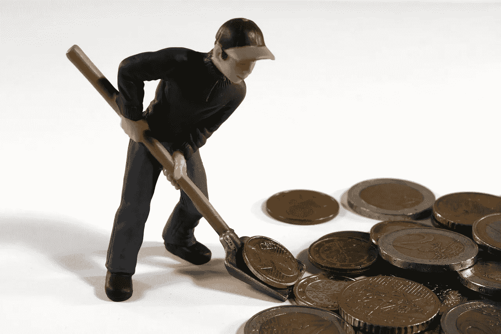
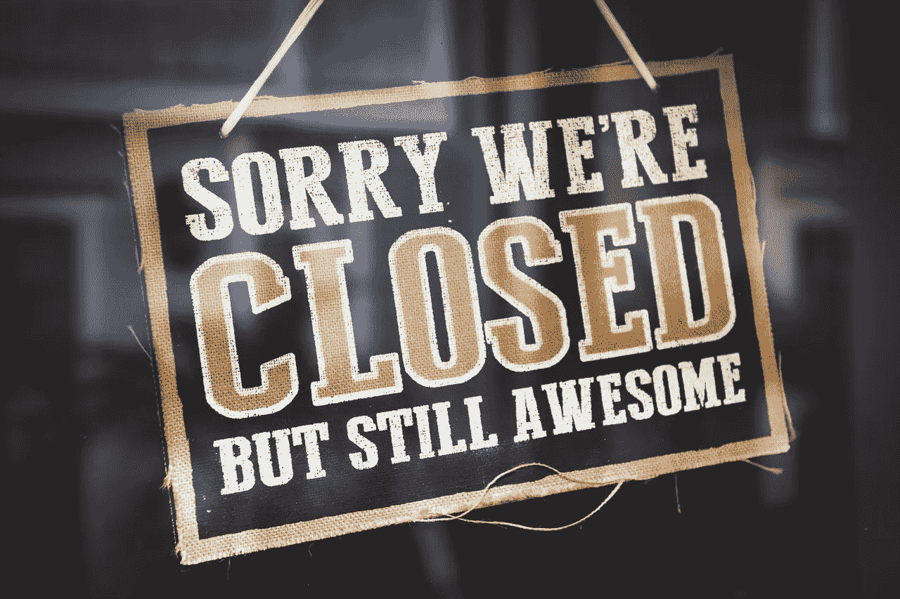

# 加密货币投机者可以从 Dot.com 崩盘中学到什么？

> 原文：<https://medium.datadriveninvestor.com/what-cryptocurrency-speculators-can-learn-from-the-dot-com-crash-b789ae99dda7?source=collection_archive---------23----------------------->

最近的加密货币崩盘和 2000 年 Dot.com 大崩盘之间的比较如今随处可见。这些比较很有用，因为加密货币投机者和企业家可以从世纪之交的 Dot.com 泡沫中学到很多东西。

对于那些太年轻而不记得的人来说，dot.com 泡沫是网络企业股票的过度销售。几乎所有这些企业都是投机性的，其中许多是理论性的。

然而，推广者让大量投资者相信，电子商务就是未来。特别是，他们向可疑的电子商务初创公司投入了大量资金，比如 Pets.com 的(以其袜子布偶电视广告而闻名)，但都失败了。

另一方面，历史告诉我们，投机者是对的。18 年后，电子商务公司赚了很多钱。dot.com 泡沫投资者在错误的时间有了正确的想法。

【Dot.com 泡沫破裂给加密货币投机者的教训】

显然，今天的加密货币投机者可以从 dot.com 泡沫破裂中学到很多东西。加密货币投机者可以从 dot.com 泡沫破裂中吸取的教训包括:

1.永远不要因为一次失败就放弃一项技术。**亚马逊(NASDAQ:AMZN)**；在萧条期间注销的股票，在 2018 年 9 月 21 日的市值为 9327 亿美元。

2.采用新技术需要很长很长的时间。亚马逊始于 1995 年，但 20 年来，电子商务并未影响主流业务。此外，流媒体视频始于 20 世纪 90 年代末，但大多数人直到最近五年才开始观看。

3.会有很多错误的开始。早在 20 世纪 90 年代末，雅虎和美国在线(如果你不到 30 岁，谷歌他们)是主要的搜索引擎。今天，两者都是大型媒体公司的小部分。

4.更新更好的平台很可能会出现并主导行业。例如，大多数人直到 dot.com 泡沫破裂四五年后才知道谷歌。

5.媒体关于加密货币崩溃的叙述将是错误的。显然，媒体在 2000 年就认为电子商务已经死亡。杰夫·贝索斯 1620 亿美元的财富最终证明，讣告为时过早。

6.大众对这次事故的看法甚至不如媒体的叙述准确。一般来说，媒体版本会包含一点事实，但暴民会将流行的概念建立在偏见和道听途说的基础上。

7.市场先生会回报长期投资者。市场先生用股票价值难以置信的增长率回报了那些保持信仰的 dot.com 信徒。(参见亚马逊、脸书(纳斯达克股票代码:FB)和 **Alphabet(纳斯达克股票代码:GOOG)** 的例子)。

8.崩溃、泡沫和破灭对技术的长期发展几乎没有影响。回顾 2018 年，dot.com 的破产并没有减缓电子商务的发展。

9.崩溃和萧条将使加密货币变得更加强大。例如，dot.com 泡沫破灭扼杀了大多数疲软、欺诈和不切实际的互联网股票。例如，像 Pets.com、[Boo.com](https://en.wikipedia.org/wiki/Boo.com)和 Webvan 这样的垃圾被扔进了下水道。另一方面，像亚马逊这样的好公司变得更强大了。

10.好人会活下来。亚马逊、谷歌等领导力好的强势互联网公司活了下来，赚了钱。弱者破产死亡。

11.许多商业计划都是不成熟的。比如说；一个臭名昭著的 dot.com 半身像公司， [Webvan，](https://en.wikipedia.org/wiki/Webvan)有一个与[**Ocado**](https://marketmadhouse.com/ocado-tests-driverless-grocery-delivery-supervalu-teams-with-instacart/)**Group PLC(LON:OCDO)**和 Instacart 几乎相同的商业计划。问题在于，18 年前，支持当天在线杂货的技术和基础设施并不存在。

12.现实世界的成功胜过最好的计划。亚马逊成功了，因为杰夫·贝索斯能够兑现他的承诺。大多数 dot.com 人都死了，因为他们不能执行他们的计划。所以，在商业计划书之前先看公司或者产品。

13.本·格雷厄姆是对的。很明显，价值投资的始祖为投资者制定的第一条规则是问“它赚钱吗？”很明显，格雷厄姆的第二条戒律是看到第一。每当你看到一种新的加密货币或区块链应用程序时，就问 Graham 的问题，并一直问下去。

14.因此，当你看到加密货币或区块链平台的提案时，总是问自己它赚钱吗？它将如何为你赚钱。如果你不能回答这些问题，不要浪费你的钱。

15.顽强的生存下来。例如，杰夫·贝索斯是世界上最富有的人，也是电子商务之王，因为他太固执而不肯放弃。贝佐斯并不比他的竞争对手更聪明，他只是更顽固。所以意志坚强的人推广的加密货币一定会成功。

16.成功需要大量的血汗和泪水。电子商务的历史证明，没有快速成功或一夜暴富这样的事情。相反，成功的区块链企业家将不得不牺牲、失败、努力工作，并且可能在他或她赚钱之前经历地狱。

17.在投资创业公司时，总是问自己“创始人会为了他或她的梦想去地狱吗”。如果答案是否定的，那就离远点。

18.好的技术会成功。如果加密货币和区块链是好技术，就像我相信的那样。尽管经历了崩溃和萧条，他们还是会成功的。搜索引擎在 dot.com 泡沫破灭后蓬勃发展，因为它们是一项拥有巨大潜在市场的好技术。

19.亚马逊、Alphabet、易趣、贝宝、网飞、YouTube、Etsy 等的成功。，证明电子商务赚钱。

20.注意大局而不是头条。总的来说，加密货币是一种具有巨大市场潜力的颠覆性产品。崩溃并没有改变这一点。

21.阅读财务报告，而不是标题。沃伦·巴菲特通过研究公司的财务报告，无视投资媒体，成为世界上最富有的投资者。因此，研究关于加密货币的市场信息、白皮书和数据，忽略大多数“新闻”文章。一个好的开始是停止阅读加密货币新闻来源，关闭像美国消费者新闻与商业频道这样的网络。

22.读点历史。阅读历史书、博客、回忆录等。试着找出 2000 年到底发生了什么。不要依赖报纸上耸人听闻的报道或你父亲的回忆。这样的轶事回忆总是不完整的，而且通常是完全错误的。

显然，投机者可以从 dot.com 崩盘中学到的最重要的教训是研究金融和货币历史。这不是未来的完美指南，但历史将帮助您了解加密货币及其发展方向。

最后，自己思考，自己拿主意。最成功的投机者总是那些独立思考的人。投机者随波逐流，会被多头和空头踩在脚下，赔钱。

如果你想在加密货币中赚钱；研究它，收集尽可能多的信息，并一直思考它。你对加密货币了解和思考得越多，赚钱就越容易。

加密货币投机者从 dot.com 崩盘中得到的最终教训是，要学会从历史和其他一切事物中吸取教训。你学得越多，你就能赚越多的钱。

这个故事最早出现在 [*市场疯人院*](https://marketmadhouse.com/) 你对加密货币疯狂的观赏画廊。