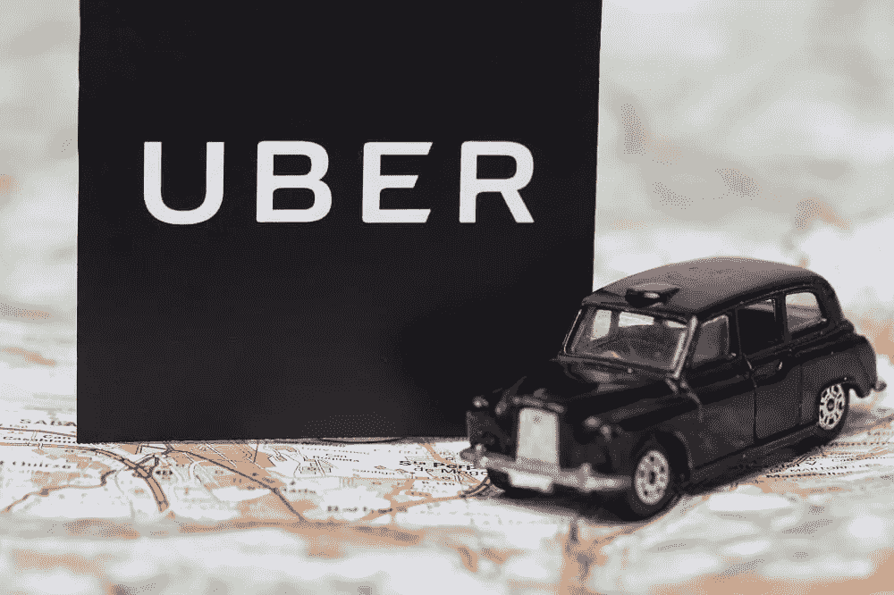

# 优步的数据科学家在用你的数据做什么

> 原文：<https://medium.datadriveninvestor.com/what-data-scientists-at-uber-are-doing-with-your-data-c82ead10326c?source=collection_archive---------0----------------------->

从一个地方到另一个地方从未如此简单，因为你所要做的就是打开优步应用程序，输入你的目的地，然后点击“查找搭车”仅此而已。但你有没有想过，在这个让你轻松旅行的应用程序上，简单的点击背后发生了什么或复杂的过程？

当你在等出租车，到达目的地后忘记一切的时候，优步的一个数据科学家团队不知疲倦地工作，以解决现有的挑战，提供更好的用户体验，改进其地理地图，并研究无人驾驶汽车。这些好奇的灵魂使用机器学习不仅可以改善你的体验，还可以让他们的技术学会在未来更好地为你服务。

优步真正使用深度学习的需求不是表面的。一家完全基于应用程序的公司，一方面与客户互动，另一方面与司机互动，在这样一个动态而复杂的环境中运营，同时处理一百万个变量，这是由使用机器保持智能的必要性驱动的——不仅仅是有限的计算，还包括通过人工通用智能解决高阶智能问题(AGI 是指越来越像人类一样思考的能力，随着每一次暴露揭示更多关于人的行为，变得越来越聪明)。

> 这家 2009 年初创公司的机器学习负责人丹尼·兰格在接受采访时说，“机器学习从一开始就已经融入了我们的 DNA。”他还补充说，“我们希望将机器学习作为一种内部服务来创建——以确保它不仅仅是市场管理中的一个部分，而是公司的每个部分。随着时间的推移，我们发现机器学习确实在人们最初不认为机器学习是一种选择的领域增加了价值。”

**智能乘车管理**
你预订的每一次乘车都给优步的人工智能团队提供了大量关于你的信息——从你的首选乘车点到你最常去的目的地。优步记录你的行为、偏好、兴趣，甚至你手机的电池电量。这有助于他们确定需求，分配资源，并制定票价以实现利润最大化。虽然有时团队会逐月使用数据，但需要更大的数据集来对可能追溯到几年前的某些任务进行季节性理解。数据专家的想法是聪明地收集数据，并清理数据以找到其中的相关性。

但这并不是优步的人工智能团队从信息中提取的一切。他们从司机那里收集更多的数据，不管他们是否载有乘客。司机的速度和加速度，他们的位置，他们是否为竞争对手(如 Ola)工作的数据都有可能被检索到。然后，人工智能团队从理解交通模式、预计到达时间、行程时间和高峰定价中做出推论。

**定价**
更长或更短的旅程时间给了他们实时定价的优势(还记得你看到的飙升价格吗？).数据科学家使用实时预测模型来估计需求和执行明智的定价。优步甚至为这种计算“激增定价”的方法申请了专利。连锁酒店和航空公司也以同样的方式使用动态定价来满足需求和调整价格，尤其是在公共假日、周末和热门活动期间。

人工智能团队开发的供需分析算法可以实时捕捉和监控交通状况和旅程持续时间。随着出租车需求的变化，价格会实时调整。随着交通状况的变化，旅程也在变化。这对司机来说很方便，因为他们可以决定主动出击需求较高的地区，并在需求下降时保持低位。

**制图**
数据科学家使用谷歌地图等几种地图服务建立模型。但是这些地图上的许多信息要么不相关，要么不准确(至少没有准确到他们希望的程度)。例如，如果你参观古尔冈的氛围购物中心，地图会向你和优步司机显示你已经到达目的地，而你可能距离你想进入的大门几乎 500 米。来自一百万次旅行的数据使该团队能够为特定的登机口提供接送服务，这些服务对最终用户来说似乎很基本。他们检索到的更多信息正在转化为增强的映射，以应对现有挑战并帮助进入下一个级别。

无人驾驶汽车位于匹兹堡的优步人工智能实验室正在进行无人驾驶汽车的实验，用不了多久，无人驾驶汽车就会变得单调乏味。通过利用深度学习改进他们的映射系统(这意味着机器在更多接触的情况下学习得更好，类似于人类的学习方式)，科学家正在带我们更快地进入未来。最棒的是，机器不只是通过算法学习一次，而是在测试和实现的整个过程中学习。随着更多的旅行，随着更多的模型使用人工智能建立，机器在处理前所未有的场景方面变得越来越智能。

优步对 AI 的应用不仅限于智能乘车管理或自动驾驶汽车；它还支持强制检测，简单来说就是欺诈检测，这样就没有人可以用偷来的信用卡或多个账户来预订出租车，以获得折扣等。它还在 8 月份收购了自动驾驶卡车公司 Otto，以利用人工智能浪潮，并抛弃那些使用过时技术的公司。