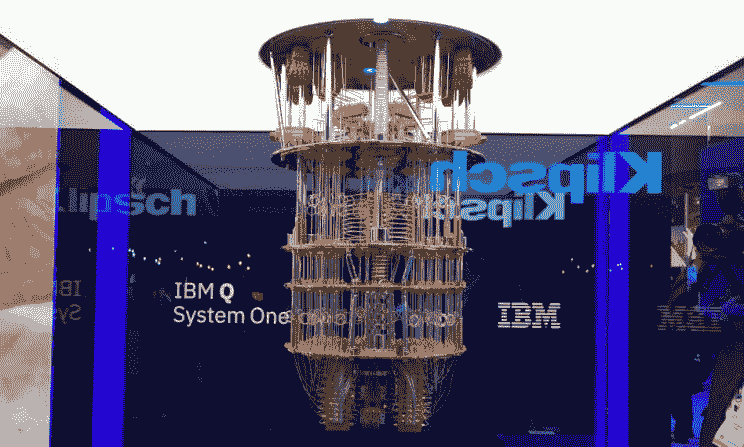
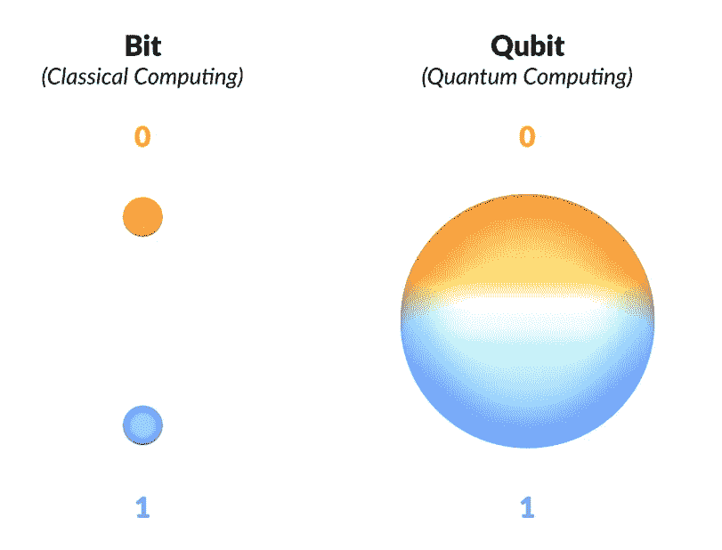
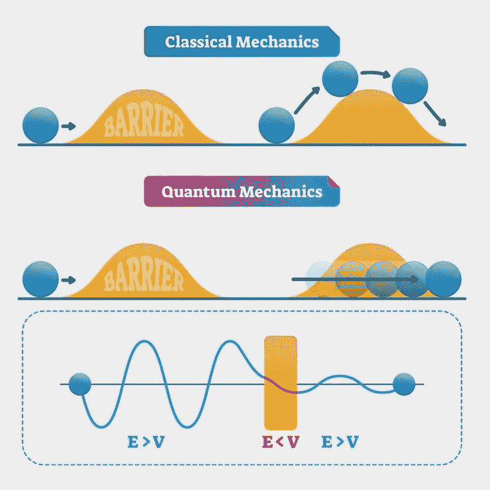

# 什么违背自然？量子计算机？

> 原文：<https://medium.datadriveninvestor.com/what-defies-nature-quantum-computers-f7ae180852d2?source=collection_archive---------1----------------------->

## 量子力学的怪异定律是开启未来计算能力的关键。

IBM quantum computer

当我第一次了解量子力学，量子计算机如此强大的潜在秘密时，我完全惊呆了。

通过利用量子力学的特性，我们可以解决世界上最疯狂的问题！是的，经典计算机在过去几十年里已经走得很远了。然而，仍然有大量的问题，即使是最强大的超级计算机也无法解决。

 [## 2019 年即将改变世界的技术|数据驱动的投资者

### 很难想象一项技术会像去年的区块链一样受到如此多的关注，但是……

www.datadriveninvestor.com](https://www.datadriveninvestor.com/2019/01/17/the-technologies-poised-to-change-the-world-in-2019/) 

量子计算机是一个完全不同的领域的一部分，它不仅仅是一台更强大的超级计算机。它的潜在前景是当今最强大的计算机所无法比拟的！

# 量子力学:超自然的自然强大的属性

量子力学是对微观尺度的亚原子粒子和原子的研究。这可能是一个很难理解的概念，但它绝对是有史以来最迷人的概念之一(好吧，我可能有偏见)！

经典计算机和量子计算机到底有什么区别？经典计算机遵循经典定律，量子计算机遵循量子力学。

## 引入量子位

经典计算机由经典比特建模。传统计算机上的所有信息都以比特或比特组合的形式存储，比特组合可以是 0 或 1。如果有两个经典比特，那么有两种可能的配置:[0，1]和[1，0]。

量子位具有某种神奇的力量，可以让它同时处于两种状态。这意味着量子位可以同时是 0 和 1。这是可能的，因为有一种叫做叠加的现象。

电子是一种亚原子粒子，具有一种称为自旋的特性，它基本上是一种角动量。量子位的状态指的是量子位的自旋。量子位的两种典型状态是:自旋向上和自旋向下。向上旋转代表 1，向下旋转代表 0。量子位可以以 0 和 1 两种状态的概率存在。这意味着对于 2 个量子位，有 4 种可能的配置或 2^N 配置，n 代表量子位的数量。

量子计算机上存储的信息量可能比经典计算机上存储的信息量大得多，因为量子位可以同时存在于多个状态中。

Qubits can exist in a combination of 0 and 1.

假设我在一个图书馆，我翻到一本书上的任意一页，贴了一张贴纸，上面有字母 X。想象一下，如果你不得不翻看每本书的每一页，只是为了找到带有字母 x 的标签，那将是非常乏味和耗时的。

现在，想象一下能够在同一时间翻阅每一本书。你可以在更短的时间内完成同样的任务。这就是叠加态允许量子计算机做的事情。利用叠加能量的量子位可以同时存在于多个地方，因此允许量子计算机同时进行多种计算。

## 量子纠缠

当叠加的力量和纠缠的力量结合时，可能性是无穷的。

假设我藏了两个弹珠，一个红色的，一个蓝色的在我手里。你的目标是猜猜藏在我每只手里的弹珠的颜色。如果你算出我右手有一个红色的弹珠，那么你也知道蓝色的弹珠一定在我的左手，反之亦然。

量子纠缠基本上是一个猜弹珠的游戏。

一个量子位可能同时以两种状态存在，但是一旦你测量了一个量子位，叠加态就会崩溃，因此，你只剩下一个最终状态。

当两个量子比特纠缠在一起时，这意味着一个量子比特的状态与与之纠缠的量子比特的状态相关。如果一个量子位被测量为处于自旋向上状态，那么它所纠缠的量子位必定处于自旋向下状态，反之亦然。这是因为状态的总和必须等于 0。

这意味着只需要测量一个量子位，就能算出它所纠缠的量子位的状态。

## 量子隧穿

当我年轻的时候，我绝对讨厌那些超级无聊、漫长而乏味的公路旅行。我总是想象如果心灵传输存在的话会有多方便。然后…当我研究量子力学并发现心灵传输确实存在时，我被震惊了！这好像是我一生中最快乐的一天，直到我发现这种疯狂的量子属性管理着称为量子隧道的传送并不适用于人类。

关于我已经说得够多了，是时候真正深入研究量子隧道了！

根据经典现象，如果重力势高于粒子的动能，粒子就不可能通过障碍。基本上，在经典物理学中，一个粒子不能穿过像墙一样的东西。

然而，量子世界却不是这样。由于一种称为粒子-波二象性的现象，这种现象解释了有时粒子的行为像波一样，反之亦然，亚原子粒子实际上有可能通过障碍。

一个亚原子粒子(比如电子)之所以能穿过障碍，是因为它表现出了类似波的性质。当一个亚原子粒子遇到一个障碍时，存在一个亚原子“波”的一部分穿过障碍的概率。因此，当亚原子“波”穿过屏障时，它的波会减弱，因为这是正常波的情况。

In classical mechanics, particles don’t pass through barriers. In quantum mechanics, particles can tunnel through barriers because they exist like waves. Waves dimish as it passes through barriers (seen in the 3rd diagram).

量子隧道令人印象深刻的一面是，它赋予了量子计算机执行经典计算机无法完成的事情的能力。

量子力学的本质允许量子计算机执行使用经典计算机永远不可能完成的计算。量子计算的一些应用包括:

*   模拟化合物用于药物发现等。
*   进一步加速机器学习领域(称为量子机器学习)
*   优化和物流:例如，优化杀死癌症的最佳辐射量
*   金融科技研究和预测市场趋势
*   网络安全
*   改善天气预报

还有更多的应用，随着我们在这一领域的进展，量子计算机的新应用可能会浮出水面。量子计算机的可能性和潜力是无穷的！

# 关键要点:

*   叠加允许量子位同时存在于两种状态
*   纠缠量子位的状态是相互关联的；如果一个量子位自旋向上，它所纠缠的量子位必定自旋向下
*   量子隧道允许量子位通过屏障
*   利用量子特性的量子计算开辟了计算可能性的新领域

如果你喜欢我的文章，别忘了留下一些掌声！还有，随时在 [*LinkedIn*](https://ca.linkedin.com/in/joey-mach-6293b1175) 上联系我！