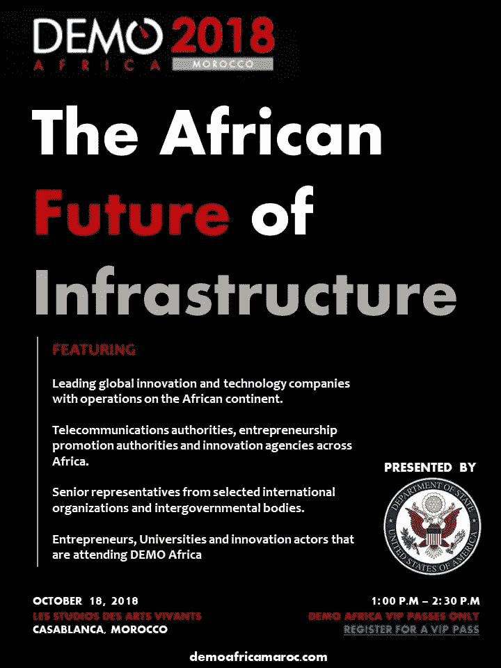
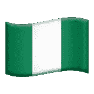

# 非洲演示教会我如何投资非洲

> 原文：<https://medium.datadriveninvestor.com/what-demo-africa-taught-me-about-investing-in-africa-5b20f7746444?source=collection_archive---------25----------------------->

几周前，我有幸参加了在摩洛哥卡萨布兰卡举行的非洲展示。DEMO Africa 是一年一度的盛会，汇集了来自非洲大陆的企业家和投资者。这是我第一次参加，也是对非洲创业生态系统的一个很好的介绍。

我最喜欢的会议是由美国国务院主办的基础设施峰会(见下文)。

在这篇文章中，我们讨论了非洲技术生态系统的一些核心系统，并概述了哪些基础设施项目取得了成功(和失败)。

> 我带着以下见解离开了会议，在评估非洲大陆的投资时，我打算牢记在心。

# 许多电信公司没有连接到谷歌/应用商店

我和一个在摩洛哥建立了一个共同工作空间和加速器的企业家交谈。他感叹道，虽然摩洛哥有许多训练有素的工程师，但当许多消费者没有应用商店时，很难建议他们开发应用。我感到非常惊讶——一个人怎么会有一部没有内置应用商店的手机呢？通过研究，我意识到我们的手机能够运行应用商店的唯一原因是因为我们为它们提供了财务信息。没有信用卡，应用程序商店无法运行。

大多数在非洲运营的电信公司都有不同的财务支付计划，以更有效地适应他们的用户。这些创新系统尚未与 Google Play 和 App Store 合作。

不过，这种情况正在慢慢改变。Orange 刚刚在埃及推出了直接计费，允许[市场访问 app store](https://fortumo.com/press/orange-fortumo-expand-direct-carrier-billing-partnership-to-egypt/) 。我们将看到这是如何继续发展的。

**为什么这很重要:**“传统”应用生态系统在整个欧洲大陆都被扼杀了。这是一个投资替代生态系统的巨大机会。

# 大多数消费者的数据存储极其有限

不像在美国，无限数据计划是许多手机用户事实上的选择，在许多非洲国家，大数据计划仍然是相对不正常的。这使得娱乐消费(尤其是在[尼莱坞](https://en.wikipedia.org/wiki/Nollywood)！)难。由于数据计划的限制，尼日利亚人看不到上传到 YouTube 上的许多尼日利亚肥皂剧。为了解决这一问题，谷歌创建了 YouTubeGo，允许用户在连接到 wifi 的情况下下载视频，以便以后使用。

但首先，手机必须配备 YouTubeGo 应用程序，因为(正如我之前提到的)，许多手机没有 Google Play 或应用程序商店。

**为什么这很重要:**投资高数据使用率的科技公司可能会大幅缩小你的市场规模。

# 从一个非洲国家到另一个非洲国家很难

DEMO Africa 展示了多哥、科特迪瓦、加纳和其他国家的企业家。我了解到他们进入摩洛哥的旅程非常艰难！许多人认为，对他们来说，飞往美国/欧洲比穿越非洲更便宜。

在深究此事时，我[了解到](https://www.citylab.com/transportation/2017/11/why-is-african-air-travel-so-terrible/546422/):

> “非洲大陆拥有大约 12%的世界人口，并将在未来 30 年内承担全球人口增长的大部分。但是它只占世界航空旅行市场的 1%。确实存在的航班往往比世界上其他地方类似时间的航线更贵。”

许多非洲国家深陷保护主义政策的泥沼，使得穿越大陆变得极其困难。

为什么这很重要:如果你希望你的公司在非洲大陆扩张，要考虑到每个国家都是非常独立的。

# 没有很好的客户获取渠道

我从非洲投资者那里听到的最常见的担忧之一是:市场准入。街上的传言是，尽管 Jumia 在网上广受好评，但它并没有受到很大的关注。电子商务领域仍然存在很多不信任。因此，投资者的焦点已经转向 B2B。许多消费者对与大型非洲企业合作改善体验感到兴奋。

**为什么这很重要:**如果你投资的是一家消费品公司，就要深入了解这位企业家的 G2M 战略。

# 再营养才刚刚开始——任重而道远

我从投资者那里听到的另一个普遍担忧是:没有足够的非洲企业家在非洲投资。但另一方面，我很惊讶(也很兴奋地看到)DEMO Africa 的许多初创公司都是由在国外生活、学习和工作后最近回到非洲大陆的非洲人创办的。但是还有很长的路要走。

**为什么这很重要:**非洲企业家对非洲初创企业投资的缺乏主要体现在天使/种子期之前。这对整个生态系统产生了连锁反应。

我希望这能帮助其他人获得更多关于非洲生态系统的信息。我非常看好在这个迷人而富饶的大陆投资。先驱公司已经在这里进行了两项投资——品尝者公司和 T2 公司。

我正在计划下一次去欧洲大陆的旅行。这次去拉各斯！如果你在尼日利亚举办科技会议，请告诉我。我很乐意去！