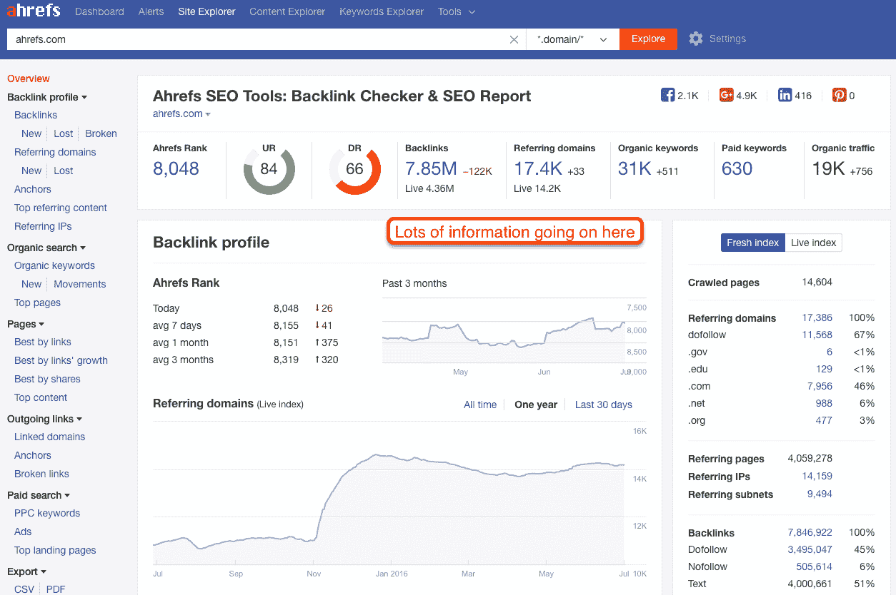
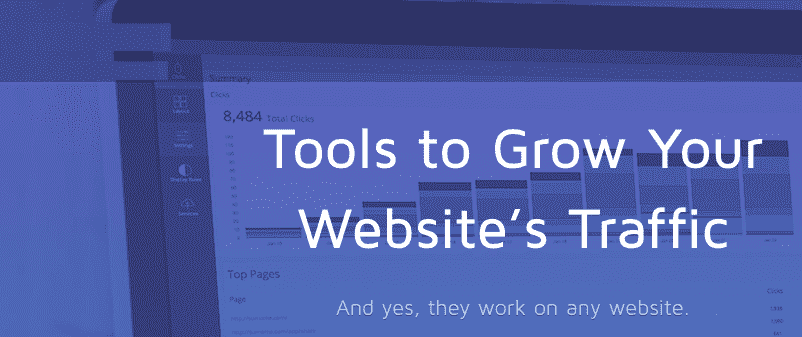

# 软件开发商能为你做些什么

> 原文：<https://medium.datadriveninvestor.com/what-developers-can-do-for-you-about-traffic-generation-marketing-653b3d09b914?source=collection_archive---------8----------------------->

我是开发商。我比大多数人更了解软件开发。但是，如果我告诉你，软件开发人员可以比数字营销人员给你带来更多的流量。

如果我告诉你，从长远来看，这也比付钱给营销人员更便宜，更好，会怎么样？听起来很疯狂，但这是真的。

 [## 数据科学和软件工程哪个更有前途？数据驱动的投资者

### 大约一个月前，当我坐在咖啡馆里为一个客户开发网站时，我发现了这个女人…

www.datadriveninvestor.com](https://www.datadriveninvestor.com/2019/01/23/which-is-more-promising-data-science-or-software-engineering/) 

我的意思是。

这是通过将智能软件工具融入你的商业网站。就像我在我公司的网站上添加了**一样。当我把这个工具添加到我公司的网站*时，*的流量在一年内从 *15K 上升到 55K* 。**

**Ahrefs 可以在很多方面帮助你。我不能告诉你所有的好处，但有一点我可以肯定地告诉你，Ahrefs 可以提高你的营销工作，你可以用它的工具集做很多事情。让我带你走一遍。**

> **首先，在你的**Ahrefs**[**Site Explorer**](https://ahrefs.com/site-explorer)中使用标签 **Overview、Referring Domains 和 Backlinks** ，你可以很快得到一份关于你的竞争对手公司的链接建设策略的报告。**

****

> **同样的，你可以通过使用 Ahrefs 中的 [**关键词浏览器**](https://ahrefs.com/keywords-explorer) **找到竞争度低的关键词来进行高流量的工作。您可以添加类似于关键字难度(KD)过滤器的过滤器，以了解低竞争和高商业潜力的关键字。****

**你也可以找出你的竞争对手的网页或帖子占了他们的有机流量的大部分。您可以使用 Ahrefs 站点资源管理器通过输入竞争域，然后输入 top pages 来做到这一点。你也可以寻找高流量的网页，以及你的竞争对手的网页很容易胜过。**

**也有可能找出严重的 SEO 问题伤害你的网站的性能，客座博文的机会，排名的进展，你的内容策略的差距，等等。使用 Ahrefs 工具有很多可行的方法。**

**为了帮助你把你的想法付诸实践，我尽量使事情简单化。**

**因此，好消息是软件工具也能解决你的业务问题，并帮助你达到你的营销目标。一旦你知道了你的市场状况，你就可以重新创造它，抓住新的商机。所以，如果你想为你的商业网站建立智能软件工具，雇佣软件开发人员为你工作更合适。**

**不同的业务领域需要不同的软件工具。这些工具可能有架构差异、开发方法和不同级别的实现策略。**

**对于大多数企业来说，技术生态系统需要以一种简化的方式工作，以获得最终的利润，只有专业的开发人员才能帮助你。**

## ****面向未来创新的软件工具****

****

**正如你从上面的信息中看到的，Ahrefs 到目前为止已经为我带来了 55K 的新访客。而且每月只花我 400 美元。**

**总而言之，有许多软件工具帮助维护了我们的业务，并且比其他任何东西都提供了更稳定的流量。我目前在公司网站上使用的工具有:**

## **[特雷罗 ](https://trello.com/en-US)**

***免费到每月 20.83 美元***

**Trello 是一个用于搜索和策划内容的内容管理工具。**

## **[**Canva**](https://www.canva.com/)**

***$12.95 每月***

**使用工具来创建自定义图像、形状、图标和字体是很棒的。**

## **[**BuzzSumo**](https://buzzsumo.com/)**

***每月 79 美元***

**一种内容研究工具，用于识别行业中的影响者，并帮助您与他们建立联系。**

## **[**谷歌分析**](https://analytics.google.com/analytics/web/)**

***免费使用***

**一个向你展示谁来了你的网站，他们在哪些页面上花费了时间和目标转化率的工具。**

## **[**Google Adwords**](https://ads.google.com/home/)**

***基于点击付费模式***

**它是在谷歌搜索引擎结果页面上为你的业务做广告的最好工具之一。**

## **[meet Edgar](https://meetedgar.com/)**

***每月 49 美元***

**一个社交媒体管理工具，可以写帖子，并从你在脸书这样的平台上发布的内容中给你最多 5 个重要亮点。**

## ******r******

*****免费到每月 199 美元*****

****社交媒体发布的另一个最佳工具，也提供对脸书帖子的分析。****

****成功营销工具的核心是软件开发人员的规划、研究和部署。企业有大量的工具来解决他们的业务问题。只有你可以决定首先关注哪里，哪些工具最适合你的公司结构和营销目标。****

****如果你想要一个免费的、全面的、一体化的软件解决方案，你可以雇佣在市场上也很突出的软件开发服务。****

## ******通过软件工具获取流量有多难？******

****在这一点上，你可能也想知道在你的营销中使用这些工具有多难。但如果你付钱给营销人员，他们可能不会让你的品牌立刻流行起来，这也是事实。****

****但问题是，当你建造了一些有用和体面的东西，它自然会获得人气和利润。****

****你所要做的就是联系一家定制软件开发公司，这家公司是业内最好的，为你的品牌打造一个工具或应用，耐心等待。如果你能把它做好，它当然会有更大的帮助。****

****看看 Ahrefs 工具的成功就知道了。它在市场上不断成长。****

## ****你觉得怎么样？****

****软件开发者的概念比数字营销者能给你带来更多的流量。是真的吗？是的，这是因为这将让你有工具，你可以免费使用你的营销免费很少或没有努力。****

****用软件工具来增加你的流量有点棘手，但是大多数企业都接受这个概念。但这并不意味着你必须跟随我的脚步。****

****只要去谷歌上搜索流量产生的最佳方法。它将为你提供大量营销工具的建议。这将让你找到一个工具，你可以免费使用，不需要在广告上烧钱。我要结束这篇文章了。如果您有任何建议或疑问，请在下面发表您的评论。****