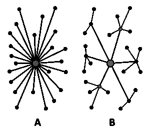

# 本周谷歌向我们证明了什么？

> 原文：<https://medium.datadriveninvestor.com/what-did-google-prove-to-us-this-week-40d938603efb?source=collection_archive---------18----------------------->

## 提示…那就是集中化不是前进的方向。

Centralizing The People’s Internet Isn’t The Way. Credit: [Pixabay](https://pixabay.com/photos/server-cloud-development-business-1235959/#_=_)

虽然我们都知道谷歌是一家非常大的公司，拥有超过 251 项个人产品和服务，但世界各地的许多人都感受到了谷歌云服务[在 2019 年 6 月 2 日周日被中断](https://www.zdnet.com/article/google-cloud-goes-down-taking-youtube-gmail-snapchat-and-others-with-it/)的影响。

虽然世界各地有许多人使用谷歌产品进行交流并推动他们的日常生活向前发展(在某些情况下，实际上是使用 Android Auto)，但本周的情况清楚地表明，谷歌维护并运营着更广泛的互联网的更大一部分，而许多人并不知道这一点。谷歌云是周日关闭的服务，负责运行谷歌服务，如 Gmail、YouTube 和 Blogger。许多人不知道的是，谷歌云负责运行许多服务，其中一些谷歌甚至不完全拥有，如 Pokemon Go、Snapchat 甚至 Shopify 等电子商务(在线购物)平台的在线服务。所有这些服务同时遇到问题，这让我想到，**互联网集中化是件好事吗？**

 [## 信息图:云之旅——数据驱动的投资者

### 聪明的企业领导者了解利用云的价值。随着数据存储需求的增长，他们已经…

www.datadriveninvestor.com](https://www.datadriveninvestor.com/2018/09/22/infographic-journey-to-the-clouds/) 

首先，我们来谈谈集中化。集权就是它在罐头上的字面意思。这意味着将**中的流程或活动集中到一个地方**。在这种情况下，我们可以说谷歌正在通过他们的谷歌云平台为互联网的集中化做出贡献，因为他们显然希望尽可能多的客户使用他们的服务。这种情况的糟糕之处在于，显然存在一个“单一故障点”，正如周日全世界所看到的那样。通过将世界上最常用的服务放在单一的云基础设施上，不可避免地会出现可靠性问题，更重要的是安全性问题。

A Centralized (A) VS A Decentralized (B) Network. Credit: [Wikimedia (CC)](https://commons.wikimedia.org/wiki/File:Decentralization_diagram.svg)

在我看来，拥有一个分散的互联网模型，或者互联网上使用最频繁的服务，会更好。分散模式的工作原理是让每个服务，比如 Snapchat 和 Shopify，运行在物理上独立的基础设施上。这样，**这里就没有真正的“单一”故障点。例如，使用“网络拥塞”的例子，如果我们网络的 Shopify 部分使用分散模型拥塞，这将意味着这个事件**不会**对网络的其余部分产生“连锁”效应。这意味着，虽然 Shopify 本身可能会遇到问题，但 Snapchat 等其他服务不会遇到问题。**

Can You Live Without Connectivity On This? Credit: [Pixabay](https://pixabay.com/illustrations/google-home-hub-google-device-3736492/)

这不是谷歌第一次在云技术上遇到问题。去年 6 月，谷歌主页和 Chromecast 服务[关闭](https://gizmodo.com/google-home-and-chromecast-outages-leave-users-with-ple-1827176110)，导致用户家中没有谷歌助手，也没有联网电视。对于一家声称希望让世界上的信息变得有用的公司来说，如果所有的信息都可以在这么一瞬间被取走，这可不是什么好事。

虽然我确实认为谷歌正在努力不断改善其云基础设施，但我确实认为没有云服务能够独自托管网络上所有种类和数量的服务和网站……至少现在还没有。

**注意:**上面解释的网络示例是集中式和分散式网络的非常简化的版本。值得注意的是，如果所有的互联网服务都转移到一个去中心化的模式，这将非常昂贵，这就是为什么许多公司喜欢“搭”一个更有声誉的在线公司的车，这些公司知道他们在做什么，就像亚马逊的亚马逊网络服务(AWS)和谷歌云本身。