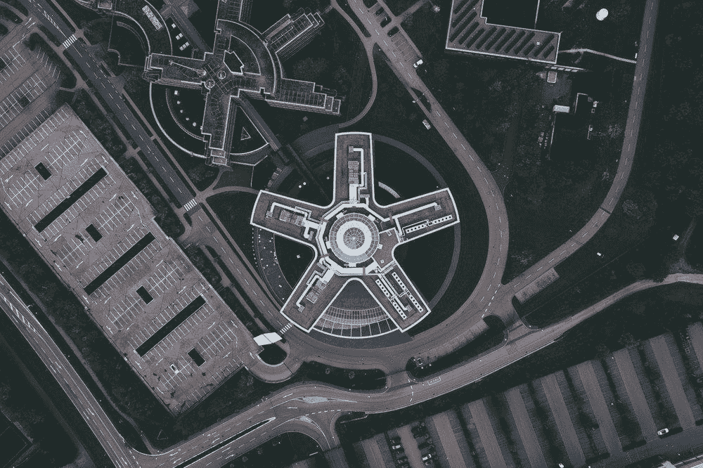

# IBM Watson 在商业 AI 战略上做错了什么

> 原文：<https://medium.datadriveninvestor.com/what-did-ibm-watson-do-wrong-in-business-ai-strategy-7392fd8f1a48?source=collection_archive---------0----------------------->

**沃森现在的健康状况不是很健康**

上个月， [IBM 缩减了其在沃斯顿的药物研发](https://spectrum.ieee.org/biomedical/diagnostics/how-ibm-watson-overpromised-and-underdelivered-on-ai-health-care)工作，不到一年前，[缩减了其沃森医院业务。](https://spectrum.ieee.org/the-human-os/robotics/artificial-intelligence/layoffs-at-watson-health-reveal-ibms-problem-with-ai)

难免有人会提出这样的问题——“AI 是否被过度宣传了？被长期吹捧的下一个人工智能冬天来了吗？”嗯，预测未来真的很难，尤其是像人工智能这样正在经历激烈进化的东西。但简短的回答是“不，不”。

 [## 值得购买的 4 大人工智能股票及其原因——数据驱动型投资者

### 人工智能(AI)在 2019 年继续进入大众意识。通过应用程序…

www.datadriveninvestor.com](https://www.datadriveninvestor.com/2019/03/06/top-4-artificial-intelligence-stocks-to-buy-and-why/) 

事实上，IBM 仍然拥有一些最优秀的研究人员和工程师，它仍然与一些顶级的学术机构合作。

IBM 绊倒的地方，是我所说的“*高管层面的不连贯商业人工智能战略”*。

**高价值、低风险**

我不是在指责 IBM 高层的缺点。说实话，在我于 2016 年开始宣扬商业人工智能战略原则——“高价值、低风险”之前 4 年，IBM 就推出了沃森医疗保健。所以，并不是说我比 IBM 更了解未来，更早。

然而，这并不意味着我们不能从沃森的不幸中吸取任何教训——尤其是在人工智能时代的新商业战略中。

是什么导致了沃森健康的麻烦？沃森医疗保健实际上有一些伟大的技术，人工智能能够识别癌症的照片，识别率甚至高于一些顶级医生。但那是在实验室里。企业高管在引入由人工智能驱动的商业模式方面几乎没有参考和经验，因此他们主要依赖工程师向他们展示可以完成什么，并在没有完全集成的商业人工智能战略的情况下进入市场。

医疗保健行业的特点正是我的商业人工智能战略负责人所呼吁的谨慎——医疗保健是一个**高风险**的行业。我们在谈论人们的生活。虽然理论上人工智能可以提高诊断的准确性，但它并不完美(它应该是 100%正确，没有假阳性，也没有假阴性)。错误，不管百分比有多小，都可能付出生命的代价——对于那些遭受那些“非常小百分比”错误的人来说，对个人和他们的家庭来说，这是 100%。

医生虽然会犯错误，但他是一个训练有素的医生，一旦获得更多信息，他就能做出反应，找到错误，并能根据反馈不断做出判断，对治疗(或缺乏治疗)做出反应，并动态调整治疗计划。另一方面，人工智能不能，它基于作为输入的“工程”数据给出它的意见，并且不能治疗患者，因此无论患者后来发生什么，都与人工智能的原始意见无关。虽然在理论上，它减少了误诊，但这是在*单*轮比较中做到的。由于诊断和治疗的脱节，增加了被误诊的风险。此外，由于人类医生几乎不理解人工智能为什么会提出某些建议，因此人类医生识别和纠正这些错误要困难得多。

对于药物研究来说，情况类似，虽然人工智能有更高的机会找到有很大希望的药物鸡尾酒，但当谈到临床试验时，我们谈论的是人类的生命，人工智能无法对 trail 患者的反应做出反应，并根据这种反馈引入额外的专业知识。对人工智能为什么会提出某些建议缺乏理解(或认同)也无助于说服我服用试验药物。

那么，什么是“*高价值，低股份*”的业务流程呢？通常，这些都是高容量(大量重复)和高容错的流程。例如，高速公路收费道路车牌识别，这是一项重复的工作(无聊)，如果人工智能错过了对车辆的充电，那不是世界末日。(但如果 AI 自动发出违规罚单，它可能会成为高风险用例，因此我会*而不是*建议自动发出罚单)。

另一个例子是餐馆菜单推荐系统——许多人去餐馆不确定他们想吃什么，向服务器请求推荐通常是漫无目的的，语音驱动系统实际上可以听就餐者的问题，分析他们的话，甚至口音，并给出最佳猜测。如果它成功了，那就太好了，如果没有成功，很可能除了增加客户参与度之外，没有造成任何伤害。(是啊，说的是 Jeopardy win 吧？)

**人工智能高管工具包**

企业如何避免 IBM Watson 的遭遇？

这是一个艰巨的任务——IBM 是历史最悠久的科技公司之一，比 IBM 更好不是许多企业能够做到的。

话虽如此，还是有希望的。看到 IBM 测试出一些商业策略，让我们其他人更加了解应该避免什么，应该着手什么。这里有一些商业高管可以放在他们的人工智能时代工具箱里的技巧。

*第一*，是商业战略，不是技术战略，除非你是研究所。这意味着商业领袖需要了解人工智能擅长(和不擅长)什么，为他们自己的业务服务。高管们需要学习足够多的人工智能技术来做出战略决策，他们不能把一切都委托给技术人员，否则，他们很可能会以“技术上可行”但财务上不可行，或商业上不可取的人工智能案例而告终。

*第二个*，人工智能并不简单地取代人类。(对于那些认为人工智能是一项技术并避免学习人工智能的高管来说，这一条*真的很难* *难*，参见上面的第一条)。许多人事经理习惯于“激励”员工，并含蓄地将行动和一些决策权授予下属。他们利用“软规则”,期望人类员工来填补这些线之间的空白。人工智能是不同的，领导者需要有一个非常清晰的愿景，知道什么是参与的规则，以及应该需要什么样的过程。容错需要设计到流程中，而不是依赖于员工的常识。人工智能的模糊性将被放大，结果将是不可预测的，或不可解释的。

第三，人工智能可以做人类做不到的事情(或者成本很高的事情)。例如，从成千上万张脸中找出一张脸，或者监视数百万次出现的信号以识别罕见的异常。因此，设计一个以前从未存在过的新业务流程，可能是人工智能时代商业领袖最有价值、也是最具挑战性的责任。

例如，大多数人都知道网飞的推荐确实能帮助顾客找到他们想看的节目。然而，在机器学习之前，电影推荐是*而不是*个性化的——一些“专家”写了一般性的评论，我们阅读它们，并决定他们的证书和评论是否值得我们冒险花几个小时去看一部电影。AI 让网飞比我自己更“知道”我喜欢看什么——它可以推荐我从未听说过的标题，而且四分之三的情况下，我都会喜欢它。它不依赖于评论文章，也不依赖于我阅读和信任它们的意愿。这是百视达没有意识到的新商业模式，并承受了后果。

**商业人工智能战略**

那么，AI 商业策略有没有万全的捷径？很抱歉带来了严峻的现实，我还没有遇到一个成功的人工智能企业将他们的成功归功于一个万无一失的规则。但是成功人士有一些关键的共性。

这些企业倾向于让数据科学家(或 ML 专家)成为其核心执行团队的一部分。对 AI 的知识和理解不能成为高高挂在图腾柱上的 techie“技能”。他们的核心执行团队内部的跨学科决策能力，涵盖“人工智能能为我的业务做什么”是一个常见的竞争优势，将成功的人工智能业务与其他业务区分开来。

他们还会发现一个尚未解决的足够大的问题——有时这个问题可能不会对你大喊大叫，需要*发现*,因为人们通常不知道这个问题是可以解决的。例如，StitchFix 发现普通约翰和乔也可以使用时尚造型师，但如果你做用户群调查，很可能人们不会告诉你他们需要一个——我从未想过使用私人购物者，因为那听起来很俗气，而且“不是普通人”的生活方式。事实证明，这是一个像我这样的人一直在回避的问题，因为过去当个人购物者是人类时，这是负担不起的。斯蒂菲克斯发现了它。识别问题是解决问题的一半，在人工智能的情况下，它可能是解决问题的 2/3。

然后是解决问题的知识、工具和能力。请记住，没有单一的人工智能算法可以解决所有的大问题。为了提供功能，AI 是连接系统的(关键)组件。有些任务是机器学习完成的，但流程链上的其他任务最适合良好的旧编程逻辑。可能需要改变流程，以便人工智能可以实现与人类过去相同(或更好)的目标，但使用不同的方法。人们(客户、员工)可能会以不同的方式参与新流程。因此，需要一个功能性的决策单元，它涵盖良好的旧软件开发、集成、过程工程、组织变革管理以及最先进的人工智能理解。

最后但同样重要的是，他们的策略考虑到了人工智能进化得非常非常快。一个好的人工智能商业战略明白，这不是一场最高精度数字到小数点后 4 位数的竞争。相反，这是一个经过未来证明的战略:如果你的核心算法不再是同类中最好的，你的架构是否足够灵活，可以在不完全崩溃的情况下改变一些组件，除了你的人工智能算法之外，是否有足够的进入壁垒，新的人工智能能力是否会以令人惊讶的方式破坏你的主动性……建立一个企业，定义一个能够适应快速变化的新流程链，是我们在成功的人工智能企业中看到的一个常见主题。

简而言之，购买市场上可以买到的东西对大多数企业来说都不是一个成功的人工智能策略。(不，我不是说不买 AI 技术，我是说只买*不足以取胜。)*

*未来可能会看到更多的整合，少数幸运的早期采用者和初创公司可能会“全盘接受”。因此，对大多数企业来说，风险相当高。*

***一个例子***

*关于人工智能可以做什么来重新定义一个行业，以及不这样做有什么风险的例子，请查看我在这里的帖子:[https://www . LinkedIn . com/pulse/utility-industry-innovation-imming-Alan-tan/](https://www.linkedin.com/pulse/utility-industry-innovation-imminent-alan-tan/)*

*(它链接到我关于公用事业行业新商业模式的原始博客，以及一篇关于新来者如何吃午餐的新闻文章的后续链接。)*