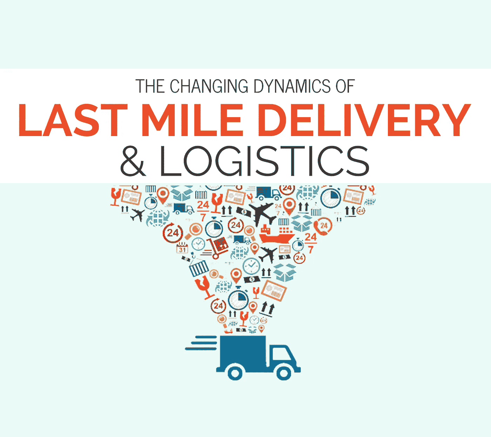

# 2019 电商圈你错过了什么？

> 原文：<https://medium.datadriveninvestor.com/what-did-you-miss-in-e-commerce-sphere-of-2019-b5c42b87dc8d?source=collection_archive---------7----------------------->

*电子商务、最后一公里配送、仓库经理、全渠道仓库、物流管理、战略管理等……了解所有这些相互之间的关系*

电子商务是一个巨大的贸易领域，由许多小部分组成，包括交货、装货、数据处理、订单、网上商店和其他重要组成部分。

> 你知道今天的电子商务如此庞大吗？有新玩家的操场？他们是谁？
> 
> 下面我们来试着搞清楚…

**不再忽视新动向**

自从交易在网上进行以来，几十年过去了，因为我们的手机和平板电脑是技术的资源，技术一直在发展，并将销售提升到一个更方便的水平。

包括，以点击几下为代价接受订单，在几分钟内在庞大的基础数据中搜索你的产品，当然，在几个小时内送货上门已经成为可能。

***首先，*** 有一种东西叫做**最后一公里的送货**。所有提供递送服务的公司都面临着最后一英里递送的问题，即包裹或货物已经在客户区，但尚未递送。

最后一公里送货？

因为，发件人知道送货公司的地址，并在什么运输工具和多少以及什么时候将货物送到仓库的帮助下大约有一个结算。而且在一个仓库里，按国家，再按城市，再按区配货，非常堆砌。以及通过仓库毫无困难地交付货物或包裹的领域。然后，送货员正在寻找能够快速安全地完成这项工作的第三方。

 [## 2019 年需要关注的 20 个数字营销趋势和技术——数据驱动的投资者

### 展示本周的电子学习模块。做一个终身学习者！关于技术、金融、工作场所的每日剂量…

www.datadriveninvestor.com](https://www.datadriveninvestor.com/2019/02/04/20-digital-marketing-trends-techniques-to-watch-out-for-in-2019/) 

新的 ***最后一公里配送*** 公司能提供什么？

阅读以下内容，了解该服务中实施的所有创新和技术。

***其次，*** 你听说过 ***多渠道仓库吗？(全渠道仓库)。*** 多渠道仓库不同于传统仓库，它通过正常模式和其他可能的渠道在线处理订单。

仓库的一个问题是他们不能处理所有订单，包括在线订单。在世界上大多数仓库中，所有这些操作都是人工进行的。

仓库继续像传统的单通道仓库一样工作的原因之一是仓库管理技术的不准确使用。

例如，这里你可以举一个亚马逊公司的例子。在亚马逊，在一个仓库中处理所有电子商务订单是不切实际的，这将导致错失机会。因此，通用仓库是唯一的解决方案。它是如何工作的，下面是亚马逊的最佳例子。

***第三，电子商务中的战略管理，*** 考虑送货付款、与消费者沟通、营销优惠、个性化忠诚计划等重要因素。

其实有很多因素，100 多种可以看[这里](https://www.smartinsights.com/ecommerce/ecommerce-strategy/10-mega-ecommerce-trends-2018/)，文章只考虑其中的一部分，和电商合作的时候看起来更有趣更重要。

最后一英里递送…

最后一公里配送是指供应链的最后一个阶段，即物料从配送中心到最终目的地(客户或商业实体)的移动。这是交付过程中的重要一步。

耐用消费品和食品电子商务市场的巨大增长导致了直接发货的相应增长(D2C)。

亚马逊在市场上的增长导致消费者对快速和免费运输的期望增加。这一趋势由 Amazon、Amazon Prime 和 Amazon Prime Now 推动，专注于当天交付和增加周期时间。

以下是一些关于 2018 年电子商务的有趣统计数据。

*   亚马逊占美国所有电子商务销售额的 44%。
*   美国买家在 2017 年黑色星期五在线消费了 50 亿美元。
*   平均而言，千禧一代目前有 54%的购物是在互联网上进行的(非用户为 49%)。
*   10 次购买中有 4 次是仅通过在线搜索和购买渠道完成的。(此处阅读更多)

这些数字每天都在增长，并导致递送服务的发展，包括最后一英里的递送服务。嗯，关于每件事的更多细节。

让我们看一个例子中最后一英里的不同变化。Volt Technologies 是韩国最著名的公司之一，提供“最后一英里”递送服务。

该公司以其方法和远见与市场上的许多公司不同。值得注意的是，Volt 技术为交付服务提供了一种分散的替代方案，从而降低了运营成本并减少了两年多的延迟。

于是，最迫切的问题——价格降到了最大。Volt Technology 将传统的运费佣金从 20%降至 5%的方法。

***第二个*** 我想提请注意的是区块链的使用。该公司使用区块链创建了一个加密的注册表，因此用户保持匿名，并且所有客户都可以看到实际成本和费用支付的透明度。

***第三个*** 是人工智能的运用。在这里，第三人的一个最困难的问题是在客户和快递之间解决的。

人工智能技术优化路线，自动计算配送成本！世界上很少有这样的公司，目前所有的公司都与第三方合作(不管有没有呼叫中心，或者即时消息等等。通信设施)它们继续发挥着承上启下的作用。

在这种情况下，不可能考虑到构成价格的各种因素！例如，在 Volt Technology，人工智能处理这一问题，并在考虑天气、供求波动、假期、距离和交通方式等变量的情况下制定价格。该系统提供当天交付、实时跟踪和财务担保，而没有传统交付服务的昂贵规则和要求。

所有渠道的电子商务和零售的增长以及消费者对快速和免费运输的日益增长的期望增加了对最后一英里物流服务提供商的需求。

综上所述，我们可以得出以下结论，即最后一英里的交付并非没有使用新技术，包括区块链技术和加密货币，以及人工智能。

如果公司想要具有竞争力，那么他们必须考虑 3 个主要的关键领域:

1.  价格
2.  质量
3.  信息技术实施

供应链行业处于不断变化的状态。使用众包应用程序和软件的新商业模式、新技术和协作措施被用来降低交付成本。它提供了更灵活的交付选项，提高了客户和供应商的满意度，并提高了最后一公里交付的效率和速度。

在文章的开始，有人说将考虑电子商务的 3 个不同组成部分，包括最后一英里的交付、多渠道仓库的概念和电子商务中的战略管理。我们决定将文章分成三部分，以较小的间隔发布在我们的页面上，但对电子商务的新趋势进行了定性分析。

我们希望第一部分是有用的，你已经为自己发现了很多新的东西，请在评论区留下你的评论。