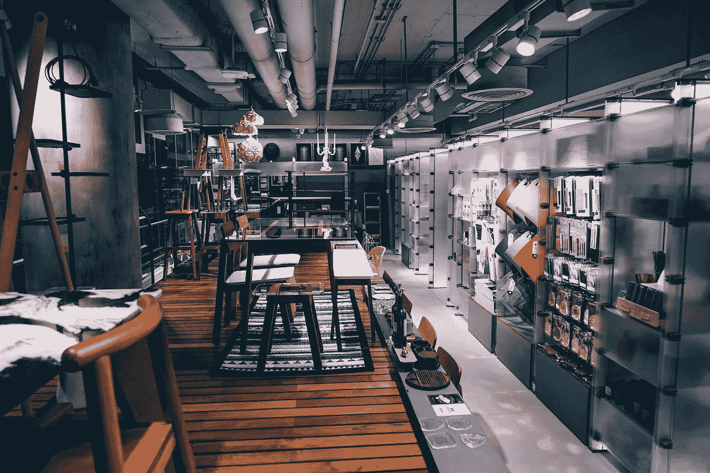
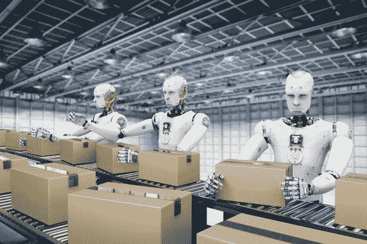
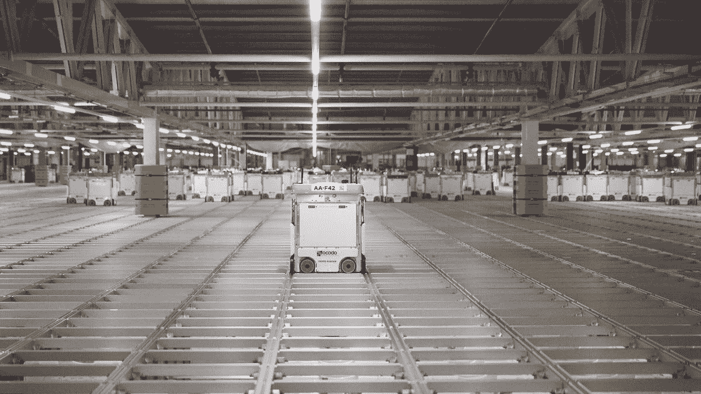

# 2019 电商圈你错过了什么？第二部分

> 原文：<https://medium.datadriveninvestor.com/what-did-you-miss-in-e-commerce-sphere-of-2019-part-2-47c84f4a21d1?source=collection_archive---------11----------------------->

*电子商务、最后一公里配送、仓库经理、全渠道仓库、物流管理、战略管理等……了解所有这些相互之间的关系*

在文章的第一部分，我们讨论了电子商务交付最后一英里的重要主题之一。在本文中，我们将探索关于数据处理、仓库、多通道仓库和其他重要组件的有趣事实。

机器人在枢纽储存货物…

订单在网上处理，然后发送给机器人包装工和机器人包装工…

下面就来说说这一切吧…

> **电子商务和多渠道仓库**

听说过 ***多渠道仓库吗？(全渠道仓库)。*** 多渠道仓库不同于传统仓库，它通过正常模式和其他可能的渠道在线处理订单。

仓库的一个问题是他们不能处理所有订单，包括在线订单。在世界上大多数仓库中，所有这些操作都是人工进行的。

 [## 2019 年需要关注的 20 个数字营销趋势和技术——数据驱动的投资者

### 展示本周的电子学习模块。做一个终身学习者！关于技术、金融、工作场所的每日剂量…

www.datadriveninvestor.com](https://www.datadriveninvestor.com/2019/02/04/20-digital-marketing-trends-techniques-to-watch-out-for-in-2019/) 

仓库继续像传统的单通道仓库一样工作的原因之一是仓库管理技术的不准确使用。

例如，这里你可以举一个亚马逊公司的例子。在亚马逊，在一个仓库中处理所有电子商务订单是不切实际的，这将导致错失机会。因此，通用仓库是唯一的解决方案。它是如何工作的，下面是亚马逊的最佳例子。

> **从网购到仓库……**

根据电子商务领域的最新研究，买家希望在 3 天内收到他们的送货，并且不支付送货费用， ***甚至在节假日*** 。这些结果迫使公司在交货和仓库方面更加努力，以提高价格和质量。

专家表示，供应链中新兴技术的微观/宏观趋势向我们表明，人工智能、机器学习、区块链、过程自动化和高级机器人将在供应链中发挥至关重要的作用。

根据 [JLL](http://www.supplychain247.com/article/9_attributes_redefining_the_warehouse_of_the_future/swisslog) 的研究，未来仓库有 9 个属性，它包括:

1.  无线技术和实时库存跟踪。
2.  超级连接工具:如条形码、物联网、RFID 扫描、GPS 等。
3.  新的叉车:物联网可以将仓库运营商的叉车与他们的企业资源规划系统和整个仓库的工人连接起来。
4.  不断增长的净高。为了优化仓库利用率，昨天的天花板高度从 24 英尺到 26 英尺，现在已经增加到 36 英尺到 40 英尺。
5.  选择的技术正在加速发展:从多语言语音拨号和增强现实到专门的机器人，革命性的技术改变了选择的实践。
6.  可持续发展，追求成功:替代能源，太阳能电池板，LED 照明，凉爽的屋顶系统，热玻璃，窗户灯和其他新的环保材料和创新引领仓库进入一个新时代。
7.  人性化设计:随着设计变得更加人性化，高效照明、空气质量传感器和温度控制变得越来越普遍。
8.  土地灵活性:如果出现额外需求，如季节性发热，增加土地和空间的能力。
9.  超级平坦或倾斜的地板。

是什么导致了仓库的变化？

问题在于，电商仓库已经无法处理所有订单。目前，仓库接收来自商店的投标，来自电子商务的订单(包括通过网站、应用程序、电话购买)，甚至通过客服接收订单。

目前，最大的玩家被认为是亚马逊、沃尔玛、速卖通、易趣和其他公司。我们都听说老式仓库会损害公司。因此，下一步仓库发展的建议是多渠道。

这种方法的新颖之处在哪里？这些都是机会！

使用多渠道仓库优化您的订单，以增加 30%。这将帮助您解决物流问题，因为这些数据将缩短 30%的新产品和退货的交付时间。于是，各公司纷纷将仓库改为通用！

**万能？！**

为了取得成功，你必须成为一个仓库，但同时还要增加订单处理、收集和交付、包装和交付等服务。因为电子商务企业家已经在仓库中看到了 3PL 功能和远程工作。

此外，企业家自己可以在地球的另一边，而 fold 可以在客户和顾客之间充当连接纽带，缩短订单履行中心之间的距离。就在 5 年前，人们还无法想象花 10 美元买一件商品并享受免费送货服务。

因此，多渠道仓库给了你在竞技场中成为关键玩家的优势。

我们可以得出以下结论，多渠道仓库在未来几年可能会经历极端的转变。事实上，零售、批发、运输和物流部门已经在转向“同类最佳”仓库管理系统，将自动化提升到新的高度——从为工人配备移动设备以提高收集订单的速度和准确性，到部署 RFID 以实时跟踪库存。

在下一篇也是最后一篇文章中，我们将讨论电子商务中的战略管理。

我们希望第二部分是有用的，你已经为自己发现了很多新的东西，在评论中留下你的看法。