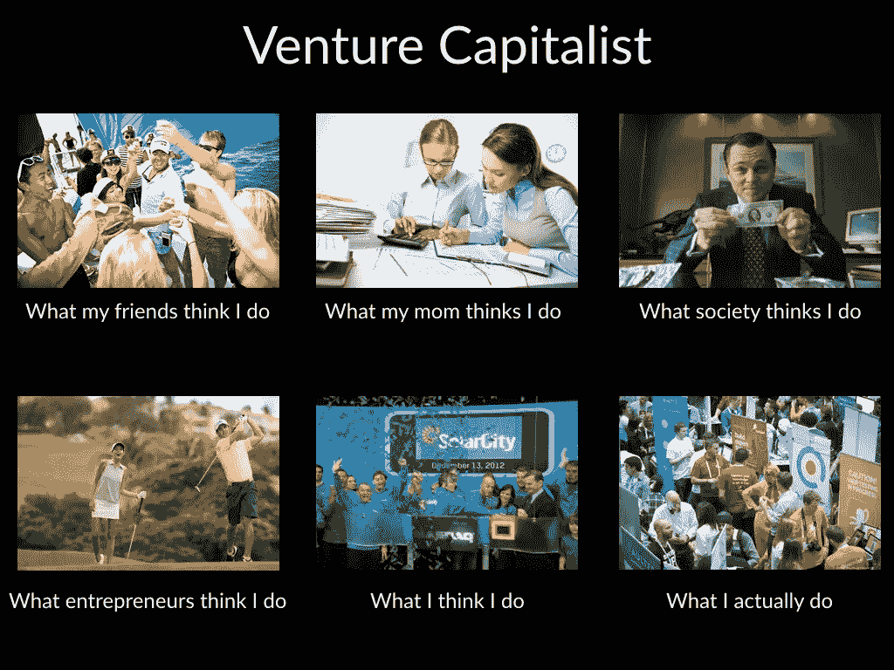

# 风投们整天都在做什么？5 个可见的活动和 1 个几乎不可见的活动

> 原文：<https://medium.datadriveninvestor.com/what-do-vcs-do-all-day-5-visible-activities-and-the-1-mostly-invisible-one-1e9c5422805?source=collection_archive---------8----------------------->

还记得几年前广为流传的迷因系列“人们认为我做了什么”吗？嗯，上面贴了一个 VC 版本，幽默地捕捉到了认知的不匹配。事实是，风险投资人如何度过一天因个性和资历而有很大不同，但总的来说，他们是在 5 个非常明显的活动上——还有一个经常是看不见的。

**1)投资组合**

投资组合是风险资本家已经下注的公司，自然是他/她将花费大量时间(如果不是大部分时间)的地方。投资的金额(从千美元到百万美元)、阶段(种子期、A 轮等)、紧迫性(一切进展顺利还是重大机遇或危机)和义务(董事会席位、董事会观察员、无)可能各不相同。考虑一下，一家风投公司将会、也应该如何区别对待一笔 10 万美元的种子期投资(公司状况良好)和一笔已经投资 5000 万美元、即将上市的 D 轮投资。

 [## 风险投资家在给创业公司播种时会考虑什么标准？数据驱动的投资者

### 2017 年，风险投资资金攀升至十年来的最高水平。你的创业公司目前吸引风险投资的机会是…

www.datadriveninvestor.com](https://www.datadriveninvestor.com/2018/04/20/what-criteria-do-venture-capitalists-consider-when-seeding-a-startup/) 

大多数风投会告诉你，那时他们可以真正投入优质时间进行 7-10 项投资，此时他们会将 80%以上的时间花在投资组合上。任何更多意味着太多的颠簸(分散注意力)。任何不足都意味着他们有带宽，这是创业者在与投资者签约时要考虑的一个关键因素。事实上，一些企业家只会与他们真正看重的投资者签约，如果他们在董事会任职，即他们愿意付出时间，即使这需要在种子阶段创建一个董事会或在稍后阶段重组成员。

**2)管道**

管道就是寻找好的公司，这些公司可以来自[四个主要来源](https://www.linkedin.com/pulse/how-do-vcs-find-fund-your-startup-4-major-paths-deal-flow-amit-garg/?lipi=urn%3Ali%3Apage%3Ad_flagship3_profile_view_base_post_details%3BJ%2FJTTV3KSdufJW6nzo254A%3D%3D):

*   其他投资者介绍——他们已经投资、正在考虑或者只是认为非常适合你的创业公司
*   拥有自己的关系网——对外和对内都有兴趣，即人们会主动联系
*   出站—比如在会议等事件中开会
*   陌生电话——主动联系自己

在大公司中，初级合伙人在管道上花费的时间不成比例，而高级合伙人在投资组合上花费的时间不成比例。在规模较小的公司，合伙人和负责人可能很少或根本不存在，合伙人通常是全权负责的。可以说，在所有风险投资活动中，管道的起伏最大——投资者根据他们的带宽调高或调低管道——在一周内可能高达 100%，但更典型的是 20%。

**3)勤奋**

如果风投发现一家他们真正感兴趣的公司，他们通常会减少所有活动，尤其是渠道，专注于勤奋。如果决策的时间压力很大，这一点尤其正确。一家纪律严明的公司在一笔大交易上可以在几个月内投入数百个小时的努力，更典型的是在 1-3 个月内投入 20-60 个小时。当勤奋全力以赴时，它可以完全占据风投的注意力，但平均下来，它更接近于 20%。

**4)通信**

或者称之为品牌、营销、思想领导。这对于每一个风投来说都有很大的不同，取决于他们发布的频率和地点，他们参加会议、在活动中发言、在小组中服务、接受媒体采访、做播客或视频广播、在社交媒体上发布等的频率。对于重大的公告，它会大起大落，但如果你调查足够多的风投，你会发现 10%的时间都花在了沟通上。

**5)行政**

管理是基金基础设施的总称——支付租金、向政府备案、聘请律师、编制投资组合季度报告等。在大型机构基金中，通常会有一名首席财务官来领导这些活动，而在公司基金中，类似的角色由运营部来扮演。显然，在小型基金中，这些活动要简单得多，合伙人自己通常可以处理许多(如果不是大部分)活动，因此只需不到总时间的 10%。

**6)LPs——最不为人知的活动**

大多数创业者往往看不到的是风投自己的融资过程。一只基金越成熟，筹集资金的速度就越快，但即便如此，这个过程也可能需要数月甚至数年。除了每年的有限合伙人日之外，还有与有限合伙人的定期沟通，以个人或书面形式，这占用了执行合伙人 50%的时间。与初创公司相比，风险投资的融资时间通常更长，需要与更多的人会面。这就是为什么大多数基金会进行多次平仓，两次平仓非常典型，因为每次平仓都会产生一个强制函数来获得承诺。作为一个数据点，对于第一批基金来说，在 2 年内平均要召开 1000 次会议，以 1–5%的投资回报率来充分筹集资金，在此期间可能需要合作伙伴 50%的时间。

*原载于:* [*数据驱动投资人*](https://www.datadriveninvestor.com/2019/12/09/what-do-vcs-do-all-day-5-visible-acitivites-and-the-1-mostly-invisible-one/) *。”我是*[*Tau Ventures*](https://www.linkedin.com/pulse/announcing-tau-ventures-amit-garg/)*的管理合伙人和联合创始人，在硅谷工作了 20 年，涉足企业、创业公司和风险投资基金。这些都是专注于实践见解的有目的的短文(我称之为 GL；dr —良好的长度；确实读过)。我的许多文章都在*[*https://www . LinkedIn . com/in/am garg/detail/recent-activity/posts*](https://www.linkedin.com/in/amgarg/detail/recent-activity/posts/)*上，如果它们能让人们对某个话题产生足够的兴趣，从而进行更深入的探讨，我会感到非常兴奋。如果这篇文章有对你有用的见解，请评论和/或给文章和* [*Tau Ventures 的 LinkedIn 页面*](https://www.linkedin.com/company/tauventures) *点赞，感谢你对我们工作的支持。这里表达的所有观点都是我自己的。*