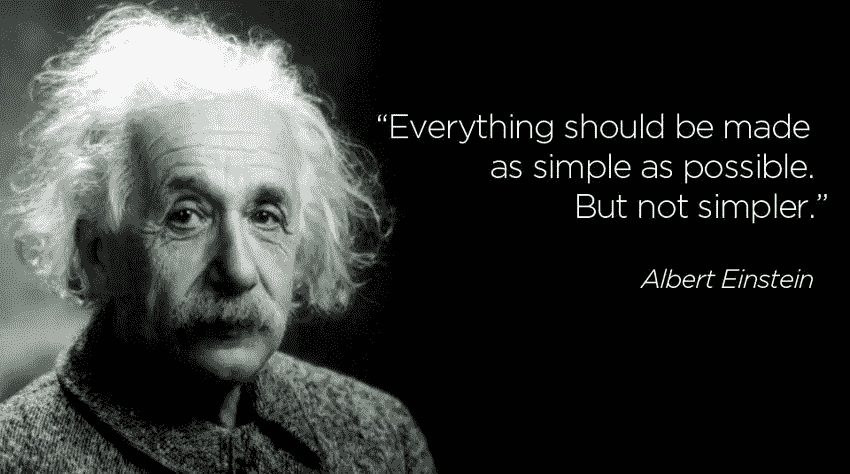
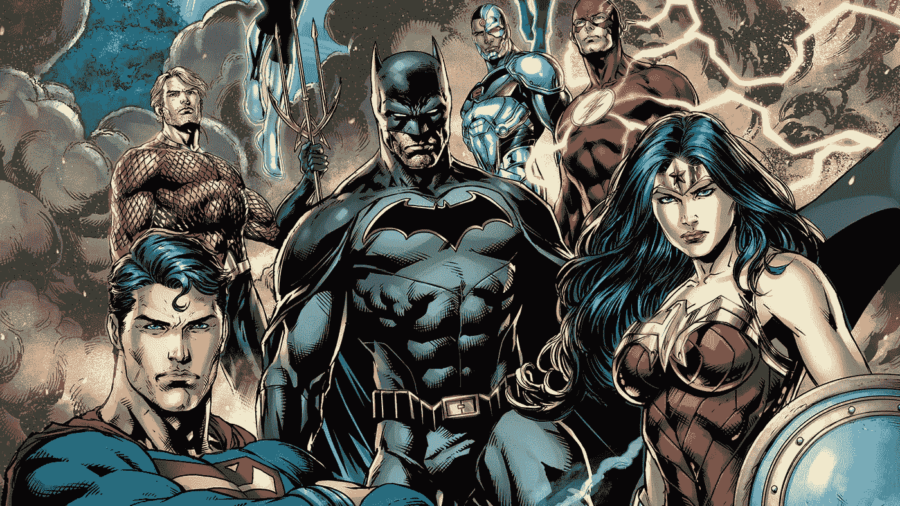

# 当你把一个新想法带到这个世界时，你需要知道什么

> 原文：<https://medium.datadriveninvestor.com/what-do-you-need-to-know-when-bringing-a-new-idea-into-the-world-8b9787a2e022?source=collection_archive---------27----------------------->

实现一个想法是一项艰巨的任务，原因有很多，从害怕对世界说“ [*”这里，我做了这个*](https://seths.blog/2016/10/here-i-made-this/) ”，到关注项目的经济、政治和其他方面的约束，例如[恰当的时机](https://www.amazon.com/When-Scientific-Secrets-Perfect-Timing/dp/0735210624)，同时努力保持热情继续前进，直到你最终看到隧道尽头的光明。

这是一个充满不确定性的过程，但是尽管对于可能会出现*和将要出现*的无尽问题没有确定的答案，但是有一个简短的列表，列出了你肯定想知道的**。不是一个终极纲要，或任何接近绝对真理的东西，但几年来我发现一些非常有帮助的东西，当试图产生一个想法时，这些东西会让事情变得有序。一份清单，大概是这样的:**

1.  ****用户需求****

**首先要知道的真正重要的事情是**谁在另一边**。为什么？因为你不想付钱。如果你真的这样做了，而且这只是一个有趣的项目，那么忽略这一点。但最有可能的是，你没有，你要么试图向你的老板推销这个想法，要么让投资者为你提供资金，要么自己投资一些启动资金*(是的，这就是这个名字的来源*)，你希望以后从顾客、客户或用户那里得到回报，或者以获得你的产品许可的形式——或者整个公司——被你池塘里的一条大鱼收购。这正是 ROI 的含义:投资回报，也就是你对投资于项目的金钱/时间/努力的预期回报。**

> **[DDI 编辑推荐——如何在没有风险投资的情况下为你的初创公司融资和发展](http://go.datadriveninvestor.com/fundstartup2/matf)**

**所以，知道谁将为你的投资回报买单是非常重要的。不仅仅是因为你想要回你的钱( [*这不是盗亦有道*](https://www.youtube.com/watch?v=jumN2AnKlqQ) )，而是因为**你必须取悦他们**。当你真的用你的想法取悦客户、用户或投资者时，我的意思是当你真的让他们对你的想法感到兴奋和激动时，他们会做你试图让他们做的事情:支持你的想法，购买东西，投资它，谈论它，等等。**

**但是，如果我们谈论的是客户、用户和投资者，为什么这个部分的标题是“**用户的需求**”?很高兴你问了。有一个想象的链条，在这个链条中，这三个行动者是相互联系的。用户总是站在最前沿，实际上*在使用*这个东西。顾客有时自己也是用户，但也许她只是购买者，并不打算使用这个东西(父母通常是为他们的用户后代购买的顾客，但办公室经理也是为他们自己*和其他人*购买以供使用的顾客)。即使她不会使用这个东西，她在购买时也必须考虑用户的需求，所以- *你猜对了* -你也必须考虑到这一点，因为这是你的客户所期待的。最后但并非最不重要的一点是，投资者还必须考虑你的想法是否会让用户高兴，因为如果会，用户会想要它，客户会购买它，这就是资金如何通过回路一路返回，成为你的(*和你的投资者的*)投资回报。**

**所以，长话短说:如果你的伟大想法有机会在世界上成功，它必须从用户的需求开始。**

****2。速度****

**第二，在我们想象的清单上，是**速度**。速度很重要，因为在我们这个时代它是不可选择的。不完全是。在网络时代，任何能够获得资金、手机和互联网连接的人都有能力实现自己的想法，就像你一样，他们绝对不会坐在那里等着你先走。因此，如果你的大创意考虑到了用户的需求，而且速度很快，那么它就有更大的生存机会。**

**许多不太好的想法之所以成功，是因为有人决定执行它们，首先去实现它们，但是没有一个好想法是因为没有采取行动而成功的。在 YouTube 的早期，视频内容的质量比今天的要差得多，但是先在那里，实际上填充了平台，给了那些早期 YouTube 的人很大的优势。*如果你不相信我*的话，可以随时向 [*加里·维纳查克*](https://medium.com/u/c4ec9163657c?source=post_page-----8b9787a2e022--------------------------------) *核实。当然，当市场稍微成熟一点的时候，有很多理由支持第二个，就像谷歌的情况一样。***

**一个奇怪的例子(*我会让你来决定把这个放在哪里……*)是 QWERTY 键盘。本来就是设计的不舒服。 ***是的，真的是*** 。这种键盘的设计实际上是为了减慢打字员的速度，这样他们就不会卡住打字机的扶手。很奇怪，对吧？但是因为 QWERTY 键盘具有作为键盘标准的早期优势，这种故意低效的设计战胜了实际上更舒适并允许更快打字的设计。**

**无论如何，这里的重点是，没有执行的好主意只是好主意。强调 ***只是*** 。这意味着这些想法没有利润，不成功，没有突破性。相反，人们谈论这些想法时会带着怜悯的语气:“*是的，这是个好主意..可惜了那个 _____* ”。你不希望你的想法变成那样。所以，**执行是必须的**。**

**现在，如果你能快速完成*，那你就真的有机会了。因为所有其他有类似想法的人，或者有可能使你的想法过时的人，也没有任何理由等待。他们可以像你一样，今天就执行死刑。为什么他们不会呢？那你为什么不呢？***

*****3。性能*****

***第三个要考虑的因素是你的想法如何实现。你的大创意不仅要建立在牢记用户的基础上，而且要快速建立，还要把事情做好。伟大的以人为中心的设计比任何人都更早进入市场，却在做这件事时彻底失败，这不是成功的秘诀。或者给任何人的好建议。***

***卓越表现的一个关键因素是简单，对我们来说，这是阿尔伯特·爱因斯坦赋予的含义，他说:***

******

***建造简单的东西有几个好处:首先也是最重要的，它允许用更短的时间来建造东西，也就是速度。我们希望事情越详细，完成的时间就越长。第二个好处是，它能让我们轻松地脱离:众所周知，我们在某件事情上投入了越多的金钱/时间/努力，就越难放手。俗话说(*常归于威廉·福克纳*)云: ***谋杀你的心上人*** 。低层次、低细节的原型，让测试想法变得更容易，而没有过度依赖的风险，并且如果想法没有按照它们应该的方式工作，从精神上放弃它们会更便宜。你可能已经发现，这有助于**的性能**。***

***制造一个简单的东西的第三个好处是，如果它出现故障(*它很可能会出现故障，这是一件好事*)，那么需要检查和/或调整的部件就更少了。想象一下你的用户，让我们称他为安德鲁，需要把东西扔得远远的(为了好玩，我们可以假设…安迪就是那种人)。想象一下，你想出了这个非常复杂的设计，你真的看到了它的潜力，它看起来像这样:***

***它看起来确实有效，不是吗？当然可以。安迪喜欢它。但是现在，让我们想象它不太正常。像这样:***

***这个精心设计的弹射器有如此多的元素(*实际上被称为投石机*)，以至于找出故障将需要相当长的时间。当安迪只是为了好玩，在他的后院做这件事的时候，这不是一个大问题，但如果他试图拆除或保留古希腊的城墙，或其他什么东西，那就严重了。***

***我会推荐一些简单得多的东西，就像这样:***

******

***这种设计拥有**简单**的所有期望品质:它可以用很少的元件建造，这使得它更便宜，它可以快速建造，如果它不起作用，它可以很容易地丢弃，没有分离危机，并且它使得它非常容易识别-并修复-任何故障部件，如果它们存在的话。***

***到目前为止，你们中已经熟悉[敏捷软件开发](https://en.wikipedia.org/wiki/Agile_software_development)概念的人，可能已经明白了原型的意义所在:最简单、最便宜、最快的可能的东西，同时仍然具有必要的功能，以便检查想法是否可行，是否按预期运行，用户的需求是否得到满足，以及这些用户是否真的喜欢并想要拥有满足这些需求的东西。换句话说，到**检查性能**。对我来说，真正有趣的事情是，它不仅仅适用于开发软件。***

*****4。可信顾问*****

***所以，现在我们已经到了这一步，它肯定似乎有很多要记住。你的想法必须很好地适应用户的需求，必须快速构建，必须表现良好，为此它必须从一个简单的原型开始，然后从那里开始构建。这是一次陡峭的攀登，路线图并不十分清晰。***

***有一点非常重要的是你不需要知道所有的事情。让我们都松一口气。***

***许多人喜欢称自己为“可信赖的顾问”，尤其是在 LinkedIn 上。我觉得就相当于称自己为心爱的人，或者优秀的老师。那是别人说的，而不是你自己说的。但是不管怎样，当你四处寻求建议的时候，**由你决定你信任谁**。***

***信任很重要，因为它能促成真诚的对话和真实的反馈，而这两者你都需要确定你的想法是否已经准备好了，以及如何区分这两者。这就是为什么这场游戏的真正玩家，那些经得起时间考验的人，是那些设法与客户和合作伙伴建立长期关系的人，因为长期露面本质上是提供信任。***

***卢克有尤达，佛罗多有甘道夫，哈利有邓布利多，丹尼尔·桑有宫城先生。此外，超级英雄以正义联盟、x 战警或复仇者联盟的形式出现。***

******

***为什么？因为我们在某些时候都需要合作，我们都需要有人在其他时候去寻求建议(*或者可能在同一点*)，提前知道那些人是谁比在我们已经有麻烦的时候去找他们更好。所以，是的，现在就开始召集你的团队，不仅仅是因为当事情变得艰难时他们会帮忙，更主要的是因为与合作伙伴一起成长会大大加快。***

*****5。将所有这些放在一起*****

***这四个要素(用户的需求、速度、性能和你信任的顾问)是让你的想法在坚实的轨道上实现的基础。其他一切都将建立在这些基础之上。它们够了吗？我的消息来源说没有。但这是一个开始，而 *start* 是 *startup* 的一大块(双关语)。***

***如果我可以留给你一个想法来思考，那就是 **#4** 适用于前 3 点:那就是，召集你的正义联盟，确保其中一个可以帮助你了解你的**用户的需求**，另一个可以帮助你**加速**事情的进展，还有一个可以帮助你的想法的**表现**，但是最重要的是记住**你需要你可以信任的人**，那些对你有判断力的人剩下的，就是执行和一点运气。***

***就像音乐中发生的一样，你的乐队的歌听起来很好，不是因为音乐家有才华，而是因为你可以信任你乐队中的每个人，他们也信任你。当那件非常特别的事情发生时，你可以放开自己，跟着一起签名，人们会轻拍他们的脚。***