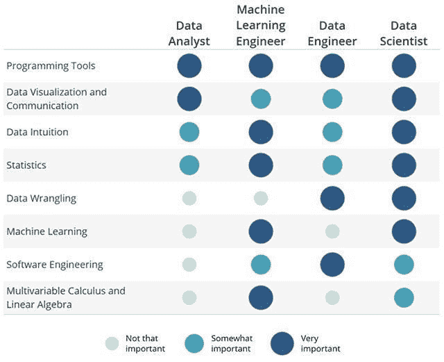

# 数据科学家是做什么的？

> 原文：<https://medium.datadriveninvestor.com/what-does-a-data-scientist-do-991b49dad3c0?source=collection_archive---------10----------------------->

[大数据](https://www.datadriveninvestor.com/glossary/big-data/)时代产生了新类型的职业。这些新的职业与数据和他们处理数据的方式有关。一些值得注意的职业是数据科学家、[机器学习](https://www.datadriveninvestor.com/glossary/machine-learning/)工程师和[物联网](https://www.datadriveninvestor.com/glossary/internet-of-things/)工程师。在本文中，我们将重点关注数据科学家。我们要回答以下问题:什么是数据科学家？数据科学家是做什么的？怎样才能成为数据科学家？数据科学家在哪里工作？

# 什么是数据科学家？

数据科学家是使用不同的统计学、线性代数和[机器学习](https://www.datadriveninvestor.com/glossary/machine-learning/)技术分析数据的专家。通过分析这些数据，他们可以为各种业务解决复杂的问题。这使得数据科学家成为许多行业领域急需的专业人员。

 [## 成为数据科学家所需的 8 项技能|数据驱动型投资者

### 数字吓不倒你？没有什么比一张漂亮的 excel 表更令人满意的了？你会说几种语言…

www.datadriveninvestor.com](https://www.datadriveninvestor.com/2019/02/07/8-skills-you-need-to-become-a-data-scientist/) 

使用正确的技术，他们从数据中提取知识。例如，这种知识有助于企业增加收入或优化生产。

# 数据科学家在哪里工作？

数据科学家可以在任何领域工作。他们的目标是解决企业面临的日常问题。数据科学家会告诉你什么时候是投资股市的合适时机，或者预测你的客户的品味和偏好，向他们展示最适合他们的产品。

数据科学家有许多不同的技能。这就是他们能在各种领域工作的原因。他们必须具备以下技能:

*   扎实的数学和统计学背景
*   知道如何用不同的编程语言编写好代码
*   知道如何访问数据库和处理大量数据
*   了解标准公司的运作方式，以便给出适当的解决方案

# 数学

数据科学家必须掌握线性代数、微积分和统计学，才能理解机器学习使用的主要算法。

# 编程和数据库

他们必须知道如何用 [Python](https://www.datadriveninvestor.com/glossary/python/) 、 [R](https://www.datadriveninvestor.com/glossary/r/) 和 SQL 编码。前两种是进行数据清理和对数据应用机器学习技术的理想选择。SQL 是一种帮助我们管理数据库中数据的编程语言。因此，如果他们想从中提取数据，他们必须知道如何用 SQL 编码。使用 Python + SQL 可以以一种简单的方式访问数据库。但是，在某些情况下，当处理大量数据时，使用这些工具并不是最佳选择。为了解决这个问题，他们可以使用 Spark、Hive 或 Hadoop 等程序。这些程序帮助他们以更简单的方式管理数据。

# 公司结构

了解一家公司的运作方式是所有数据科学家必备的技能。你可以成为有史以来最好的数据清理者，但如果你不知道如何将你的技能应用到现实世界的问题中，你将永远不会成为一名优秀的数据科学家。

在某些情况下，还有一些其他技能更难学习。交流就是这种情况。数据科学家必须善于沟通，以便与团队分享想法和不同的观点。事实上，这可能比之前提到的任何其他技能都更重要。如果你不能分享或解释你的想法，你将不得不独自工作，这将会给你带来长期的问题。

为了总结这个问题的答案，我将提到团队中有数据科学家的公司:IT 公司、银行、超市、航空公司、实验室等等。

# 怎样才能成为一名数据科学家？

如今，许多想要雇用数据科学家的公司要求获得[数据科学](https://www.datadriveninvestor.com/glossary/data-science/)、机器学习、计算机科学、物理、统计或数学方面的硕士学位或博士学位。然而，事实是，在过去的几年里，公司更重视自学成才的学生，而不是大学头衔。这是不是意味着你要退学？不要！但是，我的建议是，除了在学校或大学里学过的东西之外，你必须学点别的东西。

比如我在大学学过物理。与此同时，我一直在自学机器学习、 [AI](https://www.datadriveninvestor.com/glossary/artificial-intelligence/) 和数据科学。这种学习整理会给你多种多样的技能。这些技能将帮助你成为一名伟大的数据科学家。

有一句话是这样说的:“为了成功，你必须像一把瑞士刀。你必须做好面对任何挫折的准备。

你需要自律来自学，但是；最重要的是，如果你决定成为一名数据科学家，你必须做好终生学习的准备。这是因为这些类型的场是不断变化的。

# 数据科学发展什么样的工作？

我们将讨论数据科学家在公司中可以做的四种不同的工作。

在一些公司，数据科学家等同于数据分析师。您的工作可能包括从 SQL 数据库中提取数据、成为 Excel 或 Tableau 大师以及制作基本的数据可视化和报告仪表板等任务。你可能偶尔会分析 A/B 测试的结果，或者在你公司的谷歌分析账户上打头阵。这种训练将帮助你掌握诀窍并拓展你的技能。

一些公司达到了拥有大量流量(和越来越大的数据量)的地步，他们开始找人来建立公司前进所需的大量数据基础设施。他们也在找人提供分析。你会看到这类职位的招聘信息都列在“数据科学家”和“数据工程师”下面。由于你是第一批数据雇员之一，大量的统计和机器学习专业知识没有强大的软件工程技能重要。因此，你将有很大的机会通过“火的考验”来发光发亮和成长，但指导会更少，你可能会面临失败或停滞不前的更大风险。

对于许多公司来说，他们的数据(或数据分析平台)*就是*他们的产品。在这种情况下，正在进行的数据分析或机器学习可能会非常激烈。对于有正式的数学、统计学或物理学背景并希望继续走学术道路的人来说，这可能是理想的情况。属于这一组的公司可能是拥有大量数据的面向消费者的公司，或者是提供基于数据的服务的公司。

许多公司都在寻找多面手加入其他数据科学家的既定团队。你面试的公司关心数据，但可能不是数据公司。同样重要的是，您可以执行分析、接触生产代码、可视化数据等。一般来说，这些公司要么在寻找多面手，要么在寻找填补他们觉得团队缺乏的特定利基，如数据可视化或机器学习。

综上所述，这四种工作取决于你被雇佣的公司的类型。你可以建立你的简历，以便被这些工作录用。尽管如此，我还是建议你建立一份涵盖所有这些方面的简历。

查看下图，了解你在数据科学和其他相关职业中取得成功所必须具备的[技能:](https://www.datadriveninvestor.com/2019/02/07/8-skills-you-need-to-become-a-data-scientist/)

*Image 1\.* [*source*](https://blog.udacity.com/2018/01/4-types-data-science-jobs.html)

*Image 2\. Comparison between Data Science, Data Analytics and Big Data*

# 结论

数据科学既不枯燥也不重复。你将面临许多不同的问题和情况，在你解决任务的同时，你必须学习。你需要有创造力和主动性。

请记住，任何人都可以学会管理大量数据，但不是每个人都可以从中提取有用的信息来帮助公司改善和发展。