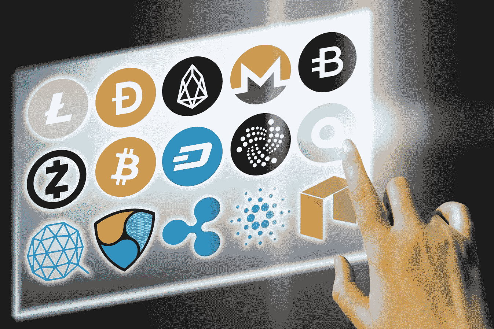
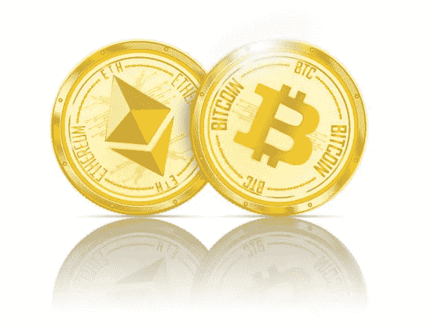

# 多元化的数字资产组合是什么样的？

> 原文：<https://medium.datadriveninvestor.com/what-does-a-well-diversified-digital-asset-portfolio-look-like-b62c148c66ab?source=collection_archive---------1----------------------->

鉴于过去 11 个月加密货币令人印象深刻的反弹，发现比特币的投资者现在也希望分散投资于其他有前途的数字资产，这些资产可能会经历类似比特币自 2009 年问世以来的强劲价格反弹。然而，构建数字资产组合——尤其是对那些不熟悉加密货币的人来说——仍然是一个挑战。

在本文中，您将了解如何构建一个平衡的加密货币投资组合，为这一令人兴奋的新数字资产类别提供多样化的投资。

**核心持股是比特币和以太**

市值最大的两种加密货币，[比特币(BTC)](https://coinmarketcap.com/currencies/bitcoin/) 和[以太(ETH)](https://coinmarketcap.com/currencies/ethereum/) ，应该构成均衡的多元化加密资产组合的最大比例。

与一些不太知名的同行相比，它们不仅波动性更小、资产更成熟，而且自今年初以来，它们还创造了可观的回报。

比特币的价格从 1000 美元上涨到 16000 美元以上，从而产生了超过 1500%的年初至今投资回报，而以太坊的以太从 8.25 美元上涨到 500 美元以上，目前在 450 美元到 500 美元的范围内交易。

比特币和以太网应该占多元化加密资产组合的 60%左右，其中比特币占 40%，以太网占 20%，因为比特币仍然是市场领导者，也是随着比特币作为投资资产越来越成为主流而经历最多新流入的数字货币。

**前 20 名替代币**

对于第二篮子加密货币，投资者应该从剩余的 20 种市值最大的加密货币中寻找最大和最有前景的替代货币。

[比特币现金(BCH)](https://coinmarketcap.com/currencies/bitcoin-cash/) 、[莱特币(LTC)](https://coinmarketcap.com/currencies/litecoin/) 、[瑞波(XRP)](https://coinmarketcap.com/currencies/ripple/) 、[破折号(破折号)](https://coinmarketcap.com/currencies/dash/)、[奥塔(米奥塔)](https://coinmarketcap.com/currencies/iota/)和[莫内罗(XMR)](https://coinmarketcap.com/currencies/monero/) 将是你这部分投资组合的首选。

比特币现金是比特币的一个分支，允许比其前身更便宜、更快速的交易。莱特币还提供比比特币更快更便宜的交易，因此越来越受欢迎。Ripple 是 RippleNet 银行间支付系统中使用的数字货币，越来越多地被主要金融机构采用。Dash 提供高速交易，可以在保密的情况下进行。IOTA 是一种令人兴奋的新数字货币，允许零费用支付，旨在成为物联网的支付层，Monero 是领先的以隐私为中心的加密货币，允许完全匿名的数字支付。

虽然前 20 名中还有其他有前途的数字货币，但上述货币目前是最有可能超越同行的货币，并且最有可能看到机构投资者流入，因为它们在整个加密市场中拥有一些最大的市值。当然，这使得机构投资者更容易进出头寸，因为流动性可能是较小硬币的一个主要问题。

这一篮子替代硬币应该占平衡的加密资产组合的 30%左右。

**ICO 代币和小盘币**

最后，对于投资组合中剩余的 10%，投资者可以投资高风险的 ICO 代币和小型加密货币。

这些可能包括关注匿名的硬币 [PIVX (PIVX)](https://coinmarketcap.com/currencies/pivx/) 和 [Komodo (KMD)](https://coinmarketcap.com/currencies/komodo/) ，数字货币借记卡提供商 [TenX 的 PAY](https://coinmarketcap.com/currencies/tenx/) 令牌，分散云存储提供商 [Stroj 令牌](https://coinmarketcap.com/currencies/storj/)，以及投资者认为有可能成为赢家的任何其他小型数字货币或令牌。

如果该项目不成功，ICO 代币和大多数较小的硬币都有变得几乎一文不值的高风险。在大多数情况下，这些区块链项目是由一小群开发人员运营的，这意味着它真的可以走任何一条路。

有趣的是，根据德勤的一项研究，已经启动的区块链项目中只有 8%仍在运行。这清楚地说明了投资仅由小社区支持的加密货币项目的风险。

由于小盘币固有的风险，一个人的全部加密资产组合中只有大约 10%应该是这些类型的加密货币。

**确切的投资组合比例取决于投资者**

当然，你也应该认购多少百分比的组合，这取决于你个人的风险偏好。你越厌恶风险，你的比特币和以太相对于其他硬币的比例就应该越高。然而，如果你愿意在一个已经存在风险的资产类别中承担大量风险，你可以将更高的比例分配给 ICO 代币和小型加密货币。

换句话说，一个仍然希望投资数字货币的保守投资者可能会投资 50%的比特币，30%的以太币，其余的在莱特币、IOTA 和 Ripple 之间分配。另一方面，年轻的冒险投资者只能持有 25%的比特币和以太币，其余的是高风险的小盘币，这些币有可能增加 10 倍以上或变得一文不值。选择总是取决于投资者的投资目标和风险偏好。

**你的净资产中有多少应该用于加密？**

你的总体投资组合中应该有多少是加密货币，这完全是另一个问题。Union Square Ventures 的首席执行官 Fred Wilson[认为](http://avc.com/2017/10/crypto-asset-allocation/)想要获得高回报的老练投资者应该将他们总净值的 5%投入比特币。

激进的冒险者可以持有高达 10%的比特币净值，但任何更保守的投资方法都不应超过 3%。威尔逊表示，那些接近退休的人应该完全避免投资数字资产。

Everguide Financial Group 的投资组合经理马克·佩因特(Mark Painter)赞同威尔逊的观点，即投资者应该持有多少与他或她的总净资产相关的加密敞口。Painter 认为比特币“是投资中最具投机性的”，并建议客户将总可投资资本的 5%投资于数字货币，前提是他们了解投资数字资产所涉及的所有风险。