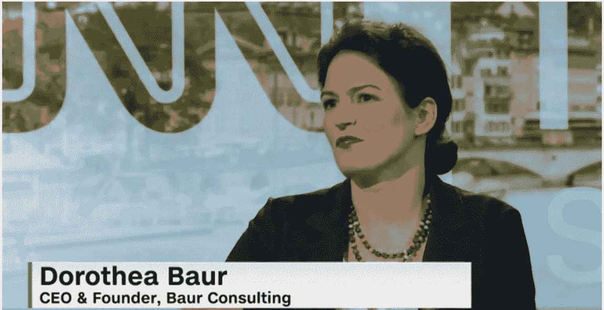
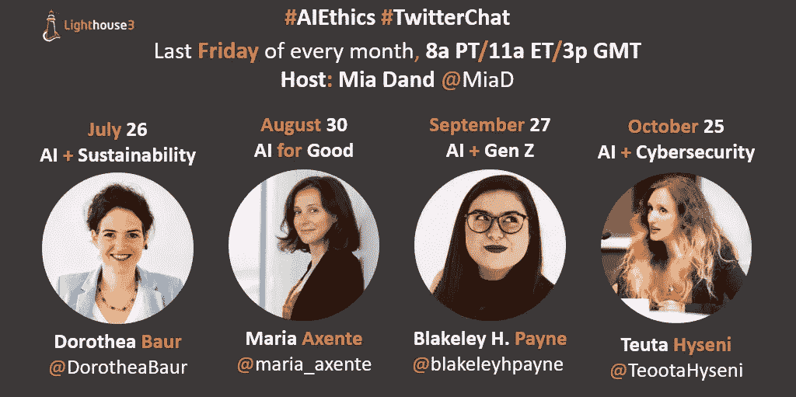

# AI 对可持续发展意味着什么？

> 原文：<https://medium.datadriveninvestor.com/what-does-ai-mean-for-sustainability-4623e53f1ce2?source=collection_archive---------3----------------------->

Source: CNN

*如果没有适当考虑人工智能对可持续性的影响，任何关于人工智能的讨论都是不完整的*

鉴于人工智能对可持续发展和环境的重大影响，在我们的[7 月人工智能伦理推特聊天](https://twitter.com/MiaD/status/1154768415376080896)中，我们邀请了 [**多萝西娅·鲍尔博士伦理官**、讲师、作者](https://www.linkedin.com/in/dorotheabaur/)([@多萝西娅·鲍尔](https://twitter.com/DorotheaBaur))来讨论“ [**人工智能对可持续发展意味着什么？**](https://twitter.com/MiaD/status/1154768415376080896)

 [## 人工智能预测能力的神话|数据驱动的投资者

### AI(人工智能)最有前途的优势之一似乎是它预测未来的能力…

www.datadriveninvestor.com](https://www.datadriveninvestor.com/2019/03/01/the-myth-of-ais-predictive-power/) 

米娅·丹德: **欢迎多萝西娅·鲍尔医生！谢谢你加入我们。让我们从基础开始。可持续发展意味着什么？**

多萝西娅·鲍尔博士:感谢邀请我！可持续性的标准定义源于 1987 年出版的《布伦特兰报告》,该报告将可持续发展定义为既满足当代人的需求，又不对子孙后代的条件产生不利影响的发展。一般来说，可持续性被认为包括三个方面的福祉——环境、社会和经济。但是当然，这三个方面之间有很多利益冲突，期待简单的“三赢”局面是幼稚的。此外，你可以批评这个定义为“人类中心主义”——它以当前和未来几代“人类”为中心；环境的健康没有内在价值。强调人类文明依赖环境——严格来说——是以人类为中心的。我并不反对人类中心主义，但我们需要清楚的是，当我们这样争论时，我们只是赋予环境一个工具性的价值。

既然我们已经有了明确的定义，你能分享一下可持续发展对技术，特别是人工智能的意义吗？

**DB:** 表示必须以符合可持续发展要求的方式开发和使用 AI。人工智能必须有助于满足今天和未来三个方面的需求。然而，这是一个简化的说法，因为每一项[技术](https://twitter.com/hashtag/technology?src=hashtag_click)都涉及到权衡。没有一种技术可以满足每个人的需求，包括环境的需求，无论是现在还是将来。但是在人工智能中加入可持续发展的维度是很重要的，因为人工智能通常是作为可持续发展问题的解决方案出现的…

**MD:同意。没有一种技术方案是完美的，人工智能也是如此，它也有一定的权衡。我们应该对人工智能的碳足迹有多担心？**

**DB:** 我们应该非常担心，特别是当我们浪费数吨二氧化碳来开发我称之为“无意义的人工智能”的时候，即不能满足任何相关需求的人工智能，无论是现在还是未来&这充其量是一种营销策略。

**MD:说得好。像联合国这样的组织也建立了全球可持续发展目标，人工智能如何帮助实现这些可持续发展目标？**

在我看来，环境可持续发展是部署“人工智能”最有前途的领域之一。环境是收集和分析数据的绝佳用例，这些数据有助于我们更好地了解和解决关键的环境挑战。与人工智能在“人类环境”中的使用相反，当你出于环境目的使用它时，你通常不会遇到隐私和歧视的问题。

**MD:我们(公司、个人)应该如何管理 AI 对环境的影响？**

**DB:** 他们应该对此保持透明。随着可持续性报告的增加，甚至在一些国家成为强制性的，人们希望看到公司不仅仅报告他们的建筑、工厂等的排放量..还包括他们使用的软件。这种类型的数据目前可能不容易获得，但提高认识和提前应对挑战是重要的第一步。

**MD:**baur 博士，非常感谢您富有洞察力的讨论。有意提高透明度和意识是迈向人工智能更可持续未来的重要第一步。

8 月 30 日(星期五)在**再次加入我们下个月的 [**Twitter 聊天**](https://twitter.com/miad) ，与我们的专家嘉宾 [**玛利亚·阿申特一起讨论如何建立对社会公益产生最大影响的人工智能程序。**](https://www.linkedin.com/in/mariaaxente/)**

[***Mia Dand***](https://www.linkedin.com/in/miadand/)*是一位数字化转型领导者，在领导业务、数据、技术和治理+道德的关键交叉领域的复杂跨职能项目方面拥有独特的专业知识。作为总部位于加利福尼亚州奥克兰的战略研究和咨询公司*[***light house 3***](https://lighthouse3.com/)*的首席执行官，Mia 擅长指导全球公司负责任地采用新的&新兴技术，如人工智能，以取得成功的业务成果。Mia 是一名热情的技术多样性倡导者，在谷歌、惠普、易贝、赛门铁克等全球公司构建以人为本的项目方面拥有丰富的经验。她是“*[***【100 位杰出女性人工智能伦理***](https://lighthouse3.com/100-brilliant-women-in-ai-ethics-you-should-follow-in-2019-and-beyond/) *”的创造者，这是一个关于多样性的权威指南，即将推出“* [***多样性人工智能***](https://lighthouse3.com/diversityinai/) *”在线工具，帮助会议组织者和公司在这个领域招募更多有才华的女性。*