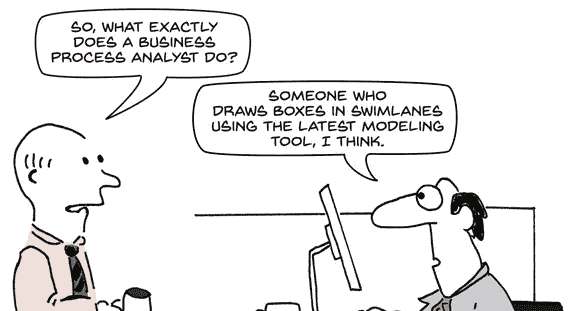

# 业务流程跟我有什么关系？

> 原文：<https://medium.datadriveninvestor.com/what-does-business-process-have-to-do-with-me-77ff6f7b57a2?source=collection_archive---------34----------------------->

Source: [https://expert360.com/blog/wp-content/uploads/2017/01/Cartoon.png](https://expert360.com/blog/wp-content/uploads/2017/01/Cartoon.png)

业务流程是一组利益相关者为实现目标而执行的一系列步骤。这些步骤通常会重复多次，有时会由多个用户重复，并且理想情况下是以标准化和优化的方式重复。业务流程可以是手动的，也可以是自动的。如果是手动的，该过程在没有自动化或辅助技术的帮助下实现。如果是自动化的，则技术援助已经到位，帮助用户以更准确、标准化或优化的方式实施流程。

业务流程通常可以被视为逻辑步骤的流程图或工作流。业务流程管理是试图将这种方法形式化的学科。

# 与业务流程相关的挑战

成功执行业务流程并不总是一件容易的事情。出现了许多挑战，包括:

*   瓶颈——由于人/机错误或困难，流程在特定阶段变慢或停止。
*   重复工作和冗余——低效的流程通常有重复或不必要的部分。
*   缺乏可见性—管理层无法查看流程所处的位置、它们的状态以及它们的总体和具体表现。
*   集成问题——流程技术并不总能与现有系统很好地集成，从而导致沟通中断和故障。

# 业务流程的类型

业务流程跨越纵向和横向的行业，可以包括任何类型的业务操作。例子包括:

*   制造——产品装配过程、质量保证过程、纠正性/预防性维护过程。
*   财务—开票流程、计费流程、风险管理流程
*   健康——医学评估，药物批准
*   银行业务—客户入职、信用检查
*   旅行-旅行预订、代理记账
*   防御——情况室流程、应急管理流程
*   人力资源—入职、离职、休假申请
*   公共部门—申请政府服务
*   合规性—安全审计，法律检查

# 应对这些挑战的技术解决方案

BPMS(业务流程管理软件)应该考虑上述挑战，并提供一套工具来处理和缓解它们。这些工具包括:

*   管理仪表板—这些可以解决可见性和瓶颈问题。想想商业智能。
*   验证和错误处理——大多数 BPMSs 都包括一个发现并帮助解决错误和故障的模块。
*   集成向导——这些向导有助于将 BPMS 与通用 ERP/CRM 和其他系统集成在一起，从而避免了对易于出错的编码的需求。
*   协作工具—能够轻松协作并查看彼此工作的用户能够帮助防止重复工作和冗余。

# 前景:过程智能——数据驱动、结果导向的方法

过程智能是一种基于 IT 系统详细数据的创新解决方案。这种类型的工具揭示了在您的业务流程中实际发生了什么，并使您能够正确地评估关键指标。

你了解你公司的所有流程吗？

无论是采购、销售、发票还是保险索赔，流程的预期状态和实际状态之间往往存在差距。

这有许多原因:

*   业务和系统环境的复杂性:
*   随着时间的推移发生的变化，
*   出于操作原因的工艺蓝图的例外情况，
*   用户在 IT 系统中有太多的自由，
*   最后，人们常常只看到一些过程，而看不到全貌。

识别和理解这些差距对于提高您的运营效果和效率至关重要。

# 过程智能将如何帮助你？

*   分析流程概述和某些过渡的数量。
*   深入了解人员、流程和 IT 系统中问题和瓶颈的根本原因。
*   评估过程标准化和控制的水平。
*   比较特定实体或部门在特定时间段或服务类型之间的行为。
*   评估交易/活动的交付周期(例如，从采购单据到货物收据、从货物收据到发票、从发票到付款)

更多关于商业流程、商业发展、企业家精神和其他来自千禧一代商业领袖的酷东西:

查看我在 LinkedIn 上的其他[文章](https://www.linkedin.com/today/author/ryan-raiker)

# [商业分析和商业智能——你的团队中有数据英雄吗？](https://www.linkedin.com/pulse/business-analytics-intelligence-do-you-have-data-hero-raiker-mba/)

# [大家都在谈论的热门话题…RPA](https://www.linkedin.com/pulse/hot-topic-everybody-talking-aboutrpa-ryan-raiker-mba/)

# 业务流程管理:我们正处于第四次浪潮的边缘吗？

在推特上关注我: [@ryraiker](https://twitter.com/RyRaiker)

喜欢我的脸书主页。赖克

在 Instagram 上关注我: [@ryraiker](https://www.instagram.com/ryraiker/)