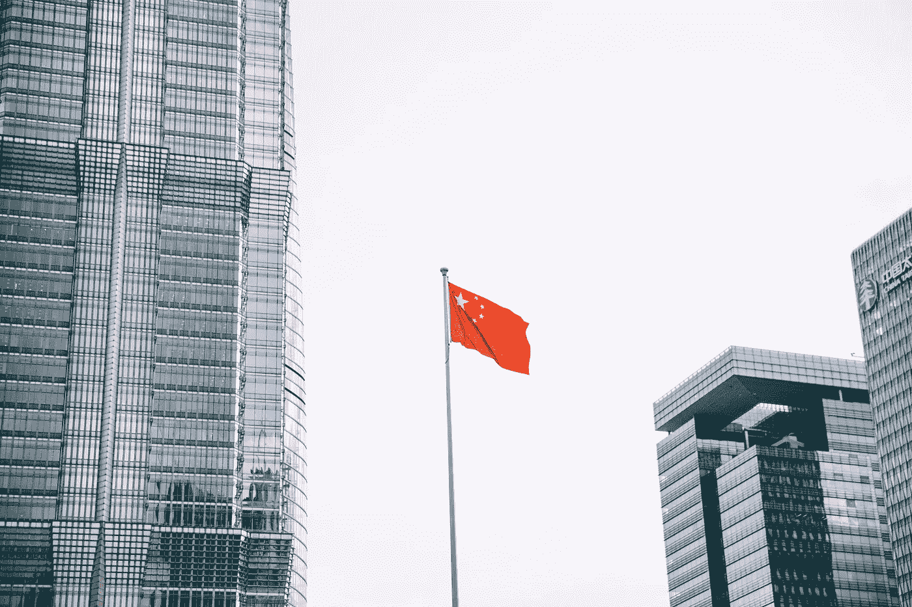

# 美国风险投资公司在中国的投资越来越多，这意味着什么？

> 原文：<https://medium.datadriveninvestor.com/what-does-it-mean-that-us-based-venture-capital-firms-are-investing-more-in-china-a194bbf6f1ed?source=collection_archive---------24----------------------->

在过去的几个月里，我看到美国的风险投资者将资金投入中国的初创企业。

而且资金只会越来越多:光速中国合伙人向美国证券交易委员会提交了文件，以筹集一只 3.6 亿美元的新基金。光速中国合伙人是总部位于美国的光速投资合伙人在中国的分支机构。

根据[Crunchbase News](https://news.crunchbase.com/news/chinese-startups-lead-us-rivals-in-2018-venture-race/)10 月份的一份报告，今年中国初创公司的融资额已经超过美国同行 20 亿美元。

我们今天知道的风险投资行业是几十年前在美国建立的，它帮助美国成为创新和技术发展的全球领导者。

中国正在迅速挑战这种主导地位。

著名的凯鹏华盈(Kleiner Perkins)合伙人玛丽·米克尔在她的 2018 年互联网趋势报告中指出，全球最大的互联网公司中，有九家现在位于中国，而五年前只有两家。

特朗普政府认为中国是一个技术对手。它试图通过对价值数千亿美元的中国进口商品征收关税来遏制中国涉嫌非法获取知识产权的行为。

中国和美国走在不同的政策道路上。虽然中国已经投入巨资将人工智能和机器学习等先进技术列为国家优先事项，但美国甚至尚未制定一个全面的数据隐私框架。

风险投资公司注意到了不同之处。中国显然因为其庞大的规模而具有吸引力，但有一个如此积极地孵化公司建设新技术的政府也是有帮助的。越来越多的风险资本流入中国初创企业，证明了中国作为全球技术创新领导者的新兴地位。

总部位于美国的风险投资公司也可以投资中国，作为对冲美国初创企业潜在低迷的一种方式。美国即将踏上一段漫长而痛苦的旅程，探索如何监管科技公司。毫无疑问，任何新规定都会让小型和成长中的初创公司感到更加严厉。美国政策制定者必须解决科技公司的滚雪球式影响，初创公司可能会陷入交叉火力之中。

美国投资者正在寻找大的退出机会，如果这种趋势继续下去，这些机会似乎会在中国更加普遍。同样有趣的是，中国投资者流入硅谷初创公司的资金数量，这些公司似乎更重视战略技术，而不是大规模退出。我们将会看到哪种策略占优势。