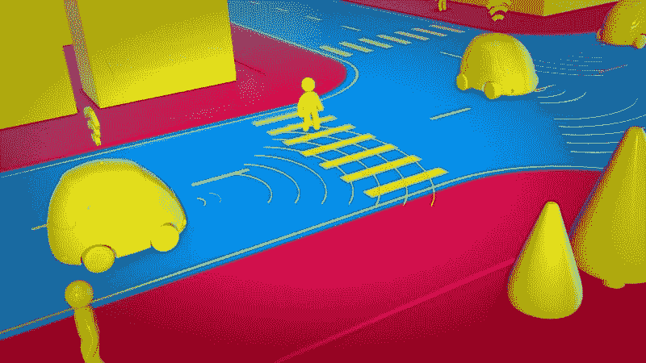
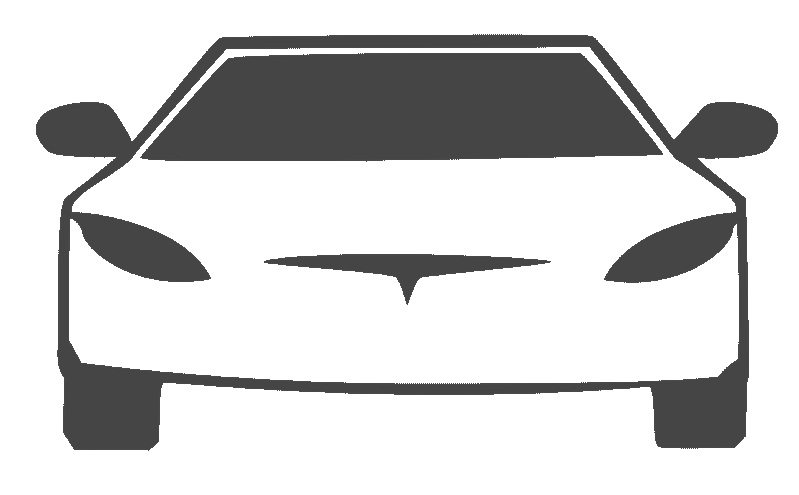
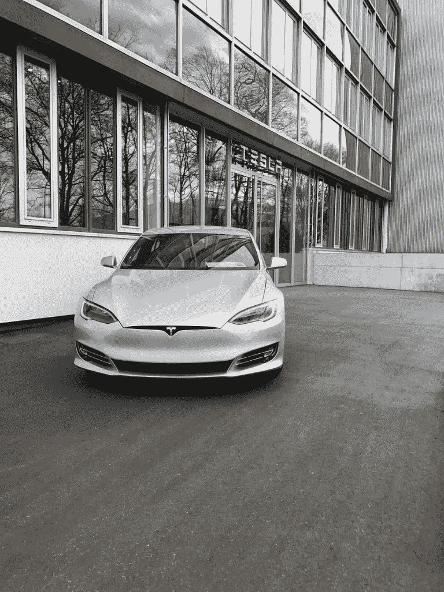
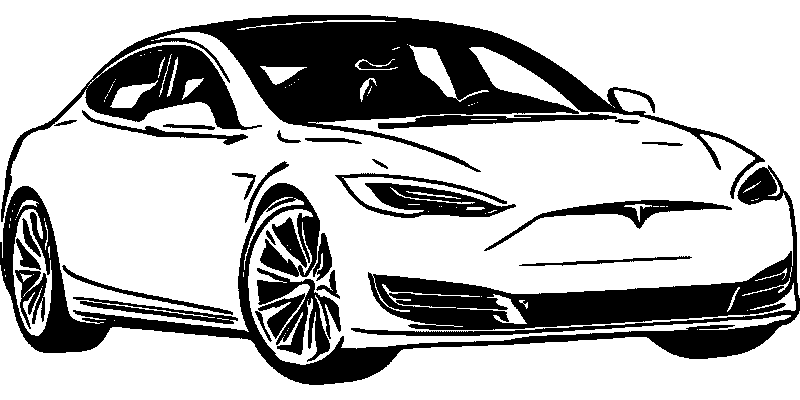
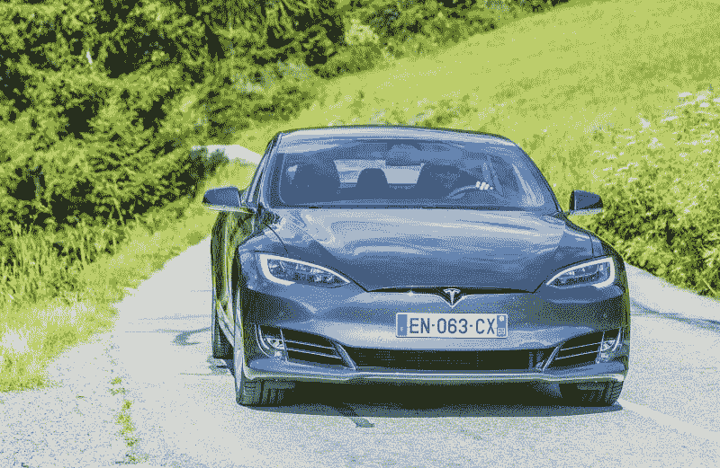

# 自动驾驶汽车的未来会怎样？—市场疯人院

> 原文：<https://medium.datadriveninvestor.com/what-does-the-future-hold-for-self-driving-cars-market-mad-house-dcc05b408fa5?source=collection_archive---------14----------------------->

自 2012 年谷歌首次将无人驾驶汽车带到道路上进行测试以来，我们一直在等待无人驾驶汽车，它将带我们去任何我们想去的地方，就像阿拉丁魔毯一样。

虽然自动驾驶汽车看起来仍然像科幻电影中的情节，但它们非常真实！特斯拉、通用汽车、谷歌、亚马逊、菲亚特、丰田、福特和其他许多顶级汽车制造商已经在研究自动驾驶汽车。他们中的一些人已经承诺尽快在 2020 年将完全自动驾驶的汽车推向市场。这是一个巨大的索赔，我们只能等待，看看有多少这些汽车标记成功地做他们声称的事情。

 [## 在自动驾驶汽车发生事故的情况下，谁应该承担法律责任？数据驱动的投资者

### 我仍然认为自动驾驶汽车是一种奢侈品，而不是必需品…

www.datadriveninvestor.com](https://www.datadriveninvestor.com/2018/11/02/who-is-legally-accountable-in-the-case-of-an-autonomous-vehicle-accident/) 

# 市场上可买到的 3 级汽车

对于那些不太了解自动驾驶汽车的人来说，知道这些汽车可以在不需要司机的情况下自行运行就足够了。自动驾驶汽车有 6 个类别，从 0 到 5，其中 0 表示常规的非自动驾驶汽车，5 表示完全自动驾驶的汽车，可以在任何地形上行驶，无需人工干预。

目前的技术已经让我们达到了第三级，即驾驶员需要坐在驾驶座上，如果自动驾驶的条件不合适，可能必须恢复控制。并且，未来几年上市的自动驾驶汽车将是 level-3 自动驾驶汽车。这意味着仍然需要驱动程序。

# 有人因为无人驾驶汽车而死亡

不幸的是，过去有人因为自动驾驶汽车而死亡。

大多数情况下，这是因为车主认为他们可能没有积极观察汽车的功能，这导致了事故。在一个案例中，[无人驾驶汽车无法从天空中辨别出一辆拖拉机](https://www.fool.com/investing/what-does-the-future-hold-for-self-driving-cars.aspx)，这导致了事故的发生。

# 自动驾驶汽车专家

专家们对自动驾驶汽车的看法不一。他们中的一些人说，这些无人驾驶汽车将在未来几年内完全占领市场。其他人说，这些无人驾驶汽车要到几十年后才会在市场上占据重要份额。

专家们对自动驾驶汽车的看法不一。他们中的一些人说，这些无人驾驶汽车将在未来几年内完全占领市场。其他人说，这些无人驾驶汽车要到几十年后才会在市场上占据重要份额。

# 人们对自动驾驶汽车有什么看法？

人们甚至害怕坐在这些车里。根据美国汽车协会 2019 年的年度自动驾驶汽车调查，近 71%的人表示，他们害怕作为乘客坐在无人驾驶汽车中。这些人主要担心的是汽车的控制权被交给一个可能出错的机器人。

市场情报和消费者洞察公司 CivicScience 的另一份报告给出了类似的结果。根据这份报告，大多数消费者表示，自动驾驶汽车如果想进入市场，需要表现出更好的安全标准。调查简报称，在涉及自动驾驶系统(ADS)技术的致命事故发生后，大多数人的想法都发生了变化。

然而，ADS 开发商已经证实，他们正在继续努力升级自动驾驶系统。他们为汽车增加了新的制动机制，并增加了更多传感器，可以在巡航过程中检测人类、动物和不可移动的物体。

# 无人驾驶汽车的好处

虽然自动驾驶汽车可能需要一段时间才能进入市场，但它们在一系列领域都有好处。

# 对驾驶员的帮助

自动驾驶系统将彻底改变卡车行业。目前，美国的卡车司机必须从加利福尼亚到佛罗里达，行程近 4000 公里。

这是一项忙乱的工作，许多卡车司机经常在驾驶过程中睡着，从而导致事故发生。自动驾驶机制将对这些司机有很大的帮助，因为它可以在驾驶过程中帮助他们，并在出现任何重大问题时提醒他们。

# 更多空闲时间

同样，广告系统将帮助司机获得更多的空闲时间，他们可以利用这些时间与其他乘客互动或做其他事情。虽然我们还没有达到我们可以获得这种自由的技术，但这将成为可能的时间并不遥远。

# 更好的巡航控制

由于道路网络已经变得先进，汽车已经变得更加高效，更多的人可能会在获得支持广告的汽车后使用道路而不是飞机旅行。虽然 T2 人可以买任何他们想要的车，但是现在更多的人开始关注能帮助他们做日常家务的广告车。

# 增强型业务

运输公司可以使用自动驾驶汽车来提升业务，并将业务范围扩大到更远的地区。

大多数运输公司通过卡车车队运送货物。这些卡车车队可以与 ADS 系统一起使用，在该系统中，只有第一辆卡车有司机，所有其他卡车都将跟随该卡车。这将降低成本，提高效率，带来更好的业务。

# 出租汽车

自动驾驶汽车的另一个好处是，它们可以出租给 Lyft、优步、Careem 等公司。这些公司中的大多数也在研究他们的技术来增强 ADS 系统。一旦这些系统可以使用，用户甚至可以在没有司机的情况下出租他们的汽车。

# 任何人都会开车

最后，自动驾驶汽车最好的一点是，任何人都可以使用它们到达目的地。今天，人们如果不知道如何自己开车，就不得不等待司机来开车。但是对于自动驾驶汽车，他们将只限于方向盘——他们有时可能需要管理方向盘。

# 最后的想法

自动驾驶汽车仍需要一段时间才能进入市场。但它们很有可能会对我们今天的生活和通勤方式产生巨大影响。

# 作者简介:

Evie Harrisonis 是自己选择的博客作者。她喜欢探索她周围的世界。她喜欢通过博客分享她的发现、经历和表达自己。在推特上找到她:@iamevieharrison

*原载于 2019 年 11 月 19 日*[*【https://marketmadhouse.com】*](https://marketmadhouse.com/what-does-the-future-hold-for-self-driving-cars/)*。*