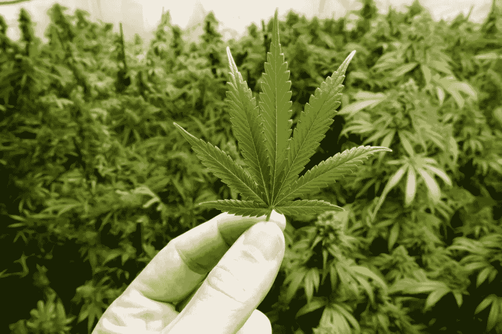
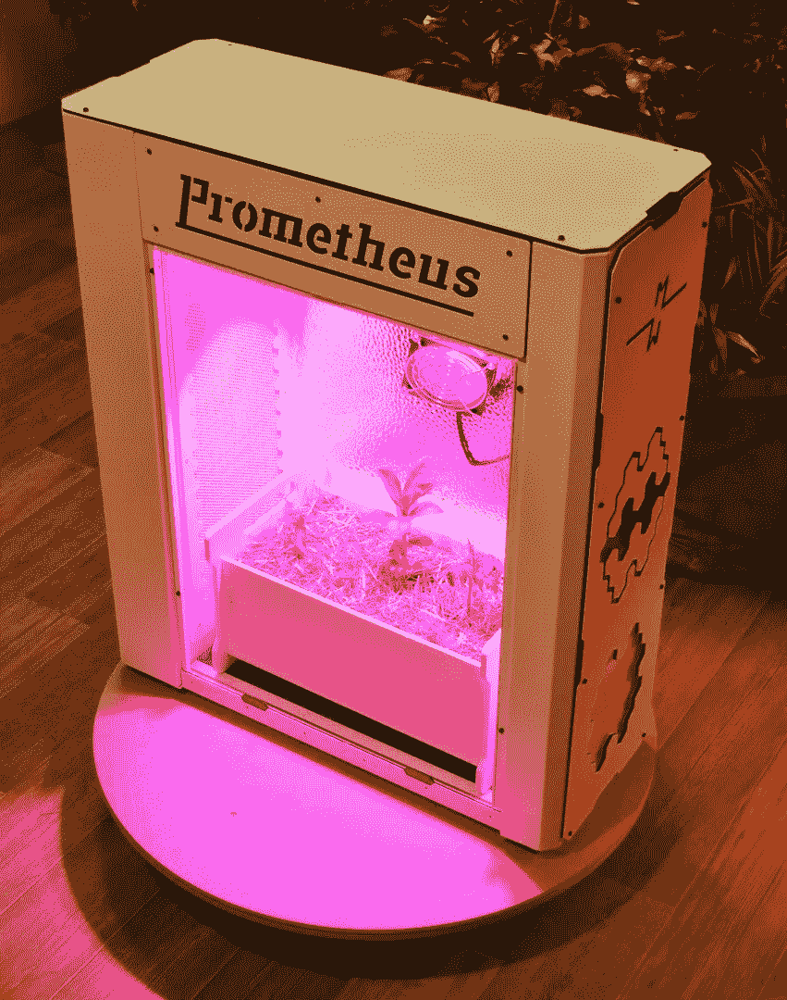

# 大麻合法化对加密货币市场意味着什么？

> 原文：<https://medium.datadriveninvestor.com/what-does-the-legalisation-of-cannabis-mean-for-the-cryptocurrency-market-438b52b271c0?source=collection_archive---------11----------------------->

## 有一种观点认为，大麻的合法化和投资者对大麻项目日益增长的兴趣导致了加密货币的投资外流。

事实是，加密货币和大麻实际上吸引的是同一类投资者和交易者。通常，这些是千禧一代的年轻人，没有巨额财富的负担，但愿意冒险。他们购买特斯拉的股票，投资加密货币，并对大麻合法化相关的项目感兴趣——这是典型的 25 岁千禧一代投资者的样子。在加密货币市场动荡、比特币价格下跌的同时，许多曾经投资加密货币或组织 ico 的人开始投资生产肥料、水培、生长箱和各种用于大麻种植的维生素的项目。

# 一点历史

不得不说，关于大麻的争论已经持续了近半个世纪。起初，大麻被广泛用于工业和医学，直到三十年代大规模反大麻运动后大麻在美国被禁止。1961 年，联合国签署了一项禁毒公约。从那时起，大麻被认为是一种毒品，并在世界上大多数国家被禁止。

几年前，关于大麻的争论再次加剧。乌拉圭是第一个将大麻使用完全合法化的国家。2016 年，超过 25 个美国州批准将大麻用于医疗目的。2018 年初，大麻在加拿大合法化。现在，在荷兰、捷克共和国、格鲁吉亚、西班牙、葡萄牙、朝鲜和美国的一些州，大麻的使用是部分允许的。

# 加密货币和大麻

目前的趋势是，世界上大多数国家的政府都放松了对大麻的禁令。对于年轻而雄心勃勃的千禧一代来说，这是一个跳上“大麻”列车、占据新位置的机会。尽管由于大麻的非法地位，投资大麻仍有相当大的风险，但这并不能阻止他们。

在我看来，加密货币的市场和大麻并不矛盾，也不对抗。他们有太多的共同点，从共同的参与者到不确定的法律地位。此外，加密货币市场最初与非法和半合法业务密切相关。简单地说，比特币的普及始于丝绸之路网站，在那里，除了其他东西之外，还有毒品出售。尽管该项目于 2013 年关闭，但大麻仍然吸引着密码爱好者，大量区块链初创公司的名字就证明了这一点，如 PotCoin、CannabisCoin 等。

如果现在投资者对加密货币的兴趣下降，这与大麻合法化无关。相反，这是加密货币市场普遍下滑的结果。可以预计，一年前试图在 ICOs 或加密货币交易中轻松赚钱的一些冒险家现在将从事与大麻种植有关的项目。然而，炒作的减少以及旨在加密货币市场上获得快速超额利润的骗子和投资者的数量可以使真正发展的公司受益。最后，任何发展都需要时间，许多旨在创造一种产品的项目只有在两三年后才能开始给投资者带来利润。这对于风险投资市场来说很正常，但对于那些希望在购买一些加密货币或替代货币后获得即时超额利润的人来说，绝对无法接受。

我非常希望，由于大麻的合法化，加密货币市场将至少从骗局和骗子那里安全一点。

# 跟随[费尔温](http://fairwin.io/):

推特:【https://twitter.com/FairwinGambling[T4:](https://twitter.com/FairwinGambling)[https://www.facebook.com/fairwin.gambling/](https://www.facebook.com/fairwin.gambling/)insta gram:[https://www.instagram.com/fairwin_team/](https://www.instagram.com/fairwin_team/)

# 与我们聊天:

不和:[https://discord.gg/Hbardp2](https://discord.gg/Hbardp2)
Reddit:[https://www.reddit.com/user/fair-win](https://www.reddit.com/user/fair-win)
电报:[https://t.me/fair_win](https://t.me/fair_win)