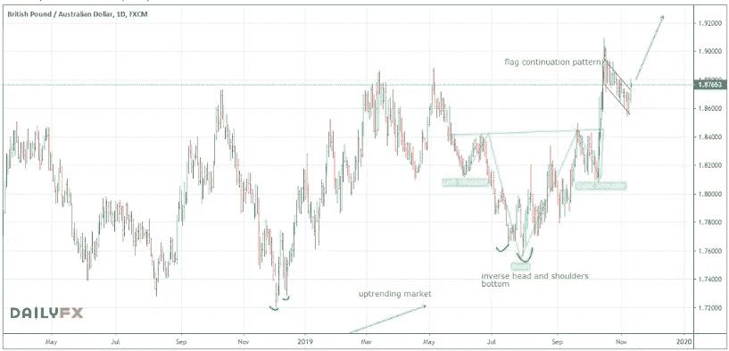

# 英国大选对英镑意味着什么？

> 原文：<https://medium.datadriveninvestor.com/what-does-the-uk-election-mean-for-the-british-pound-c42f9df8f580?source=collection_archive---------15----------------------->

**本周一周交易:*买入 GBP aud***

在过去的几个月里，英镑为 T4 提供了很多机会。本周，我正在寻找另一对英镑作为我的本周交易，并将分享我认为价格行动可能预示着即将到来的英国大选。

最近几周我们没有看到多少后续交易，所以我的交易量一直在减少。所有市场时不时都会经历这些时期。我们必须尊重他们，并通过等待最清晰和最佳的设置来做出反应。如果我们试图强求，对我们的客户来说，这可能是一个危险时期，会导致很多情感和财务压力。

 [## 机器学习的外汇交易挑战|数据驱动的投资者

### 机器学习是人工智能的一个分支，之前占据了很多头条。人们是…

www.datadriveninvestor.com](https://www.datadriveninvestor.com/2019/02/18/the-challenge-of-forex-trading-for-machine-learning/) 

话虽如此，现在还是有一些机会的。几天前，我做了一笔不错的英镑交易，我将继续持有，并随着(如果)事态的发展，可能会继续尝试利用这一趋势。

总的来说，英镑对大多数其他主要货币继续保持强劲。英国大选即将来临，尽管结果仍不确定，但市场会在可能的结果之前给我们一个很好的提示。至少对英镑价值的可能结果是如此。目前情况是积极的，但是离选举还有一段时间，所以我们会在临近的时候知道更多。

美国和全球大多数其他股市继续创出新高。他们所展示的缓慢而稳定的价格波动——没有剧烈的大范围波动，告诉我们这种波动可能至少会持续一段时间。

过去几周，美元一直在窄幅波动。我们正处于一个关键的价格区域，应该会很快变得更加清晰，并确认美元的下一个主要走势。

你想学习如何从市场中获得持续的利润吗？ [*点击此处*](https://go.mangrovetrading.com/freetraining) *，我们将通过一系列免费培训视频带您一步步了解我们的整个交易策略。*