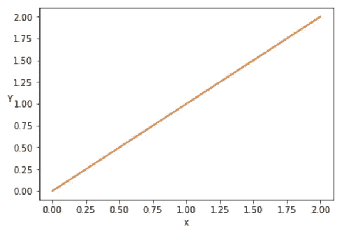
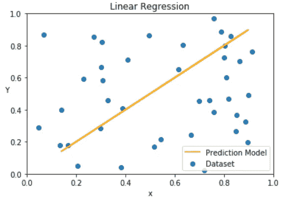
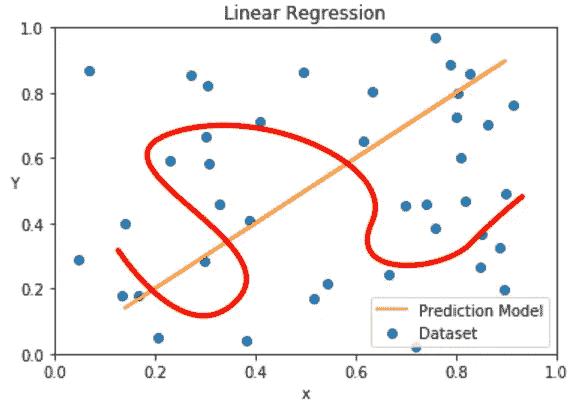
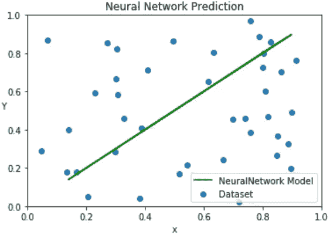

# 人工智能模型到底是什么？一辆 ELi5。

> 原文：<https://medium.datadriveninvestor.com/what-exactly-is-an-a-i-model-an-eli5-2b87e4d48114?source=collection_archive---------1----------------------->

机器学习模型。我们一直听说他们。他们看起来和听起来都很棒，但是他们能预测和应对棘手的问题吗？它们到底是什么？

机器学习可以被认为是“通过公式和算法解析数据”，给我们一个结果。

这里的机器学习“模型”将是基于公式、算法及其相对设置计算的变量之间的 ***关系。***

比如一个简单的 Y = mX + c 线性函数，说明了 x 和 Y 的关系。

这里我们有一个输入 X，一个输出 y。这里的“设置”应该是:
m = 1
c = 0。
用非常简单化的话来说，输出= 1 *输入+ 0。

该模型将从给定的数据集生成该线性函数。

让我们看看机器学习如何基于给定的绘图点数据集生成线性预测。

# 线性回归

线性回归—线性回归是变量之间关系的线性建模。

在我们学校的数学中，这通常被称为“最佳拟合线”。

在这种情况下，模型的可视化将为我们提供如下所示的线性函数。

Prediction visualization based on data set

这里的数据集由 0 到 1 之间的随机(x，y)坐标生成。上图中有 40 个数据点。

使用随机数据的线性回归建模，
我们发现数据之间的关系是一个完美的 Y = X 线性函数。

这个关系帮助我们预测，如果
X = 0.5，
Y 最有可能是 0.5。

## 这条直线上的机器学习在哪里？

当更多(非随机)数据被放入数据集中时，线可能会移动。

有些变化可能比其他变化更细微，特别是对于大数据集(例如 100 万个数据点)。

这里的机器学习就是检测，重新训练模型，进行预测和推断。

你可能会想“这么简单，只需重画线就行了！”但是，如果我们有一个更复杂的任务，需要一个复杂的拟合呢？

If we want the red squiggly line. Not so straight forward now huh?

机器学习，在这里，将简化计算拟合曲线的任务！

更复杂的任务当然需要更复杂的模型！

# 神经网络模型

人工神经网络模型基于一些线性公式和激活函数的计算，权重、偏差(即它们的“设置”)随着每次计算而调整。

1-Layer Neural Network

以上是 1 层神经网络。每个圆圈被称为一个神经元，更准确地说是一个感知器。我们可以使用上述神经网络模型来寻找给定数据之间的关系。

我们将训练一个 1 层的神经网络模型，隐层有 100 个神经元。

让我们看看它与之前的数据集相比表现如何。

Prediction Visualization of the NN Model

请注意，它给出了与更简单的线性回归模型完全相同的预测模型。

# 我们如何选择使用哪个模型？

简单！哪个更容易实现，哪个更准确？哪个更适合手头的任务？

对于上面这样一个简单的问题，使用线性回归模型是明显的赢家！

还有许多其他机器学习模型，如 Q 学习、强化学习、卷积神经网络和许多其他模型。

许多是任务特定的，这意味着它们被设计成在不同的“设置”和环境下表现得更好。

因此，决定你的任务，并采取选择！