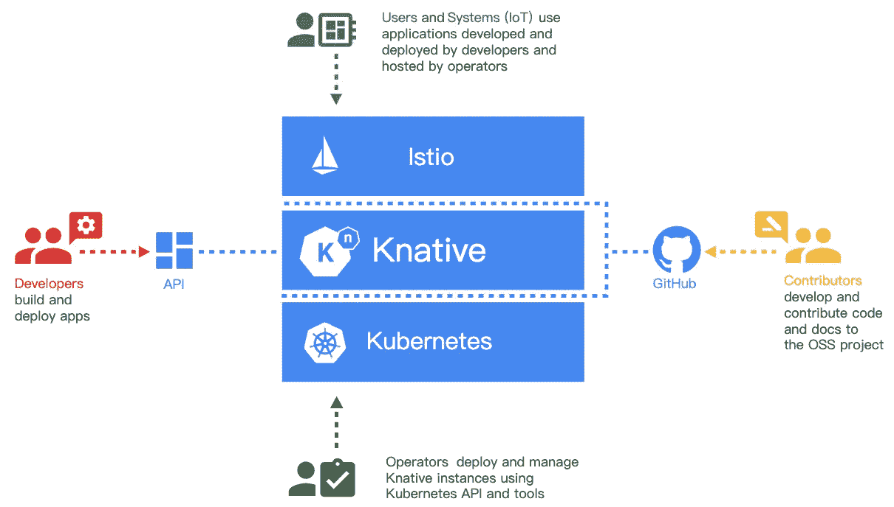

# Knative 到底是什么？

> 原文：<https://medium.datadriveninvestor.com/what-exactly-is-knative-252ec94e4de7?source=collection_archive---------0----------------------->

Knative 是一个基于 Kubernetes 的[无服务器框架](https://hackernoon.com/what-is-serverless-architecture-what-are-its-pros-and-cons-cc4b804022e9?spm=a2c41.13373763.0.0)，由 Google 宣布并开发。Knative 的一个重要目标是建立一个云原生的和跨平台的编排标准。Knative 通过集成容器或功能的创建、工作负载管理和自动扩展以及事件模型来实现这种无服务器标准。除了谷歌，Knative 社区的主要贡献者包括 [Pivotal](https://pivotal.io/?spm=a2c41.13373763.0.0) 、 [IBM](https://www.ibm.com/cloud?spm=a2c41.13373763.0.0) 和 [Red Hat](https://www.redhat.com/en?spm=a2c41.13373763.0.0) 。PaaS 提供商如 [CloudFoundry](https://www.cloudfoundry.org/?spm=a2c41.13373763.0.0) 和 [OpenShift](https://www.openshift.com/?spm=a2c41.13373763.0.0) 也在积极地为 Knative 社区做出贡献。

# Knative 的诞生

在 Knative 开发出来之前，社区中已经有了许多无服务器解决方案。其中包括 [Kubeless](https://kubeless.io/?spm=a2c41.13373763.0.0) 、[裂变](https://fission.io/?spm=a2c41.13373763.0.0)、 [OpenFaaS](https://www.openfaas.com/?spm=a2c41.13373763.0.0) 和[阿帕奇 open whish](http://openwhisk.apache.org/?spm=a2c41.13373763.0.0)。除了这些开源解决方案，主要的云提供商也提供了等效的 FaaS 产品，如亚马逊网络服务的 [Lambda](https://aws.amazon.com/lambda/?spm=a2c41.13373763.0.0) ，谷歌云的 [Functions](https://cloud.google.com/functions/?spm=a2c41.13373763.0.0) ，微软的 [Azure Functions](https://azure.microsoft.com/en-us/services/functions/?spm=a2c41.13373763.0.0) ，以及阿里云的 [Function Compute](https://www.alibabacloud.com/products/function-compute?spm=a2c41.13373763.0.0) 。

 [## 信息图:云之旅|数据驱动的投资者

### 聪明的企业领导者了解利用云的价值。随着数据存储需求的增长，他们已经…

www.datadriveninvestor.com](https://www.datadriveninvestor.com/2018/09/22/infographic-journey-to-the-clouds/) 

将业务代码部署到无服务器平台需要源代码编译、部署和事件管理。然而，开源解决方案和公共云提供商的 FaaS 产品都涉及不同的实现方法。缺乏统一的标准导致了一些市场的分裂，每个可用的解决方案都有可能被特定的解决方案提供商所束缚。

此外，缺乏统一的标准和市场分割导致了许多其他问题。对于云提供商来说，很难允许他们的用户以无服务器的方式迁移到云中。对于 PaaS 提供商来说，他们发现很难为用户构建一个通用的 PaaS 平台。然而，为了克服这些困难，谷歌与 Pivotal、IBM 和 Red Hat 等公司共同发起了 Knative 项目。

下图显示了导致 Knative 系统的协作努力:

来源: [Knative GitHub repo](https://github.com/knative/docs/)

根据这个图表，你可以看到 Knative:

*   开发者:无服务器服务的开发者可以直接使用原生的 Kubernetes API 来部署基于 Knative 的无服务器服务。
*   贡献者:贡献者主要是对社区有贡献的人。
*   运营商:运营商可以将 Knative 集成到任何支持的环境中，比如云提供商的环境和内部企业环境。Knative 是基于 Kubernetes 实现的。您可以使用 Knative 在 Kubernetes 上部署服务。
*   用户:用户通过 Istio 网关访问服务，或者使用事件系统触发 Knative 中的无服务器服务。

# Knative 的核心组件

Knative 的整体无服务器框架由三个核心组件组成:

*   构建组件:构建支持创建一组从源代码到容器映像构建应用程序的步骤。
*   事件组件:事件提供了一整套事件管理功能，包括连接和触发事件。
*   服务组件:服务管理无服务器工作负载。它提供基于请求的自动扩展，并在没有服务需要处理时支持扩展到零。

现在，让我们更详细地讨论这些组件。

构建组件主要负责从代码库中获取源代码，将代码编译成映像，然后推送到映像库中。所有这些操作都在[的 Kubernetes 豆荚](https://kubernetes.io/docs/concepts/workloads/pods/pod/?spm=a2c41.13373763.0.0)中进行。

事件组件有一整套针对无服务器事件驱动模式的设计实现。这些功能包括连接到外部事件源、事件注册表、事件订阅和事件过滤。事件模型可以有效地使事件生产者和消费者解耦和独立。任何生产者都可以在活动事件消费者开始之前生成事件。任何消费者都可以在活跃的生产者开始之前收听事件。

服务组件负责管理工作负载并提供外部服务。Knative Serving 最重要的特性是自动缩放(向上和向下到零)。发球的另一个重要特点是分阶段释放。

你可以说，尽管 Knative 是在 Kubernetes 之上实现的，但这并不意味着 Kubernetes 的所有特性都可以在 Knative 中使用。这是因为 Knative 是专门为无服务器场景设计的，例如在一个 Pod 中只能包含一个容器，并且一个容器中只能包含一个端口。更多相关细节将在后续文章中介绍。

# Knative 的优点

Knative 构建于 Kubernetes 之上，支持无服务器编排，也是基于 Istio 实现的，支持包括服务连接、路由管理和分阶段发布在内的功能。Knative 构建在现有的云原生基础上，因此拥有庞大的社区基础。Knative 一旦作为开源项目发布，就会在市场上引起巨大轰动，原因如下:

*   Knative 的定位不是 PaaS，而是一个通用的无服务器编排框架，可以用来构建自己的无服务器 PaaS。
*   Knative 是建立无服务器架构设计标准框架的先驱。在 Knative 之前，每个以前的 FaaS 解决方案都有自己的事件标准，与另一个 FaaS 解决方案不兼容。Knative 为设计提出了 CloudEvent 标准。
*   成熟的社区生态系统:像 Kubernetes 和 ServiceMesh 这样的社区都支持 Knative。
*   跨平台支持:Knative 构建在 Kubernetes 之上，它在不同的云提供商之间提供了几乎通用的标准。因此，Knative 还实现了跨平台支持，消除了与供应商绑定的风险。
*   成熟的无服务器模型设计:Knative 拥有比以前的无服务器解决方案更成熟的设计。例如:
*   事件模型非常完善，实现了一整套设计，包括注册、订阅和连接外部事件系统。
*   例如，Knative 允许从源代码到图像构建应用程序。
*   服务支持按比例分阶段释放。

# 结论

在这篇博客中，我们描述了 Knative 诞生的背景，Knative 期望解决的问题，核心概念，以及 Knative 的优势。在一系列后续文章中，我们将继续描述 Knative 的使用，并分析其内部实现。

*作者:董导，阿里云智能部技术专家*

# 原始资料

 [## Knative 到底是什么？

### 阿里巴巴开发者 2019 年 8 月 8 日 19 1 由阿里云智能部门技术专家董导 Knative is…

www.alibabacloud.com](https://www.alibabacloud.com/blog/what-exactly-is-knative_595211?spm=a2c41.13373763.0.0)