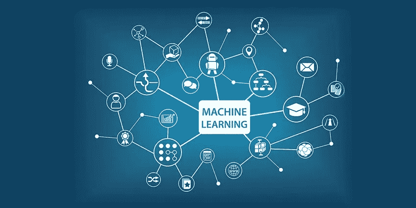

# 机器学习到底是什么？？

> 原文：<https://medium.datadriveninvestor.com/what-exactly-is-machine-learning-6033c63dcbf4?source=collection_archive---------13----------------------->

我们中大多数有计算机科学或人工智能或任何其他相关领域背景的人都知道什么是机器学习，以及人们目前如何/在哪里使用它。

但是，有很多人不知道机器学习到底是什么。我为这些人写这篇博客，所以让我们希望在这篇博客结束时，你会对什么是机器学习及其应用有所了解。

机器学习的一个正式定义可以是，“一个计算机程序在做某类任务时从经验中学习，如果它的性能度量随着经验的增加而提高”。这个定义遵循了艾伦·图灵在他的论文《计算机器和智能》中的提议，他在论文中提出的问题是“**机器能理性思考吗？****通俗地说，我们可以说机器学习(ML)是在各种算法的帮助下研究一项任务的数学模型，并使用它们来逐步提高特定任务的性能。**

虽然人工智能(AI)是人类行为及其能力的综合科学，但机器学习是人工智能的一个子集，它训练机器如何学习。由于计算技术的进步，今天的机器学习不同于过去的机器学习。据说机器学习起源于模式识别，并且基于计算机可以在没有人类干预的情况下学习特定的任务，对人工智能感兴趣的研究人员想看看机器是否可以从数据中学习。机器学习最重要的方面是，当模型暴露于新的数据集时，它们具有独立的适应性。模型从以前的计算输出中学习，以获得可靠的决策和结果。这不是一门新的科学，但却获得了新的动力。

好了，我们已经过了机器学习的定义。现在，让我们深入一些技术内容，并对机器学习问题进行分类。

机器学习问题分为几大类。监督学习就是其中之一，其中算法建立了一个数据集的数学模型。另一种是半监督学习，虽然它是监督的，但与监督学习略有不同，其中学习算法从不完整的数据集开发数学模型，并且一部分样本输入丢失了预期输出。而分类和回归，算法是监督学习的类型。当输出被限制在特定范围的值时，使用分类算法。而在回归算法中，用于连续输出，这意味着输出可以是某个范围内的任何值。

无监督学习只获取只有输入的数据集，并建立数据集的数学模型。无监督学习在数据集中寻找结构或模式，并将它们分组(聚类)到一个数据点。所识别的模式将被归类为特征学习。

强化学习也是一种机器学习算法，在这种算法中，机器根据动态环境中正面或负面强化的先前反馈来预测结果。机器学习算法可以用来寻找特定问题中预期结果的概率。在元学习算法中，归纳偏差是由算法本身根据以前的经验学习的。

那么，我们已经过了什么是机器学习和一些学习算法/方法，现在让我们总结一切…

机器学习(ML)在可学习的概率模型中迈出了重要的一步。计算能力和数据可用性方面的最新进展极大地改进了机器学习技术。主要是自动化和解决各种复杂的问题。在今天，机器学习已经发展到可以在最少人工干预的情况下识别模式并做出决定的程度。机器学习方法可以分为两类，学习算法和相似性算法。机器学习的应用一直在快速增长，它可以是无限的。这些应用使用各种 ML 算法，每种算法对问题环境的影响不同。要决定哪种机器学习对特定问题最有效，数据驱动的方法是最合适的。基于问题环境的数据集，我们可以决定采用哪种机器学习方法。

我希望你们能理解机器学习。如果你们想了解更多关于机器学习的知识，那么我打算再写一篇关于机器学习方法的博客，这将更具技术性，并且与我在这里提到的数据驱动方法相关。

**参考文献**

图灵，A. M. (2009)。计算机器和智能。在*解析图灵测试*(第 23–65 页)。斯普林格，多德雷赫特。

**下一篇博客(下篇):** [机器学习方法及其应用](https://medium.com/@brij.rokad/machine-learning-approaches-and-its-applications-7bfbe782f4a8)