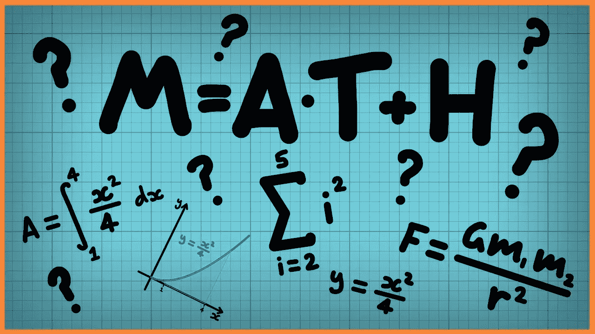
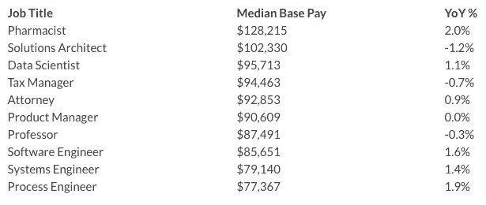

# ML 到底是什么？python 是如何进入画面的？为什么有这么多关于它的炒作？

> 原文：<https://medium.datadriveninvestor.com/what-exactly-is-ml-how-does-python-come-into-the-picture-why-is-there-so-much-hype-about-it-f1b9dedb5190?source=collection_archive---------20----------------------->

好吧，让我们来看看底线。

炒作到底是怎么回事？

# 总结(TL；博士)

随着数据存储和数字连接人口(想想智能手机)的增加，我们可以处理的数据比以往任何时候都多，这就是机器学习发挥作用的地方。通过回顾过去，它有助于预测未来的数据。大部分 ML 由基本微分方程组成

Python 只是一个用来写那些方程的工具。虽然我们需要使用一些编码知识，但这或多或少局限于循环和函数调用。

# 说来话长

想知道 youtube 是如何知道哪些视频值得推荐的吗？或者你访问的所有网站都有你想要的东西的广告？([推荐系统](https://en.wikipedia.org/wiki/Recommender_system)

对于精通金融的人来说，拥有一个魔术盒的前景几乎可以肯定地告诉他们一只股票/产品在未来几个月将赚多少钱。([财经预测](https://www.analyticsvidhya.com/blog/2018/10/predicting-stock-price-machine-learningnd-deep-learning-techniques-python/)

甚至通过拍摄虹膜照片来检测你是否患有心脏病。([谷歌虹膜](https://www.theverge.com/2018/2/19/17027902/google-verily-ai-algorithm-eye-scan-heart-disease-cardiovascular-risk))

Heart disease or nah!

**问:这一切是如何实现的？**

从远处看，它可能像一个魔盒，在某些方面，它有点像，但它非常容易理解，基本上是我们几年前学习的那些讨厌的数学积分和微分方程的混合。

我们只是把方程式编码进编译器，然后让它运行。这就是魔力的来源。

基本上，你可以做任何事情，直到你有了数据。

*sigh*

**问:那么 Python 在图片中处于什么位置呢？**

还记得我们为特定目的推导的数学方程吗，我们需要计算机来理解它们。它是这样流动的:

**第一步:**将公式编码到系统中
**第二步:**从任何数据采集设备(甚至是你使用的智能手机采集数据)获取数据流
**第三步:**将输入的数据通过编码后的公式传递，得到结果。

如果编码公式听起来很难，不要担心 python 有大量与 ML 相关的库，因此我们只需要做函数调用就可以了！

即使在 python 中也不需要太深入的知识，因为我们最多处理函数调用和循环。

注意:我们可以使用自己选择的任何语言。真的没关系。Python 拥有最优质的生活功能，这使得编写代码变得更加容易。有时候，只需要 3-4 行代码就可以完成一系列您不需要担心的工作。

**问:机器学习的未来如何？**

很高兴你问了:

几乎所有的大公司都在转向人工智能，至少在未来 10 年，这将是一个非常有利可图的领域。不相信我？，这里有一些文章:

1.  [桑德尔·皮帅谈论机器学习](https://www.youtube.com/watch?v=5cFUZ03Sbhc)
2.  [对机器学习未来的 5 个预测](https://www.ibmbigdatahub.com/blog/5-predictions-future-machine-learning)
3.  [机器学习和人工智能的未来](https://www.dataversity.net/future-machine-learning-artificial-intelligence/)

当然，还有很多。这只是给出一个大概的概念。

问:工资有多高？

我看得出你已经盯上了这个奖。

Something that started very recently is already in 3rd spot of highest paid in 2018.

**总之:**这篇文章只是一个引子，用来消除人们对机器学习的一些困惑。希望你喜欢这篇短文。

任何关于更简化流程的建议或任何疑问，请随时评论。