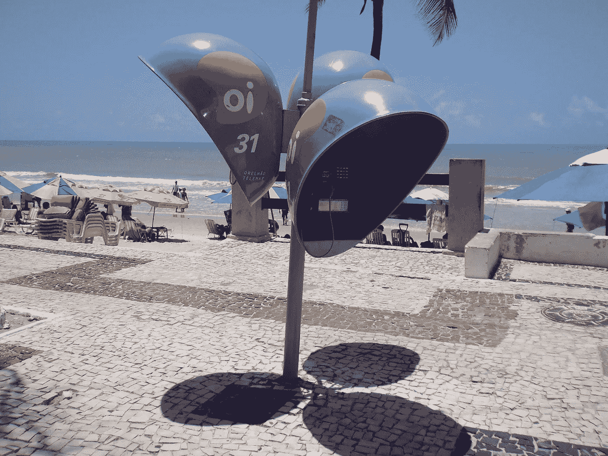

# 巴西电信巨头 Oi 怎么了？

> 原文：<https://medium.datadriveninvestor.com/what-happened-to-brazilian-telecommunications-giant-oi-cbedc9037f1f?source=collection_archive---------14----------------------->

Image: Wikimedia

以下是对上市公司的概述，不应被视为投资建议。

Oi 是巴西乃至整个南美最大的电信公司。Oi 的服务起源于 20 世纪 90 年代末巴西电信系统的私有化，包括面向个人、企业和政府客户的固定电话和移动电话网络、互联网、电视和 IP 语音。在经历了纽约证券交易所(OIBR)的价格高峰之后。c)继 2009 年[和 2013 年](https://oglobo.globo.com/economia/apos-brasil-telecom-oi-ja-sonha-com-tim-brasil-3572554)[的大规模并购之后，Oi 的股票现在的交易价格还不到过去十年价格的 0 . 5%。](http://economia.terra.com.br/uniao-de-oi-e-portugal-tel-cria-empresa-com-receita-de-quase-r40-bi,01c877f273971410VgnCLD2000000dc6eb0aRCRD.html)

Oi 和其他巴西公司面临的一个主要问题是本国复杂的宏观经济形势。2014 年至 2016 年间，巴西经济[持续减速](https://tradingeconomics.com/brazil/gdp)，实际上，在通胀高峰期间，雷亚尔对美元贬值[100%](https://tradingeconomics.com/brazil/currency)。在一位总统被弹劾下台后，深化改革的承诺重新点燃了投资者对这个国家的信心，但是最近选举的不确定性和对紧缩措施的普遍不满并没有消除所有的疑虑。

随着外部因素侵蚀其收入流，近年来 Oi 被债务吞噬——最终导致漫长的破产保护过程和 2017 年 12 月的一项决议，以[债转股](https://www.reuters.com/article/us-oi-restructuring/brazils-oi-approves-debt-for-equity-swap-legal-wrangles-continue-idUSKCN1GI1JK)的方式重组数十亿美元的债务，这大大稀释了股东权益。这些导致了激烈的法律斗争，期间[一群股东受到指责](https://www.reuters.com/article/oi-restructuring-pharol/brazils-oi-wins-ruling-in-battle-with-shareholder-pharol-idUSL1N1QW0JY)和[董事会被罢免](https://www.cnbc.com/2018/08/02/reuters-america-update-1-brazils-oi-proposes-new-board-for-shareholders-meeting.html)。

尽管困难重重，但随着债务重组的成功完成，内部阴谋的解决，以及标准普尔评级的提升，Oi 的前景有所改善。尽管公司没有排除在未来一旦财务状况恢复健康后将公司出售给另一家公司的可能性，但管理层已经否决了短期内将公司出售给另一家公司的可能性。