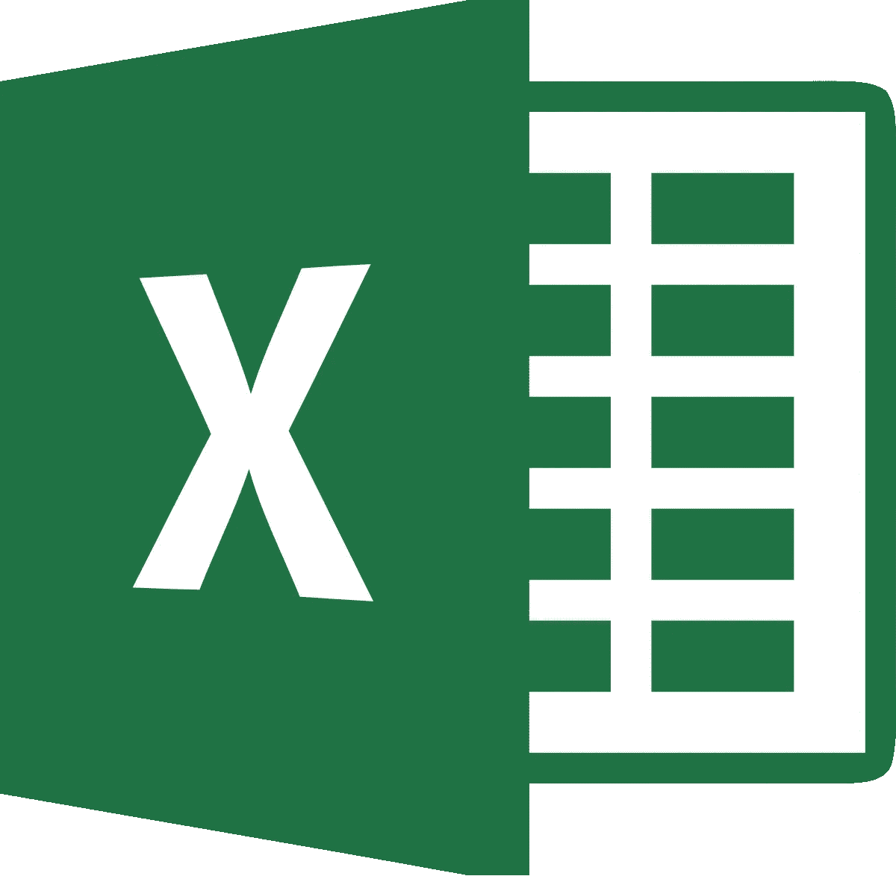

# 微软 Excel 怎么了？

> 原文：<https://medium.datadriveninvestor.com/what-happened-to-microsoft-excel-19fef92228bb?source=collection_archive---------6----------------------->

几天前有人问我，为什么人们不在 Hadoop 或大数据中使用更多的 Microsoft Excel？我开始思考这个问题，从表面上看，这是有道理的。毕竟，世界上所有最大的数据库和最重要的应用程序都运行在 Microsoft Excel 上，对吗？有些人会嘲笑这种说法，但它有一点真实性。于是我开始在网上闲逛，偶然发现了一个页面，向我展示了如何将 Microsoft Excel 连接到 Hive 和 Hadoop。它声称你所需要的只是一个 ODBC 驱动程序和一个连接字符串，你可以将数据导入 Hadoop。嗯嗯？？耐人寻味！在我 30 年的经验中，我见过一些非常时髦和令人惊叹的 Excel 工作簿。Excel 有很大的局限性，它不是一个企业应用程序，并且像许多大数据应用程序一样，它本身是不完整的，需要其他工具才能使它处理大数据。

简单地说，Excel 在规模方面有很大的局限性。这些将带来挑战，因为 Apache Hadoop 可以容纳不同种类的数万亿条记录。使用 Excel 时，只能有 1，048，576 行和 16，384 列。每个单元格只能包含 32，767 个字符。您还受到运行 Excel 应用程序的可用内存和系统资源的限制。因此，MS Excel 绝不是一个可以用于大数据分析或数据管理的大数据工具。Excel 通常是在标准个人计算机上运行的桌面应用程序，不能向外扩展，但即使可以，也仍然会受到上面指定的行数和列数的限制。

Excel 不是企业工具。这意味着它缺乏控制、授权、认证、安全性、备份和简单的共享。你说等一下！我可以在我的 Excel 电子表格上设置密码，并且可以备份。没错，但这些并不真正强大，可以被一个名为([www.passware.com/excel](http://www.passware.com/excel))的 39 美元软件产品破解。一旦我的数据离开 Hadoop 或数据湖，许多糟糕的事情都可能发生:它可能会丢失，意外地通过电子邮件发送给不该拥有它的人，或者被复制并在组织内发送。拥有一个中央安全模型是关键，将您的数据保存在一个安全且加密的空间中也很重要。将数据保存在本地 Excel 文件中意味着我可以轻松地将它与其他数据源结合起来，并在识别出未识别的数据时进行渲染。作为您的朋友，了解 HIPAA 合规性和识别患者保护医疗保健信息(PHI)。要点是，一旦数据离开中央治理的存储库，就应该认为它是不安全的，并且对组织来说是潜在的安全/隐私风险。Excel 肯定不是一个企业工具，我们将会发现，对于大数据分析来说，它确实是一个不完整的解决方案。

Excel 总是让我想要更多。更大的尺寸、更高的可扩展性和更多的企业功能。那我们要做什么？我们必须构建 OLAP 立方体和汇总数据库，将数据压缩到足够小的大小，以便用于分析。这就剥夺了深入基本记录的能力。我还必须在 Excel 上添加额外的软件工具，比如数据透视表服务。在网站上没有什么奇特的装置可以让 Excel 感觉像是一个大数据分析工具。这给团队带来了复杂性、开发成本和许多不同的工具。这也意味着 ETL，这可能意味着延迟和陈旧的数据。另一方面，如果我有一堆 Excel 工作簿，上面有敏感数据，我最好在数据静止时加密整个硬盘。大多数较大的组织都有这种功能以及 LDAP 和其他目录服务来锁定设备。然而，很难阻止某人将数据组合在一起以重新识别患者、支付卡数据和高度敏感的数据。Excel 本身并不是答案。

我们需要的是一个工具，它提供单一平台来针对大数据执行分析。一个从源头实现安全性的工具，如 Apache Ranger 或 Sentry。该工具还应该支持行级安全性，并限制人们引入外来数据源，这些数据源可以组合起来重新识别匿名数据。我们还需要一个简单易用的工具。一切都应该是拖放的，这个工具应该帮助你对可视化做出选择，它还应该使你能够加速对象，而不需要雇佣一群代码“特种部队”来实现它。对于业务用户来说，加速仪表板的性能应该很容易。我们还需要能够进行自然语言处理或者我喜欢称之为“搜索”工具唯一的搜索方式是“从…中选择计数(*)”的日子已经一去不复返了。不会吧！相反，我想问一些人类可读的问题，比如:“给我玩具部门 SE 的所有净销售额？”我想通过一个易于使用和锁定的网络界面，我可以从我的手机使用这一切。我要的是阿卡迪亚企业！观看此视频了解更多信息:[数据集和仪表盘](https://www.youtube.com/watch?v=3VOYot7QfWM)