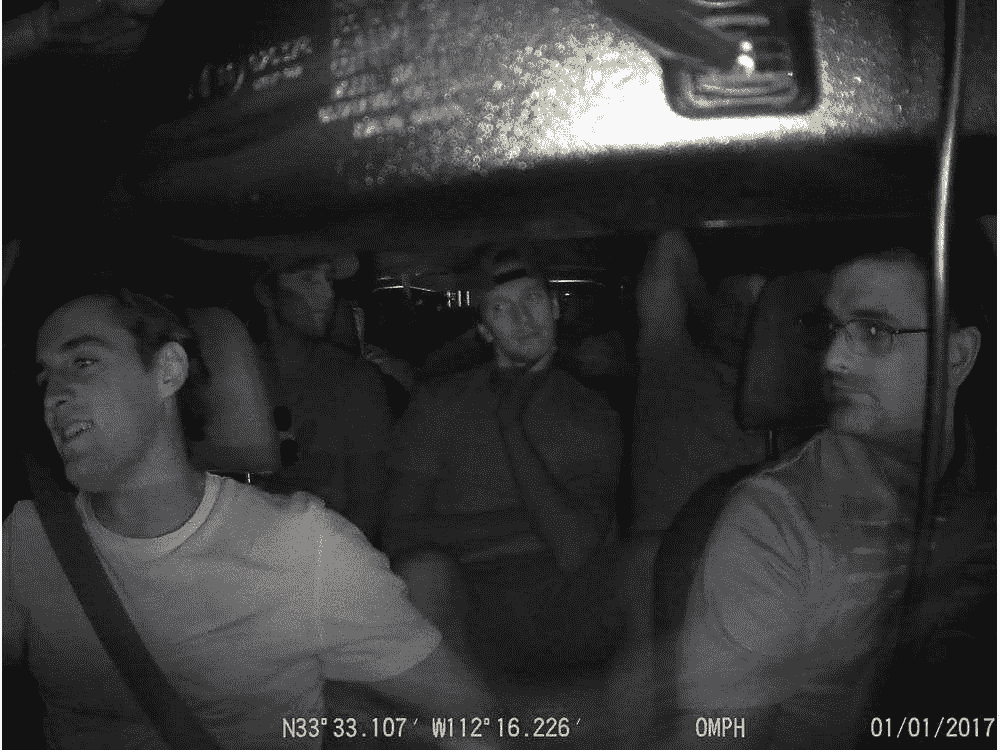

# 隐私到底怎么了？

> 原文：<https://medium.datadriveninvestor.com/what-happened-to-privacy-1b7fed26d017?source=collection_archive---------37----------------------->

在最近渥太华参议员队球员被抓到唱衰他们的教练马克·雷蒙德之后，可以肯定地说，对于 NHL 球员来说，没有任何地方是安全的，或者任何公众声誉受到威胁的人，这是毫无疑问的。

我认为这适用于任何参与社交媒体的人，在与朋友外出一夜之后，任何事情都可能发生。想象一下，你喝了一些成人饮料，但你并没有真正清醒地思考，前一分钟你还在出租车上和朋友聊天，接下来你知道的事情就是它在社交媒体上迅速传播。

当然，要让人们真正关心你说的话，你必须比普通人更有名，但尽管如此，任何普通人都应该关心。

摄像头和麦克风。它们就在我们周围，不仅仅是在出租车里，在商店里，在房子外面，而是在我们所有的手机里，天知道还有哪里。这就像是社会的隐私已经降到了历史最低点，对你能做什么和不能发布什么真的没有什么期望了，如果曾经真的有过的话。

例如，我可以在 BCIT 大学坐在那里，摇着相机，等着一个学生嘲笑一位老师，或者说一些完全不被社会接受的话，然后发布到网上，给他们带来自己的公关噩梦。

你可能认为你是安全的，但你肯定不是。

可怕的是，这种情况似乎只会越来越多，就像围绕隐私和拍摄视频的法律没有变得更好。CSIS 和联邦调查局，甚至其他入侵我们个人设备的随机组织都在设法获取我 iPhone 里的小麦克风。

那么什么是隐私，什么不是呢？

事实是，当你和其他人在一起时，任何公共场所都不安全。这就是我们生活的世界的生活方式。