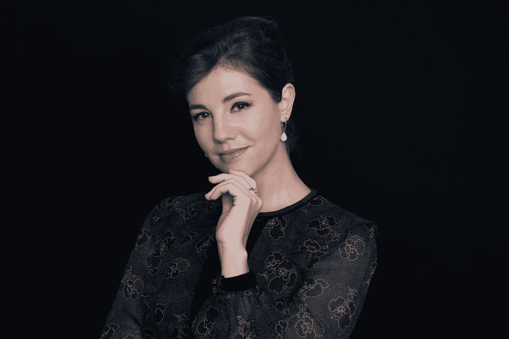

# 建立我的个人品牌如何帮助我发展业务

> 原文：<https://medium.datadriveninvestor.com/what-happened-when-i-decided-to-build-my-personal-brand-6e842de7e1c8?source=collection_archive---------6----------------------->

如果你一直在关注我，你现在会知道我是一个目标设定的坚定信徒，并且每六个月我都会留出一些时间进行自我评估和反思。

这是一个跳出日常生活，真正了解事情将如何发展的机会——什么可行，什么不可行，以及未来的机会在哪里。

 [## 健康品牌源于定位|数据驱动的投资者

### 品牌定位是 Phemelo Segoe 的激情之一。她是一名企业家、健康教练和米尔部落的创始人…

www.datadriveninvestor.com](https://www.datadriveninvestor.com/2019/01/11/healthy-brands-grow-from-positioning/) 

大约一年前，我意识到是时候在我的事业上迈出下一步了，这需要我做一些我不是 100%满意的事情:这意味着从我的事业背后走出来，以比以往任何时候都更加个人化的方式展现自己。

具有讽刺意味的是，这是我经常向客户推荐的一种策略，以建立他们的思想领导力，并与他们的目标受众建立个人联系。所以真的，是时候吃点我自己的药了。

但是人们会有什么反应呢？

如果你是一个企业主，你会知道自己和公司之间的界限很快变得模糊。你就是企业，它可以成为*深深地*个人化。

我和朋友分享了我的想法和疑惑。他们对我的计划感到兴奋，并鼓励我大胆尝试。我和我的团队设计了一个策略，通过分享我多年来与企业家、初创企业和小企业打交道的经验，开始提升我的个人形象。

我已经通过一对一的咨询会议分享了一些见解，但我想接触更多的人。因此，我决定开始定期写博客，并每月举办一次研讨会，帮助更多的人在商业上取得成功，这反过来会提高我们服务的知名度。

**一年后，结果在很多方面都让我大吃一惊……**

我做了我计划要做的事情，并且做得更多，因为我知道你们中的许多人可以从做同样的事情中受益，所以我想与你们分享这个策略如何使我的业务受益:

**吸引更多合适的客户:**通过为我的企业持续撰写营销和创业主题，我们形成了更强的声音，这有助于澄清我们做什么、如何做以及为什么要这样做。正因为如此，更多从我们的工作中获益最多的企业最终会来到我们身边。我们不仅吸引了更多的潜在客户，还吸引了更多正确的潜在客户，让我们能够做更多我们想做的工作。

**与更多合作伙伴合作**:从与 [WeWork](http://www.wework.com) 的系列研讨会开始，我们与[的《外籍人士生活》杂志](https://expatliving.sg)、 [BLOCK71](https://singapore.block71.co) 、[蜂巢](https://thehoneycombers.com/singapore/)等建立了合作关系！这是一个认识人、建立我个人品牌的好方法，也提高了人们对我公司的认识。

**区别于竞争对手**:人们通常会向我寻求营销方面的帮助，但真正让[EMMS](http://www.the-emms.com)与众不同的是我们对整个创业旅程的关注。通过教授课程和撰写博客来讲述如何经营一家成功的企业，我已经能够让人们一窥与我们合作和与你们典型的营销机构合作是什么样的。

**完善我们的产品:**从网上和面对面的人那里获得反馈后，我意识到人们确实需要我过去提供的更深入的咨询服务。因此，我们现在提供[咨询包](https://www.the-emms.com/marketing-consulting-home)来帮助企业家应对常见的营销挑战。

**阐明我们的产品:**我们喜欢与快速增长的公司和崭露头角的企业家合作，但同时兼顾两者并不总是容易的。通过向创业者提供教育和咨询，同时将我们的营销服务重点放在大多数科技公司上，我们能够为不同类型的公司提供价值，而不会降低服务质量或牺牲业务增长。

为顾客和追随者提供价值:这是最重要的一点！站出来，说出来，分享一路上的挣扎，这不是我与生俱来的东西，所以如果不是那么有回报，我可能不会坚持下去。很高兴得到你们中许多人的反馈，看到你们的企业不断发展壮大。

当然，仅仅因为我取得了一些胜利并不意味着我们做的一切都是对的。总有改进的余地。我们永远不会结束，是的，有些事情已经到了一边。

那么下一步是什么？

在接下来的一年里，我希望在这个基础上继续发展，更加关注我们在营销方面的经验和专业知识，这样更多的人就能清楚地知道我们在做什么，以及我们如何帮助他们。

我希望继续与合作伙伴开展更多活动，分享更深入的营销内容，并通过细分战略完善我们针对不同社交媒体渠道的方法，因为很明显，我们在每个渠道上都有完全不同的追随者，他们需要比我们目前给予他们的更多的爱。

除此之外，我想更加努力地实现我的愿景，即通过发展一个生态系统和社区来帮助更多的企业家取得成功，这个生态系统和社区通过技能发展和不同的服务来支持初创企业及其创始人，并在最重要的时候拥有正确的联系。

就像这样，计划总是在发展和成长，旅程也在继续。这就是我喜欢自己做生意的原因。

你有没有想过如何提升自己的形象和分享你的专业知识来帮助你的企业取得成功？

博客可能是开始行动的最佳方式。如果你想了解更多关于如何利用内容拓展业务的信息，请给我发邮件或联系 mreussisnk@the-emms.com。

*最初发表于*[T5【https://www.linkedin.com】](https://www.linkedin.com/pulse/what-happened-when-i-decided-build-my-personal-brand-reussink/?published=t)*。*