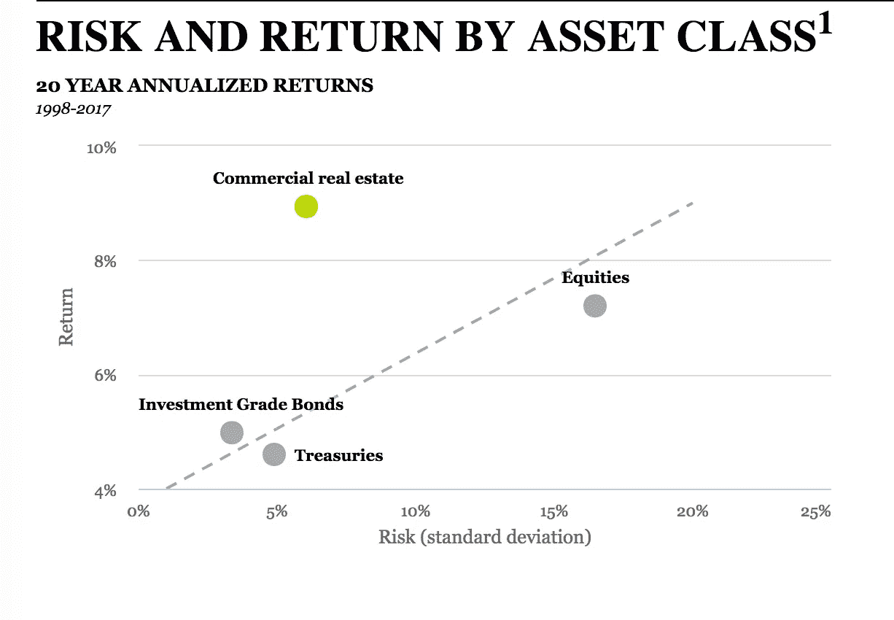

# 当股票开始下跌时，你该何去何从？

> 原文：<https://medium.datadriveninvestor.com/what-happens-if-a-recession-hits-fdc32ea14317?source=collection_archive---------15----------------------->

## 知情投资者指南

就在上周，股市再次创下历史新高，本轮牛市延续至第九年，成为有史以来最长的牛市。但是历史告诉我们，天下没有不散的宴席。还有进一步上涨的空间吗？也许吧。今年早些时候，12 名华尔街策略师的一次综合调查发现，几乎所有专家都仍然看好 2018 年的美国股市。迄今为止，他们大多是对的。截至 9 月 1 日，标准普尔&500 指数上涨了 6.29%。然而，尽管许多策略师仍持乐观态度，但他们警告称，全年将出现常规回调，并预计会出现一定程度的波动。我们已经看到了一些。尽管有这些积极的观点，大多数投资者认为我们正处于当前周期的后期。(正如任何优秀的房屋承包商都会告诉你的，“修理屋顶的最佳时间是阳光明媚的时候。”)这就向成长型投资者提出了一个问题:除了股票，还有其他可行的选择吗？

## 被忽视的资产

多样化。多样化。多样化。我们都听说过很多次了。然而，大多数投资者通常只持有两种资产类别:增长型股票和安全型债券。当股市连续 9 年攀升时，这种策略似乎是合理的。但是如果没有呢？现在可能是考虑大多数投资者错过的第三种资产类别的最佳时机；这就是商业多户房地产。这种经常被忽视的选择可以为投资者提供更大的多样化和更高的回报——即使面对经济和股票的潜在下滑。

> “股票会给你带来高潮，但也会周期性地让你严重失望。国债会让你安全，但不会让你富有。住房？这样两全其美。”——Quartz 的丹·科普夫介绍了一项新研究的发现

## 多户型房地产:“完美投资”

抛开夸张不谈，许多高净值投资者和金融专家都认为房地产是理想的投资——尤其是商业多户型房地产。[与你的住宅](https://www.moneyunder30.com/why-your-house-is-not-an-investment)不同，商业地产是真正的投资，因为它的主要目的是升值和财务回报。什么让房地产变得理想？

与股票和债券相比，商业房地产为投资者提供了许多诱人的好处。这些包括更高的年收入、优惠的税收待遇和更有吸引力的风险调整回报。此外，商业地产的回报与股票和债券的相关性很低，因此这是分散投资的绝佳方式。如果利率和价格继续上涨，房地产甚至可以作为对冲通胀的工具。

Commercial real estate historically has generated attractive returns and has exhibited less volatility than public equities. [http://bit.ly/RealEstateData](http://bit.ly/RealEstateData)

多户住宅，也就是大型公寓的另一种说法，被认为是最安全、最稳定和可预测的商业房地产。最近一本关于投资主题的书称之为*完美的投资。虽然经常被忽视，但多户型房地产的机会并不新鲜。事实上，根据最近的一项研究[在过去的 150 年里，住房一直是世界上最好的投资。](https://qz.com/1170694/housing-was-the-worlds-best-investment-over-the-last-150-years/)*

## 现在投资哪里最好？

从包括我在内的许多投资者的角度来看，答案很清楚:多户型房地产。方便的是，你不需要成为一个房东来利用房地产提供的好处。这些资产可以通过专门收购和管理公寓的公司进行被动投资。具体来说，我喜欢 OpenPath Investments 的投资模式和过往记录。完全披露:自 2007 年离开谷歌以来，我一直是 OpenPath 的投资者/合伙人[。](http://medium.com/@davidscacco/my-next-google-9921201ec63c#.zgfokzifd)

## 12 年超越市场的业绩。

OpenPath Investments 是一家具有社会影响力的房地产公司，专注于在不断增长、库存有限的美国西部大都市获得稳定的劳动力住房(即大型公寓)，然后为房产和居民生活增值，同时关注环境。这个[短视频](http://vimeo.com/138650798)展示了它的工作原理。

自 2006 年成立以来，OpenPath Investments 已经收购了 33 处房产，退出了 15 处房产，为投资者带来了超出市场的回报，并为环境和我们的居民带来了积极的成果。我们目前持有另外 18 家公司，其中大部分是在过去两年内收购的。在所有这些出口中，OpenPath 的平均内部回报率为 30%+T1。这些房产的平均持有时间为 3 年左右，投资者权益的平均倍数为 2.2 倍。这与股票市场相比如何？在同一时期，标准普尔 500 指数的 10 年年化回报率仅为 7.20%。OpenPath 显著更高的回报强调了早先的断言，即多户家庭不仅可以作为一种多样化工具，而且也可以是你投资组合中表现最强的部分。

## 下一步是什么？

OpenPath 希望看到这样的结果吗？在接下来的 10 年里，我们会很高兴能达到过去 10 年的回报，但我们没有这样的计划。相反，我们敦促投资者关注我们更加保守的预测。展望未来，我们预计 2018 年新的 OpenPath 机会将带来约 7%的年回报率和约 15%的总 IRR。这种回报超过了道琼斯和 S&P 的历史平均水平，甚至超过了这些股票指数最乐观的预期。上面的 OpenPath 投影是一般目标。对于 OpenPath 提供的每一个投资机会，我们都将提供详细的房地产信息和形式预测。如果你想了解更多，请告诉我。

> “按照不确定性的标准衡量，房地产的风险约为股票的一半，略低于债券。
> 
> 这些发现如此引人注目的原因是，它们与资产估值的经济理论背道而驰，这些理论认为，股票等风险资产的回报率应该高于住房等稳定资产。但事实并非如此”——石英

## 我想你会喜欢另外几个帖子:

[“我的下一个谷歌:75 号员工的观点](https://medium.com/@davidscacco/my-next-google-9921201ec63c#.ottmnxgwx)”

[“房地产的长期繁荣:专家看到几十年的机会](https://medium.com/@davidscacco/good-news-for-apartment-complex-investors-b6fed768a26e#.soe48fvik)”

*注意:OpenPath 投资机会面向合格投资者。我不是注册会计师或专业财务顾问。所有观点都是我自己的。我鼓励你咨询你的会计师，以充分了解你的个人纳税情况。*

【1】[*保罗·摩尔的《完美投资*](https://www.wellingscapital.com/book) *于 2016 年 8 月出版*