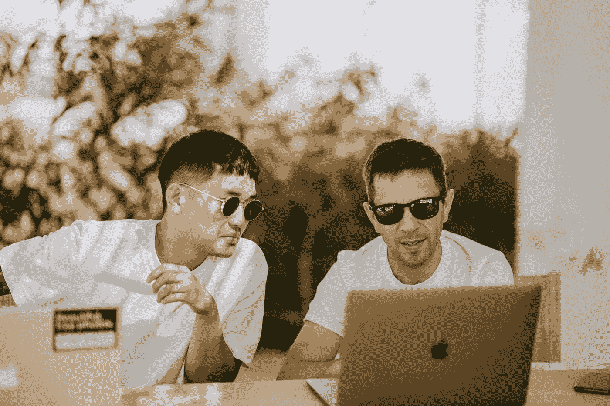
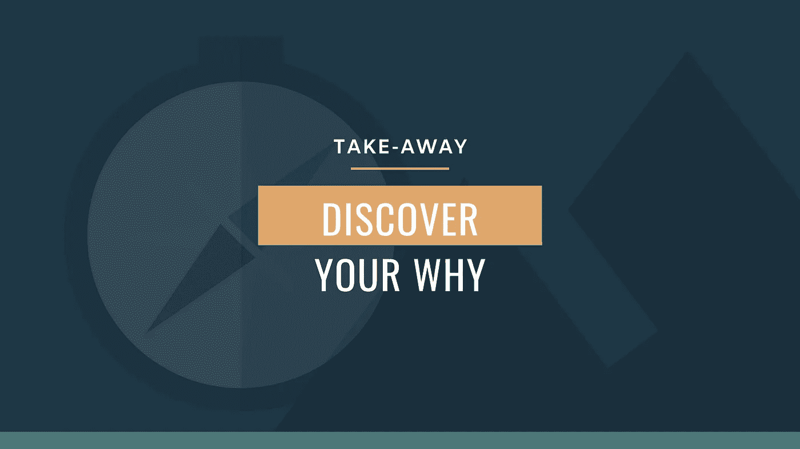

# 当你放弃比较综合症时会发生什么

> 原文：<https://medium.datadriveninvestor.com/what-happens-when-you-renounce-the-comparison-syndrome-a7a56451fa79?source=collection_archive---------29----------------------->

## 恢复你的独特性

Photo by [Unsplash](https://unsplash.com/@unsplash?utm_source=medium&utm_medium=referral) on [Unsplash](https://unsplash.com?utm_source=medium&utm_medium=referral)

头条新闻充斥着成功的故事。

像收入很少或没有收入的单身母亲这样的故事——努力养活自己和她深爱的孩子——现在每年通过制作 YouTube 视频获得六位数的利润，供全世界观看。

这位神童在青春期前又写了一本《纽约时报》畅销书——与此同时，我们大多数人都很难弄清楚逗号到底在哪里。

或者是一个在竞争激烈的领域被稳定的工作解雇的家伙，结果却在很短的时间内白手起家创办了自己成功的公司。

某些人似乎有获胜的诀窍。就像他们醒来时发现了特定问题的解决方案，超越了“哦，好”社会规范的不寻常的想法，然后噗——一卡车的钱出现在他们的前门，随之而来的还有名声和恶名。

然而，尽管如此，我们只是继续堆积损失，因为，嗯，我们只是没有那么“幸运”生活中没有一件事会如我们所愿，尝试真的没有意义。

但故事真的是这样吗？他们真的是像绊倒在路边，落在柔软、保养良好的草地上一样被成功绊倒吗？还是他们做了一些我们大多数人都分心去做的事情？

# 环顾四周

对于那些对有趣的事实感兴趣的人来说，你将会有所收获！我已经尽可能地保守这个秘密，但是我再也忍不住了。这就是:

我是双胞胎。

是的，有两个我。在我们生命的大部分时间里，我们(几乎)一起做了所有的事情。

从搭配衣服到剪一模一样的发型，你需要双筒望远镜才能注意到我们之间的任何差异。我们甚至在二年级整整一周都没有被老师发现的情况下调换了班级——我仍然对那样做感到有点内疚。

在我妈妈发现之前一切都很好。因为她是我们所在学校的行政人员，她能够将那些小行为扼杀在萌芽状态(除了那一周！).但是随着时间的推移，我们作为骗子的古怪时刻和作为青少年的更严肃的阶段之间的差距越来越大，我们的差异也越来越大。

在高中，我的双胞胎哥哥开始成为受欢迎的明星运动员，而我自豪地接受了我作为书呆子的身份，一个对 f .斯科特·菲茨杰拉德的作品比对 NBA 最佳球员的集锦更感兴趣的人。

即使我们在同一个大学篮球队打球，人们也能很快区分我们。我开始思考，*“伙计，他比我强多了。为什么我不能像他一样得那么多分？”*

这是你停下来，想想你问自己同样问题的频率。那些相对的时间空间，当他们的生活在那里看起来比你在这里好得多。

我们目前可能没有意识到这一点，但当我们这样做时，我们正在我们所处的位置和我们有潜力所处的位置之间建立一个厚厚的边界。我们把注意力从过程中转移出来，并把它固定在另一个过程的终点上。

# 向内看

这种思维方式正在损害我们这个时代的许多聪明人:我们中太多人通过他人的成就来判断我们能够完成什么。这样做，我们空手道砍我们的进步，践踏我们独特的技能。

很多事情都与社交媒体有关，至少大部分时间是这样。

旨在与我们周围的世界联系和分享的创造性途径已经成为我们与自己脱节的主要原因之一。

我们的生活是如此偏离基础——至少在我们的头脑中是如此——以至于我们[感到被迫](https://medium.com/datadriveninvestor/minimizing-minimalism-57dd8a1a2d0a)去寻找符合我们期望的生活。在某种程度上，我们想要成为的一切和我们渴望成为的每个人都受到社交媒体领域的规范的影响。

> 生活，在这方面，成为一个充满比较地雷的游乐场。

对于一个大学生来说，这似乎有点奇怪，但是**我建议，至少，暂时不要接触社交媒体**。这并不是说社交平台天生邪恶，应该不惜一切代价避免，而是当这些平台成为用来凝视他人往往被夸大的生活的窗口时，我们就有一个问题了。不健康的。

这种巨大的挑战会让你专注于你以前没有注意到的生活，你可能已经成长了，但你没有意识到。这会让你更加珍惜你所拥有的，而不是抱怨你所没有的。

用这个标准来评估，你就排除了任何你渴望成为的人。换句话说，这变成了一个关于你将来想成为什么样的人的问题。你专注于你的*潜力，并加倍努力实现你的目标。*

如果是写作给你带来了平静，那就尽可能多地写作。花更多的时间写下你想到的任何东西，不管其他人会怎么想。

如果你喜欢画画，尽可能经常画。花点时间勾勒出你最感兴趣的作品。

当你早上醒来时，你的吉他或钢琴是你脑海中带给你快乐的物体吗？挤出一段时间来写你自己的音乐。没有借口。

不管是什么，尽可能经常地去做。少花点时间环顾四周，多花点时间审视内心，因为那才是真正的冲突所在。

> 这不是你和别人的问题。是关于你对你。这场战斗的赢家要么是专注于培养你的优势和改善你的弱点的你，要么是将自己与其他人进行比较的你。

当我专注于我哥哥在球场上的能力时，我忽略了自己的能力。我看不出我实际上是好的，只是方式不同(没有双关语)。

我的强项是防守。这是我自然而然想到的。最终，我意识到，如果我只是做我擅长的事情，而不是试图达到别人的标准，我将在这个过程中帮助团队和我自己。

我们不去问如何给我们周围的环境带来价值，而是问自己如何达到某某标准。它正在杀死我们。

下一次，当你想拿自己和别人比较时，想想这背后的原因。

*为什么我要努力成为这个男孩或那个女孩？为什么我要根据他们的生活来分析我的生活？*

在这方面找到“为什么”的答案，最终会揭示你把自己等同于他们的动机。

在一天结束的时候，你的未来可能不太关心你的过去或者其他人在做什么，你也应该这样。重要的是你眼前的时刻，以及你是否利用了它们。

**凯文·霍顿** *是一名大学生，一个谦虚的书虫，一个想要成为网络开发者的人，他对写作有了新的热爱。他写了一些关于创造力、生产力和令人愉快的简单生活的有用的文字。*

下次见。感谢阅读！

