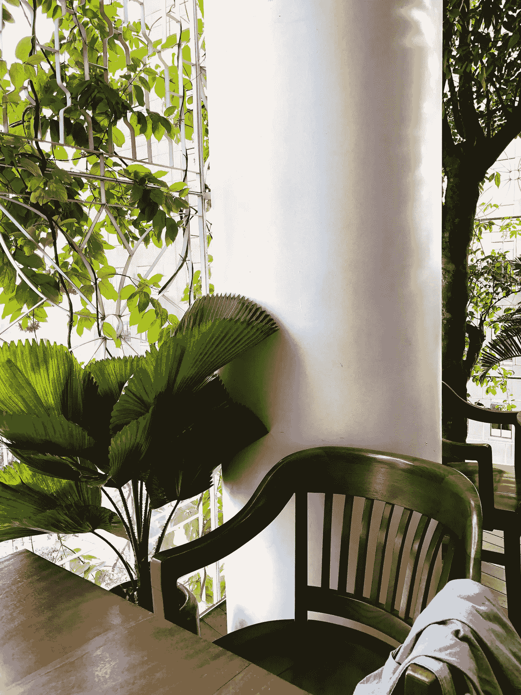
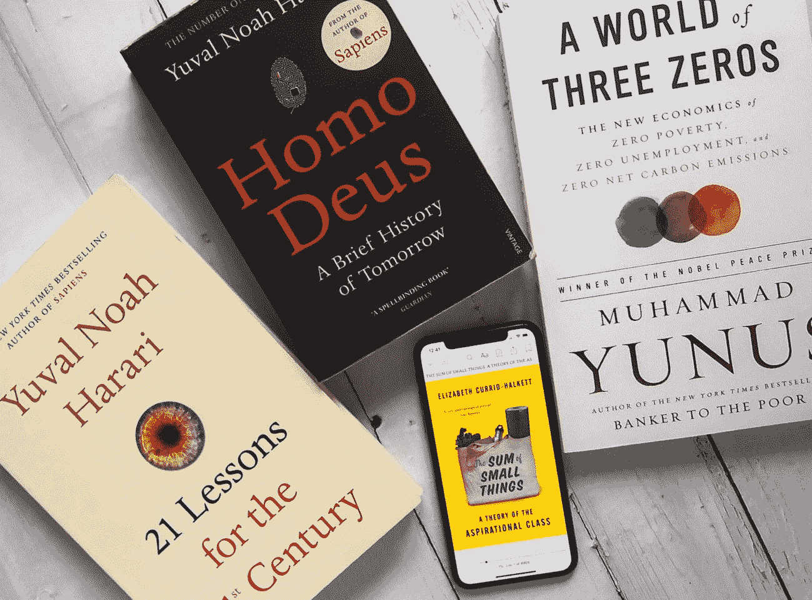

# 我最近在想什么？

> 原文：<https://medium.datadriveninvestor.com/what-have-i-been-thinking-lately-451808e8e20b?source=collection_archive---------18----------------------->

## 介绍“好奇的未来主义者”

*(本文首发于* [*【小恶:博客*](https://thelesserevil.co/lifestyle/what-have-i-been-thinking-lately) *)*

我花了很多时间思考未来。事实上，也许太多了。我沉迷于未来，而(有时)忽略了现在。我知道我不是最聪明的人之一，我害怕未知的事物。我对人类的未来想了很多，我们将如何在极端天气、缺乏不可再生资源以及与我们的超人计算机相比在数字方面无能的时代生存下来。我想了很多关于同情、情感和价值观的问题。我认为这将是一个非常有趣的视角，影响我如何策划内容——因此，我正在考虑将我的通讯更名为“好奇的未来主义者”！

## 在一个更“现在”的心态中，

我会思考谁是我们未来的消费者，以及我们最终会在什么时候到达那里。未来的消费者将更加关注可持续性。不是因为他们想，而是因为他们不得不。他们会更有社会意识，不管你喜不喜欢。它没有科学的支持，但这是我认为它会去。我不知道我将如何利用这些深夜的思考和阅读，但我知道我正朝着正确的方向前进。

我认为人类通常无法理解科技发展的速度有多快，以及它领先我们多少。现在，确切了解区块链或加密货币的运作方式并不重要。对你来说，理解人工智能如何识别语音并以语言学术语再现它们也不重要。如果你不是开发者，不要担心，你永远也不会是。**更重要的是了解技术将如何发展或被使用，并明智地使用它。**思考远远超出当前的用法，预见 20 年后会发生的问题，因为它们将在未来 5 年内发生，无论你喜欢它还是能想象它。

我现在陷入了一个似乎两极分化的议程，即我们如何平衡作为一个自然的人，吃营养的有机食品，回到千年的阿育吠陀实践，同时接受摄入或可穿戴技术如药片如何增强我们的人类能力。如果将来有超人，我想成为其中的一员。我不想成为异类。

## 但是 I GO 应该走多远呢？

我应该尝试各种各样的技术，还是应该保持“自然”的自我并以真实性为荣？我们是倡导可持续的绿色实践，还是参与开发尖端技术来重复利用塑料？我投资锻炼是因为我们的身体最终会衰退，还是投资并拥抱可以让我们逃离身体的技术？这是一个伦理和生存问题。这不是一场哲学辩论，而是一场实践辩论，因为所有这些都正在发生。

## 那现在怎么办？

我们如何在这个看似平静、实则思想混乱的时代导航？

嗯，不多。我不是专家，所以我告诉你这些没有多大价值，但这些是我的想法:

1.  **读书，不忘思考。**有兴趣，虚心。更开放地去阅读和思考。社交媒体涌入我们的生活剥夺了我们思考的能力。我们在点击“喜欢”之前是否思考过，在“分享”之前是否检查过，有多少次我们只是被一个没有明显意义或含义的美丽画面所吸引？
2.  **富有想象力。**现在是你释放创造力的机会，因为正是在今天和这个时代，我们再也无法想象未来会发生什么，因为每天都有如此多的事情以极快的速度发生。我们正处于第四次工业革命。事情只会变得更快，不会变得更慢。例如，仍然被你的社交媒体关注所困扰？所以让我们来思考一下，未来同伴认可会进化成什么样的形式。未来 5 年我们会有 Instagram 吗？
3.  区分你喜欢的东西和你认为你应该喜欢的东西。总有一天，机器人会接管你，而你会失业。让我们暂停一下，重新思考你做的每一件事，看看 AI 怎么能比你做得更好。如果你能想出一两件事，恭喜你，如果你喜欢这样做，你就中了彩票！
4.  我们需要更有前瞻性思维的一代人。如果打盹，你就输了。人类进化到了可以争论的地步，因为我们是唯一能够借助语言相对无缝协作的物种(来阐述思想、说服对方、协调)。让我们保持这种方式。要么你是其中的一部分，要么你被排除在外。宣布你的兴趣，聚在一起交流思想，互相通报。这是值得的。

这几本书最近启发了我。不在框架内的还有许多其他的，包括:

*   第四次工业革命
*   谢谢你迟到了
*   起源——是的，丹·布朗的小说。
*   地狱——是的，我确实引用了小说，因为它给了我们在一个富有想象力而又现实的背景下探索伦理/道德困境的奢侈。
*   如何不死

如果你喜欢这篇文章，请在下面留下评论或者 DM 我！享受阅读！

卡米·索索

让我们做虚拟咖啡☕️在:

[http://thelesserevil.co](http://thelesserevil.co)
脸书:[小恶博客](https://www.facebook.com/TheLesserEvilBlog/)
insta gram:[@ thebarezero](https://www.instagram.com/thebarezero/)
YouTube:[小恶博客](https://www.youtube.com/channel/UCg6alpqVSgBTRbZu8qnPpPw)