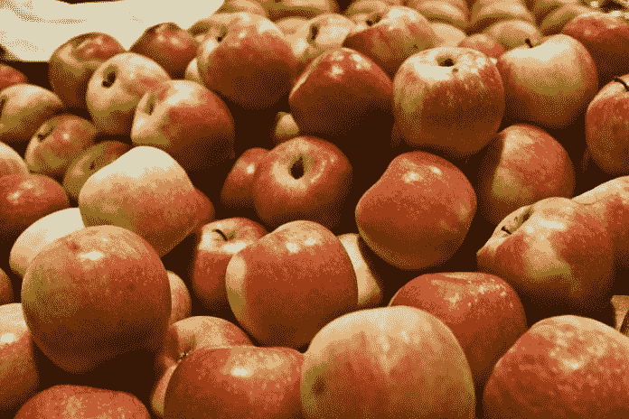
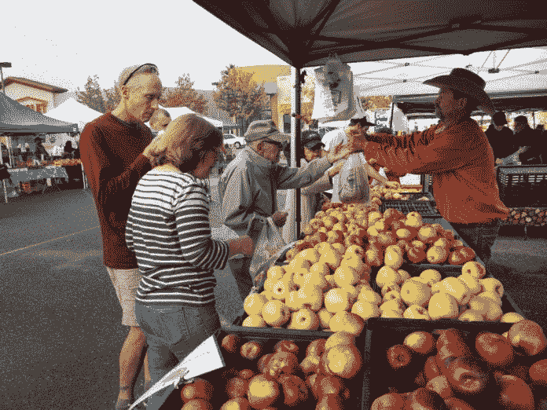

# 哪些医疗专家应该从苹果交易中带回家？

> 原文：<https://medium.datadriveninvestor.com/what-healthcare-experts-ought-to-take-home-from-the-apple-trade-c482653d4989?source=collection_archive---------4----------------------->

Healthcare economy

每一个灵魂，从出生到生命的终结，都保持着一种内涵，因为它是维持生命力和茁壮成长的必要条件。为了战胜这一旅程，每个人都必须努力实现一个目标:繁荣。茁壮成长超出了一个简单词的范围，因为这是一次有众多影响、困难时刻和不可预测性的旅行。繁荣迫使精通——因此，不是每个人都掌握所有的技能。然后，在整个旅程中，你必须在指定的时间和地点用能力换取有收益的东西。交换仅仅是以元素的概念出现。那一个正紧抓着有权利；(无论是商品还是技能)与另一种财产相比的优先性、优点或适用性，即价值。

与有形物品或服务相关的真实价值的负债是必要的，因为它是需要帮助或小工具的人的成本的驱动因素。推断某物的价值在古代可能是自命不凡的，但现在要复杂得多。少数人可能会同意，因为我们生活在一个被经济租金夸大的金融泡沫世界，但大多数人可能都忘记了它的有效性。为此，我倾向于将我们的人生旅程与苹果市场联系起来。一旦我们进行了修饰，我们应该能够将这种直觉与不同的需求联系起来。为了便于比较，并且事实上这仅仅是我的能力范围，我倾向于扩展这个例子，因为它与医疗保健市场相关。

# 苹果市场一瞥

苹果是一种奇特的水果。它对健康有益，这是我们大多数人都熟悉的普遍观念；“一天一个苹果，医生远离我。”此外，它古老的精神意义可以追溯到亚当和夏娃分享一口苹果；或者在技术上是著名电脑的品牌。

随着时间的推移，苹果通过各种方式积累了恶名。一些社会文化环境的自负在过去通过当前的结合点发生，但是没有一个会改变真相，因为它仍然是一个果实。有了渊博知识的缺点，人们可能会猜测这样一个重要的食物元素已经从人类所有者那里获得了大量的审查，所以我称之为身份命名的捏造。新时代的品牌是行使说服任务中的公民，以最大限度地增加货币收益暴跌在光谱的某处建立身份，营销，经济租金，肯定垄断勒索。

 [## 医疗保健的未来正在被一场大型技术入侵所塑造|数据驱动型投资者

### 过去十年，全球经济的所有部门都经历了大规模的数字颠覆，而卫生部门现在…

www.datadriveninvestor.com](https://www.datadriveninvestor.com/2018/11/02/the-future-of-healthcare-is-being-shaped-by-a-big-tech-invasion/) 

苹果实际上仍是一种球形水果，上部饱满，下部纤细。它有各种深浅不同的颜色，从红色、金黄色、绿色，以及以上几种颜色的组合。味道和质地，以及咬的大小，为每一种提供了独特性。苹果的每一个与众不同的特征都有一部分是为了迎合每一个消费者的欲望。

根据网上的消息，全世界有 7500 种苹果，其中美国种植了 2500 种。然而，在美国只有 100 种后者的变体可以买到。

为什么不是每一个苹果都进入市场，有一个充分的理由。对其余的 2400 种苹果品种没有需求，这表明竞争对手将认可哪种苹果品种必须出售，理由是只要人们不咬苹果，他们就不会渴望它。我喜欢酸红苹果，但我在美国市场上一直找不到。物种变异和选择的限制将制约竞争；因此将培养那些提供一个或两个苹果类的捷径，意思是；通过阻碍选择、阻碍质量和培养经济租金的方式对市场进行排他性控制。

苹果的成本是值得注意的，因为在它变质之前，它必须是廉价的，并且经过一段时间的合理交易。价值和成本取决于质量、可用性和必要性。

事实上，苹果的质量并不主要取决于苹果的种类；还取决于购买者的喜好，包括味道、外观、新鲜度、大小、香味、收获季节、质地和形状。附近的任何地方，一棵苹果树仍然播种，照顾，包括种植影响上述所有，说不尽的巨大。因此，苹果的营养成分是由它们各自土壤中的矿物质提供的，这是值得注意的。健康益处，交易时的成熟度，无论是有机的还是转基因的，在推断质量时都同样重要。

沉思的所有标准是召集在一个大斋期和需求；最重要的是，作为苹果卓越的重要贡献者，苹果的供求过程将是艰苦的。如果订单很高，农民将会有动力提取更多的玉米来满足市场需求。随着时间的推移，中间商作为批发经纪人出现了，他们会指定一个单独的苹果品种给杂货店背书。

在此过程中，熔炉联盟与[客户](https://www.datadriveninvestor.com/glossary/client/)从选定的农民那里确认了预定库存的最低水平。为了保持市场的垄断，中介将与买家、卖家和竞争对手建立密切的关系，让苹果的分销物流望而生畏。一旦实现，后者将通过促进当选的种植者和银行挖掘其他人来限制工资义务，更不用说垄断供水和通过与各自的科学和工业领域的联系来规划基本的农业资源，如化肥、杀虫剂和基因加工。

# 营销少数苹果品类会卖出有限的种类。

最终收益是通过回扣、游说和幕后交易的定价。因此，它影响了质量，人为地阻止了价值、价格和所有监督就业市场的人。引人注目地承认农业行业垄断的含义不仅降低了国内就业市场的积极性；而且还鼓励雇用非法移民，他们倾向于为较低的工资而更加努力地工作；没有中介的承诺，而他们却在利用环境。

网络市场中立性不是垄断的主要参与者所希望的，因为它阻碍了对产品供求的支配。激素有助于通过始终向社区提供更多已经受到限制的苹果品种来最大化垂直生产力，这反映了水平生产，其中所有类型的苹果都由农民提供给每个人，农民通过公正的竞争和目标获得激励，从而连续地参与更明确的独立物流，将收获的苹果运送到商店。

决定苹果价值的实际因素是质量、消费者购买力以及将苹果从农场运送到消费者手中的物流。苹果的个人品味；卖家对特定品牌的情感；中间商的定价方式是操纵苹果生产的方方面面，从肥料到水；谈判桌上和购物者的胃口。他们还利用其他实体在化肥、杀虫剂、环保主义者等方面的参与，采取回扣做法。，规避了自由和封闭市场原则的所有基本要素。中介机构通过维持稀缺的透明度、组织工会和游说政府，能够毫不费力地阻挠种植者的呼吁，从而在杀虫剂、供水、肥料和成本控制方面保持严格的自由裁量权。

政府在历史上反复灌输选择性透明度取决于每个实体的游说力量。除了后者——供给和需求受阻。完全的不感兴趣阻碍了苹果的个人选择。

利用资源获得的额外收入包括土地、资本或劳动力；通过使用一种不同于最初由明确的战术含义所传达的行动方针；为苹果市场打造的经济租金。作为大型实体之间贸易协定的副产品，后者已经失去了在交易中的主导地位。这种干预已经转化为一系列措施；比如，X 市都得到青苹果，并在官方规定的价格下。

政客们没有在基层创造透明度和问责制，而是制定了其他有漏洞的法规，这些漏洞最容易被特定机构利用。

价值通常不是基于作物的单个驱动因素，而是基于合作表中优先考虑的谈判产品。今天一个苹果的成本绝不是对配额、需求和苹果质量的反思，而是通过捷径避免竞争这一目标的反映。同样试图合法化他们的欺骗行为——聪明地工作，而不是努力地工作，但我称之为“ ***”。***

# 让我们跨越一些案例！

Elain Schwartz 2015 年在《经济生活》上发表的一篇[手稿显示，一个有机的蛇果苹果大约是 2.50 美元一磅，而薯片是 5.23 美元一磅。价格差异被认为完全是商标的问题；因为两者都是同一棵树的变种。根据这篇文章，苹果的传统价格一直是通过种植者开发可比水果、监督市场和调整成本的方式进行精心竞争的结果。](https://econlife.com/2015/06/with-monopolistic-competition-you-pay-more-for-an-apple/)

一旦 Honeycrisp 为种植者提供了一些产品差异化，他们就通过种子专利和大规模营销活动转移到强大的市场安排连续体的垄断追求中。通过建立品牌，Honeycrisp 的农民获得了价格控制。

2009 年，明尼苏达大学培育了一种新的苹果品种，Sweetango，也就是广受欢迎的 Honeycrisp 的继承者。该大学通过与该州最大的苹果种植商 Pepin Heights 的“独家协议”，可以利用 Dassel Hillside 农场种植商，自 1982 年以来，该农场一直是明尼苏达州 Townsend 的路边市场。

独立的苹果种植者对科学院和明尼苏达州南部种植巨头之间的排他性条约不满意。还值得一提的是美国国会最初于 1922 年 2 月 18 日通过的旧行政法规《卡珀-伏尔斯泰德法案》(p . l . 67–146)(也称为[合作社大宪章](https://en.wikipedia.org/wiki/Magna_Carta%20)the%20Co-operative%20Marketing%20Associations%20Act%20(7%20U.S.C.%20291,%20292))。该法案旨在保护“拥有反垄断法避风港的农民协会”。

# 这如何应用于医学和医疗保健？

为了争论起见，让我们用医疗服务(X，Y 等)来代替苹果。)，物流与技术和数据，客户与患者，供应商与医生和供应商。并允许我们将纵向人为抬高的生产价格和价值与横向的个体自由市场属性进行比较。

正如你可能看到的，复杂的相互关系和经济水域的黑暗赋予了公司和其他团体控制市场需求的竞争环境，从而淡化了主观偏好的真正价值，增加了官僚主义和单边干预主义的规模。

百分之百的政府条件下的封闭市场策略便宜，因此方便，但除非封闭是在小范围内进行，并通过安全和透明的渠道与民众的理解，它将最终停止工作，由于伪隧道式的视野政策，视而不见，听而不闻。

人们认为，将医疗服务与商品联系起来，是毫无根据地提供了它的复杂性和对人类生活的沉浸感。错综复杂是一种逻辑驱动力，通过这种驱动力，一种特定的服务被分配或一种产品被交付给接受者。例如，一个苹果可以作为疫苗接种的例子，而各种各样的苹果很可能代表了通用疫苗的一个变种。或者；红色之间的差异；和青苹果，表示单个医生对同一个病人的两种不同的治疗方案。进一步扩大——涉及化肥、农药等元素。，类似于技术、资源、药物；医疗保健服务系统；和诊断方面。

毫无疑问，在我看来，所有其他部门都同样受到赞助、经济、劳动和学术企业自上而下影响的“伪苹果现象”的影响。此外，必须理解大宪章的概念已被频繁应用于今天的医疗保健，确保药房福利管理组织的安全港(PBM)。或者[联盟派系和协会的参与滥用权力](https://medium.com/datadriveninvestor/medical-societies-and-their-flop-of-a-century-old-quest-2734c9c90f72)通过策划不被关注的其他模式来转移他们的使命，如基于价值的补偿，使用纯粹制造的社会决定因素，将医生和病人的奉献置于财政机会主义者的摆布之下。

# 字里行间

如果耐心等待一段时间，并在其背景下单独分析每个场景，我们可能会得出结论，过去几十年的市场趋势是竞争、创造力、供应、需求和创新以及[行政干预的结果，以最大限度地提高生产力和降低费用](https://medium.com/datadriveninvestor/data-science-medicine-tactics-vs-strategy-the-commencement-of-unclaimed-domain-abdbe8f60195)。在主流计划中，它甚至可能以这种方式出现。然而，不可思议的是，我们正在经历旨在实现财政雄心的政策的后果，不管其最初的战术布局如何。

在一个战术概念中，生产一种苹果并将其交付给客户需要一系列的事件，从种树到放在杂货店的货架上，同时赚取适度的利润。相反，该球场在战略上实现了多元化，以创造财政利润。在这个过程中，苹果还被送到商店的货架上，通过那些在系统内紧握琴弦的人，将价格戏剧性地保持在预定的比率。

# 事实是

像苹果畜牧业贸易或其他市场一样，医疗保健系统也受到腐败和法律勒索的困扰。就像苹果公司的故事一样，那些占据上风的人在确保医生能够为他们的病人提供适当的护理之前，证明他们给予红利的方法是正确的。

再一次，当陷入困境时，信任者会向政治贩子和那些。他们遵循千篇一律的协议来解决一个精心设计的、互补的、灵活的方案，这个方案带有他们的前任首先钻好的漏洞。

这些规则肯定会通过赋予精英群体权力，并为实际上可能不具有同样价值的东西或人支付高价，从而产生经济租金，来伤害个人。一个半监管的市场，绝不是指一个最佳的可问责的商业交易。

我们今天所看到的是病人和医生的受控市场；另一方面，它为实体和协会开辟了广阔的前景；以及一个人的非人格化和组织力量的人格化。

# 解决方案

解决方案在于基层，通过赋予个人权力，扩大每个人对市场各个方面的平衡准入，这是发展物流以利用平等机会，同时在多样化的自由市场中建立透明度的结果。至关重要的是巩固对从卡车到物流的所有行业特征的理解；直到最后，保证精确的责任。

我们必须将实体去人格化，恢复个人身份，通过我们的独立参与来简化合作事业，限制合并和整合的规模，并对经济租金的灾难性处置保持警惕。

*原载于 2019 年 11 月 15 日*[*【https://www.datadriveninvestor.com】*](https://www.datadriveninvestor.com/2019/11/15/what-healthcare-experts-ought-to-take-home-from-the-apple-trade/)*。*

 [## 经济租金——人才和技能之间有影响力的转换

### 好家伙！我们做了一天的工作！他们为工作竭尽全力！”——国内运营分公司在……

medium.com](https://medium.com/datadriveninvestor/economic-rent-the-influential-switch-in-excess-of-talent-and-skill-3cf884954a64)  [## 亚当·塔布里兹，医学博士

### 医学博士 Adam Tabriz 的最新推文(@adamtabriz)。" #内心的平静会通过宇宙降临到每个人身上…

twitter.com。](https://twitter.com/adamtabriz)  [## 斯塔克法则，与医生法令的公正性相矛盾的企业避风港

### 贿赂及其形式化版本；根据目前的定义，回扣行为无疑是最…

medium.com](https://medium.com/datadriveninvestor/starks-law-corporate-safe-harbor-in-contradiction-of-impartiality-to-physician-decree-f572890707eb)