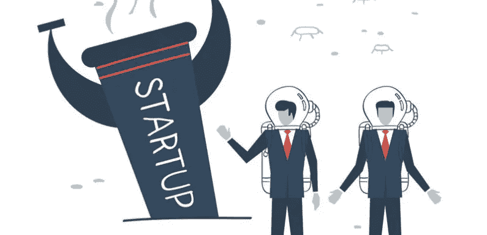
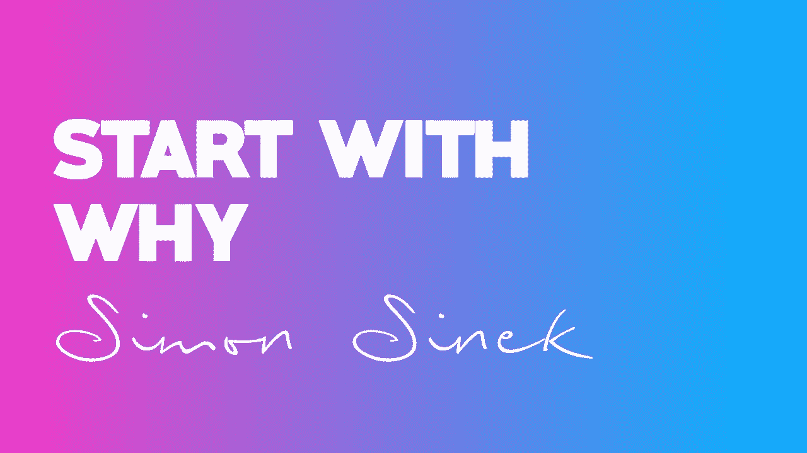
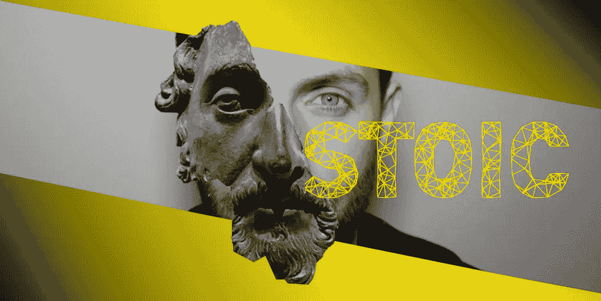
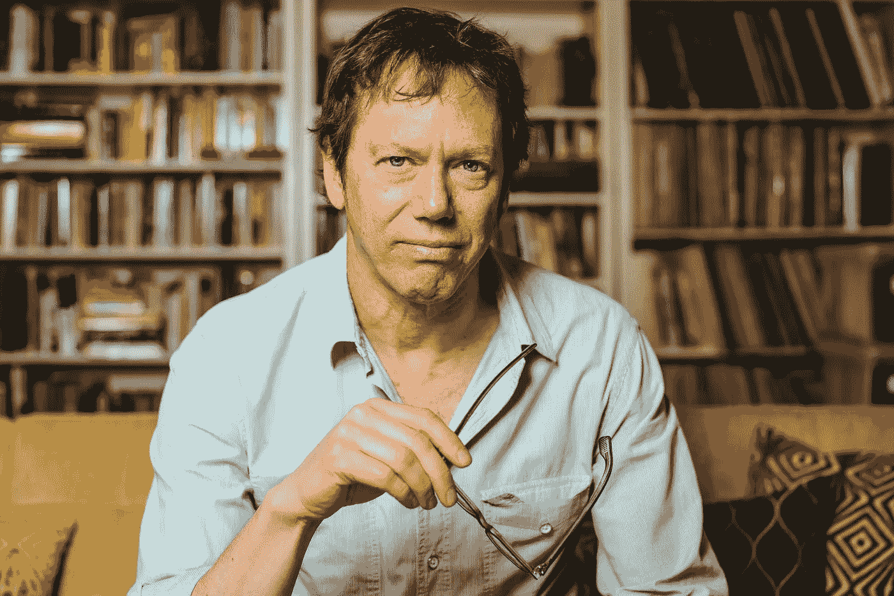

# 当我的创业失败时，我做了什么？

> 原文：<https://medium.datadriveninvestor.com/what-i-did-when-my-startup-failed-7cad11c2e348?source=collection_archive---------30----------------------->

如今，人们把导师制度简化为只有在创业过程中才有导师。当他们有一个伟大的想法时，他们觉得需要从有经验的人那里得到建议。当然，这当然是对的，也是必须做的。然而，一个人一生中最伟大的想法是:在特定的时间里，我能为我的生活做些什么？

在我们生活的不同阶段，无论是在职业层面还是个人层面，我们都会面临令人困惑的情况、情绪和决定。我们缺乏处理事情的知识和经验，我们感到进退两难。

在这一系列文章中，我挑选了一些导师，他们在从商业到性生活和人生哲学等多个层面上给了我很多普遍的建议。

> 但是等一下！你为什么要听我的？

我来告诉你为什么:

我不知道从哪里来。我的生活如此艰难。我出生在阿尔及利亚，在一场内战中度过了极其艰难的童年，这场内战摧毁了许多人的生活，夺走了 20 万人的生命。

我不得不从负 100 万美元开始建立自己。作为一个普通人已经是很大的成就了。完美地学习 5 种语言是很了不起的。启动一个失败的创业公司，并重新站起来，这是值得一提的。

在通往生存和满足的旅途中，许多人给予了帮助。在这篇文章中，我不会列举从童年到毕业挽救我生命的来源。那些建议可能适用于我，但不一定适用于你。所以，我把这个留给以后的文章和视频。现在，我将谈谈我认为对任何人、任何地方、任何时间都有效的方法。

# 你做任何事情都需要一个为什么，这样你才能茁壮成长，继续前进

自从我开始寻找我周围一切的原因，我就有了生命。我摆脱了朋友、想法、职位，甚至是不符合我存在理由的有吸引力的工作。我的为什么救了我的命。我知道我应该自由，过自由的生活。我应该经济自由。我的下一个项目或下一份工作应该满足我对自由的渴望。

从我的“为什么”的清晰性中产生的行动的自然选择直接使我成为 Upwork 上的顶级自由职业者。我挣扎着离开这个国家，搬到我女朋友身边。因为她如此支持我的自由，所以我和她结婚了…

回答为什么是成功的开始。如果不回答第一个问题:为什么？你就无法建立一个充实的生活，一个成功的产品，推销它，或者让你周围的世界不那么令人头疼。

*西蒙·西内克*在他的书***中以为什么*** 开头明确指出，客户不买你的产品，他们买的是“你为什么要生产它”。你建立了一个忠诚的客户群，如果你失败了或者你没有达到他们的期望，他们永远不会让你失望。史蒂夫·乔布斯的苹果被认为是一种崇拜，而不是一家科技公司。Herb Kelleher 的西南航空公司是中产阶级的公司，而不是商业航空公司。他们的顾客支持他们的事业。

> 一旦“为什么”是有形的:头脑和灵魂、个人和团体、实体和整体在协同与和平中作为一个整体工作。

# 一旦你发现了为什么，你就选择了一条路。但是…

当你带着“为什么”度过一生时，你会面对成吨的事件、人，甚至你的弱点试图阻碍你的行动。这绝不是预言性的启示。然而，你对这些障碍的感知和处理方式极大地决定了你行动的结果。

2017 年秋天，我的科技创业失败了，我身无分文，肩上背负着巨额债务。与高度不安全的伴侣的问题。要付的税。我祖国的一个家庭等着再次见到我，看到我的成功。异国他乡的女朋友想我。所有这些问题都发生在我身在异国的时候，那里没有人帮助我。我独自一人，迷失了，破产了。

为了走出所有这些痛苦的烦恼，我不得不运用 Holiday 书中的公式，这个公式被 Marcus Aurelius 运用了一生，也被历史上许多其他伟大的人物运用了，并给了他们拯救生命的结果:

> 1-看清事物。
> 
> 2-正确行动。
> 
> 3-接受后果。

> “道路上的障碍变成了道路。不要忘记，每个障碍中都有改善我们状况的机会。”―瑞安·哈乐黛

我出去教学生语言。我建立了一个 Upwork 个人资料，使我后来能够旅行，并与我心爱的女朋友在 2018 年 5 月成为我的妻子。当我决定将障碍视为礼物时，非常好的事情发生在我身上。

> “我们忘记了:在生活中，无论你发生了什么，无论你来自哪里，都不重要。重要的是你如何对待发生的事情，以及你得到了什么。”―瑞安·哈乐黛

# 如果你决定和某人一起工作，你必须准备好拯救自己

正如罗伯特·格林(Robert Greene)在他的著作《权力的 48 条法则》(The 48 Laws Of Power)中所说:“当你向世界展示自己并展示自己的才华时，你自然会激起各种怨恨、嫉妒和其他不安全感的表现……你不能一辈子担心别人的琐碎感受”。

至于我的第一次冒险，我遭遇了与这类人打交道的痛苦，他们随时准备在陷阱中抓住你。我们是三个搭档。我过去常常向缺乏安全感的人展示缺陷，以让工作进展并避免紧张。我的第二个搭档自信而迷人，他打破了不安全感，只做他自己:迷人、聪明、权威。

> "看起来比别人优秀总是危险的(……)嫉妒会制造沉默的敌人."格林说。

结果，缺乏安全感的合作伙伴真的变成了傻瓜，破坏了旋转项目。他对失败没有百分之百的责任，但我们最终解决了其他问题，而不是关心做一些有效的事情。

应用罗伯特·格林的建议，爬上一个组织的阶梯，或者至少能够保护自己和他人。

## 感谢阅读。如果你喜欢这篇文章，请随时留下评论、反馈或分享你的批评。在接下来的几天里，你会在我的网站上找到更多的内容。

