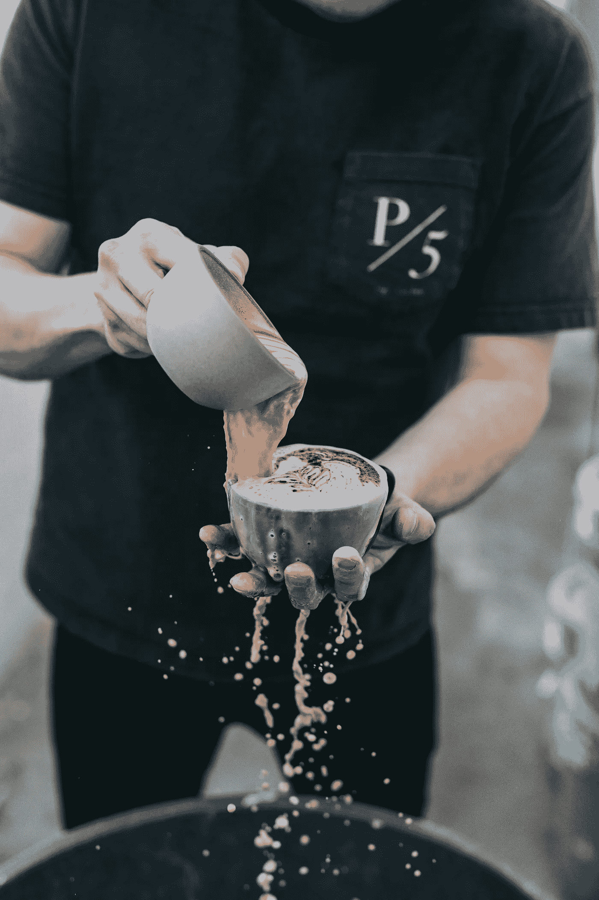

# 和新习惯分手后我发现了什么

> 原文：<https://medium.datadriveninvestor.com/what-i-found-after-breaking-up-with-my-new-habits-85095ecfd0c1?source=collection_archive---------19----------------------->

这个问题是在几周前开始的，在实施新的日常事务两个月持续成功之后。最初，我的意图是学会让我的思想集中在几个目标上。不久后，我意识到保持这种意图会适得其反，会削弱我的主要超能力。我擅长把不可能的点连接起来，这让我有创新和创造力，为此我需要专注于许多不同的领域。**这不是重点，我需要的是纪律**。

Photo by Nathan Dumlao

我的新的灵活的纪律带来了巨大的成果，直到突然，没有明显的原因，在我未能执行我新采纳的习惯之一后崩溃了。这就像一个加速且不可阻挡的失败的**多米诺骨牌效应**。幸运的是，一周的假期在等着我，我决定休息和享受。我想和你分享我的发现:

*   在我失败后，我的大脑开始热核化，寻找借口和补丁。这个过程**比接受失败并重启**花费更多的时间和精力。
*   我被一场政治闹剧抓住了，又一个借口。我浪费了更多的时间和精力。那时我发现我的新习惯不包括园艺，而园艺是我最喜欢的活动之一。
*   在我的院子里，一个反复出现的想法变得显而易见:**有时我一直在以牺牲自己的自由为代价来支持他人的自由。我决定学着走一条允许我尊重、鼓励和支持他人自由的微妙路线，同时赋予自己自由。**
*   在和家人玩了一会儿，在我的花园里享受了几天，并了解了几家不错的餐馆后，我发现我的热情恢复了，我的电池充满了电，我的习惯完好无损地等待着我。
*   当我失去力量，不再试图找回能量时，我就失去了阻止多米诺骨牌效应的能力。我成了自己小剧的见证人。

> “道家哲学”，静止先于运动，静止先于行动。”―阿里安娜·赫芬顿