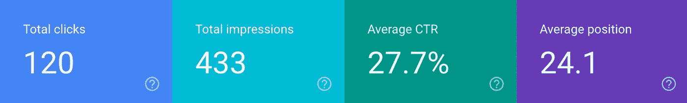
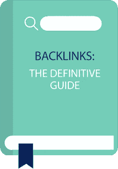

# 我在一周内学到的关于 SEO 的知识

> 原文：<https://medium.datadriveninvestor.com/what-i-learned-about-seo-in-a-week-d39d4d473bee?source=collection_archive---------6----------------------->

## 10 月 13 日 SEO 链接综述

亲爱的读者，又见面了！正如我在上一篇文章中提到的，我在日本马达劳创办了一家[滑雪小屋，开始了新的冒险。很明显，我们关注的事情之一是试图让我们的全新网站吸引更多的眼球…但是…我该怎么说呢…我们不想花很多钱！](https://www.raicho-lodge.com/our-story)

如今，任何人搜索答案的第一件事就是打开谷歌，如果你不是最热门的搜索结果之一，你将很难获得关注。

所以，很自然地，我每时每刻都在学习搜索引擎优化的黑暗艺术(SEO，对那些了解内情的人来说)。

当任何人在谈论 SEO 时，他们真正谈论的是试图让他们的链接在谷歌搜索结果中与他们相关的搜索项中尽可能高。

作为马达劳的一家酒店，我们希望搜索“马达劳住宿”的人能找到我们。谷歌提供了一个搜索控制台，你可以用它来查看你的网站在相关搜索中的排名。所以我用它作为一个起点(我排除了对‘Raicho Lodge’的任何搜索，因为，老实说，那可能就是我——我们还不是像可口可乐或麦当劳那样的知名品牌)。

调查显示:

对于那些在搜索结果中看到我们的人来说，点击率似乎相当不错，但我非常确定 24.1 的平均位置意味着我们大多数时候不会出现在首页！

那么，还有很大的改进空间。是时候开始一些 SEO 魔术了！

> 尼尔·帕特尔写了一篇关于 SEO 及其工作原理的精彩的[介绍。他指出，每天都有 220 万人在谷歌上搜索“SEO”。](https://neilpatel.com/what-is-seo/)

读完之后，我开始充分欣赏和理解“反向链接”的重要性——从其他网站链接回你的网站。你看，谷歌的算法把网站排在更高的位置，越多的其他网站链接到它们。

*布莱恩·迪恩写了一份* [*权威反向链接指南*](https://backlinko.com/backlinks-guide) *。这是一篇很长的帖子，但是写得很好，充满了技巧和窍门。正如他在文章中所说，“如果你想要更高的谷歌排名，你会喜欢这篇文章的”。*

通过阅读那篇文章，我了解到不仅反向链接很重要，而且这些反向链接的来源和性质也非常重要。每个网站都有一些相关的“域名授权”。你想要来自谷歌认为权威的网站的链接。增加你自己网站的域名权威也会帮助你排名。

> 我发现 Maher Abiad 的帖子确实有助于增加我网站的权威性。这篇文章包含了 35 个网站的列表，这些网站将增加你的域名的信任度，并给出了如何最好地利用它们的建议——例如，不要总是链接到你的主页，因为这对谷歌来说看起来是“垃圾邮件”。在你网站的相关内部页面上传播对高质量内容的热爱。

在尽了我最大的努力学习了所有新发现的知识后，我会迫不及待地等待，看看我们是否能在排行榜上有所上升。他们说心急吃不了热豆腐，但即便如此，我还是忍不住不停地点击谷歌搜索控制台上的刷新按钮！

如果我分享的链接对你有帮助，请告诉我——如果你学到了新东西，请点击拍手按钮！如果您有任何问题或反馈，请留下您的评论。