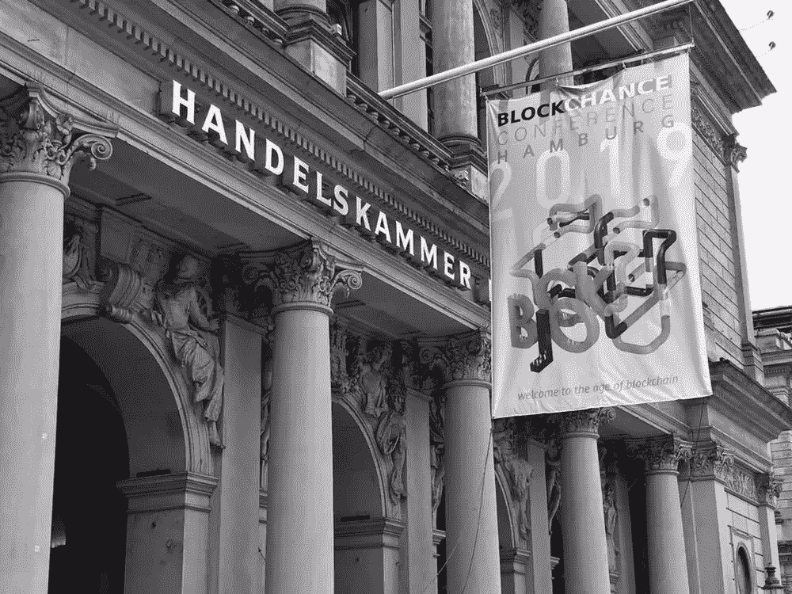

# 我在汉堡 Blockchance 2019 学到的东西

> 原文：<https://medium.datadriveninvestor.com/what-i-learned-at-bkockchance-2019-in-hamburg-77d465236a19?source=collection_archive---------13----------------------->

*区块链不是为了钱。这是关于改变。*

我离开了汉堡的区块链大会( [Blockchance](https://www.blockchance.eu) ，8 月 17-18 日)，印象深刻，动力十足。

给我留下深刻印象的不仅仅是与会者的数量，还有技术的发展。作为一名在公共部门工作的律师，通过区块链跟踪什么是可能的，什么是已经完成的，这是一个挑战。在这方面，对于“技术人员”来说什么是自然的，我可以通过听伟大的演讲者在出色的概述中解释进步来学习和理解(Blockchance 2019 肯定有不少)。

 [## 2019 年十大区块链课程|数据驱动的投资者

### 渴望在区块链发展吗？你想知道区块链是如何工作的，但不知道在哪里？或者就是太多了…

www.datadriveninvestor.com](https://www.datadriveninvestor.com/2019/03/08/top-10-blockchain-courses/) 

然而，这让我更加有动力。我感兴趣的是区块链如何改变我们的社会、我们的政府机构，甚至我们在许多层面上的思考和行动方式。区块链的金融方面，特别是用加密货币赚钱，对我和我的日常工作来说没什么兴趣。因此，当我参加这样的会议时，我总是有点怀疑，因为有时在我看来，这似乎就是在摇动金罐。Blockchance 不是。

**胸怀大志，改变世界**

许多演讲者，其中包括魅力非凡的思想领袖马克·巴克利(联合国可持续发展目标倡导者)，向观众传达了一条信息。我们可以用区块链的技术改变世界，为此，我们都必须改变我们的想法。

马克·巴克利强调说，技术可以做得更多，而迄今为止我们对它的潜力利用得如此之少。宇航员使用最先进的技术去月球旅行，但必须在旅行结束后填写一份书面公式来报销他们的费用。他的故事让我想起了我工作过的很多地方，即使我不做太空旅行:在某些方面使用最先进的技术，并就此提供咨询，但没有走到最后一步，将我和其他人的工作完全数字化。如果我改变了对事物的看法，我能为别人和我自己取得更多的成就吗？

如果我们在公司层面发现这种现象，而这一切都是为了降低成本和提高效率，那么我们在管理和政府层面又有多少呢？我从自己在公共部门的第一手工作中了解到:很多，非常多。如果我们改变我们的方法，如果我们完全数字化程序、文件、供应链和其他一切，会发生什么？这么说吧:如果我们将我们思考世界的方式数字化？如果我们拥抱科技，看不到它的威胁，并且一直走下去，会怎么样？德勤的主讲人 Nicolai Andersen 就人们对技术的恐惧做了一个很好的陈述，这里涉及到人工智能技术。我们全心全意地讨论被人工智能驾驶的汽车碾过的恐惧，但不是这种卡片提供的机会。只要想想生活在小村庄的老年人，对他们来说，每次去看医生都是一次艰难的挑战。人工智能驾驶的汽车能为他们带来什么好处？感觉好像人们更喜欢被人碾而不是被机器人碾。

那么我们能做什么呢？让我们停止思考技术给人的第一印象可能带来的所有威胁:让我们首先想到所有的可能性，让我们梦想，让我们大胆设想，然后解决所有可能的错误使用/双重使用情况和内在问题。然而，让我们首先把技术看作是这个世界真正的问题解决者。我相信这就是马克和其他发言者向我们指出的方向，我喜欢这个方向。

最近我读了 Renee Yang 的一篇很棒的文章:“区块链需要无私的人。"许多发言人证明了这正是他们的心态，不仅是之前提到的 Marc Buckley，还有 IOTA 的 Juie Maupin 博士和 Blockchance 的 Albert Peci。

我喜欢这种心态:让我们拥抱科技，让世界变得更美好。

**区块链如何融入其中？关于合作和透明**

不少发言人认为区块链技术不能解决所有问题。几乎所有人都表示:区块链技术没有好坏之分，也不无私，更不邪恶。只有人和我们想用区块链的方式。我们必须用它来造福大众。

区块链以其去中心化的技术、中立性和透明性提供了巨大的可能性。它可以促进国家和国际组织之间、个人和公司之间的合作，因为随着合作中的交易变得透明和安全，信任就会产生。作为一个在公共部门写了许多合作合同的人，知道每一方都担心被利用，我可以全心全意地接受这个想法。如果合作能通过区块链技术更好地进行，世界自然会变得更好。因为哪里的人一起工作，互相信任，哪里的仇恨和欺骗就会少一些。此外，公共部门的合作是必要的，以应对气候变化，应对饥饿和贫困，应对全球范围内的移民风险和犯罪行为。

无所不在的脸书天秤座

脸书的天秤座也是一个大话题。当连我都发表了关于这件事的文章时，我并不感到惊讶[。然而，我并没有感受到谈论这个话题时通常会遇到的对脸书的鄙视。一些发言者和与会者强调，Libra 也可以为区块链社区提供一个强大的可能性，因为它可以导致区块链技术在全球范围内的大规模采用，并解决银行服务不足的人。这些发言者当然也质疑 Libra 是否是一种加密货币，或者我们是否可以称之为区块链解决方案，因为它既不是分散的，也不是中立的。然而，大多数演讲者和我交谈过的人都同意，关于 Libra 的白皮书只是一种“试错”方法，这意味着脸书发布它是为了看看世界范围内对该问题的反应，然后在具体采用时进行调整。我们还讨论了这样一个问题，如果其他人，如亚马逊，现在不坐下来，让脸书做所有的脏活，然后在扎克伯格公司扫清道路后提出他们的整洁的解决方案。我发现 Libra 上这种非常不同的讨论非常令人耳目一新。](https://link.medium.com/6DNBynTXfZ)

**大公司世界**

尽管如此，在 Blockchance 也能看到大公司的世界，至少从德国人的角度来看是这样。来自 Deutsche Bahn 的 Moritz von Bonin(国家“火车公司”，即 peak)就区块链铁路系统的可能性做了一个非常有思想的介绍，很高兴听到即使是这个非常保守的德国公司也在研究这项技术。毫不奇怪，德国最著名的汽车公司大众、戴姆勒和宝马对这项技术非常感兴趣，因为在我看来，没有区块链或另一种分布式账本技术，自动驾驶就不可能实现。然而，作为一名律师，让我感兴趣的是汽车公司解决了以下问题:公司代表没有争辩共同区块链解决方案将是最佳选择的想法，因为“大众区块链”与“戴梅尔区块链”平行根本没有意义，因为它违背了自动驾驶的所有需求。然而，令人兴奋的是，德国和欧盟的反垄断法规甚至禁止这些公司谈论标准的共同解决方案。对我来说，这是一个典型的例子，说明“模拟时代的法律”可能会阻碍符合共同利益的数字进步。我们必须在德国和欧洲改变这种状况。尽快。

**做一个有远见的人**

Tron 欧洲代表 Frank Schulze 说了一些让我印象深刻的话:在区块链问题上，要有远见。我喜欢这个。当然，我不能声称我是一个，但我们都可以尝试发展一个的心态:让我们想得更大。让我们想象一个世界，在这个世界中，区块链技术发挥着重要作用，让每个人的生活变得更美好。不要让恐惧或担忧阻止我们迈出第一步:想象一下如何通过区块链改变一切，不是为了赚钱，而是为了让世界变得更美好。

*很乐意为您连接。在 Medium 上关注我，访问我的网站 http://theblockchain.lawyer 或在 LinkedIn 上连接***。**