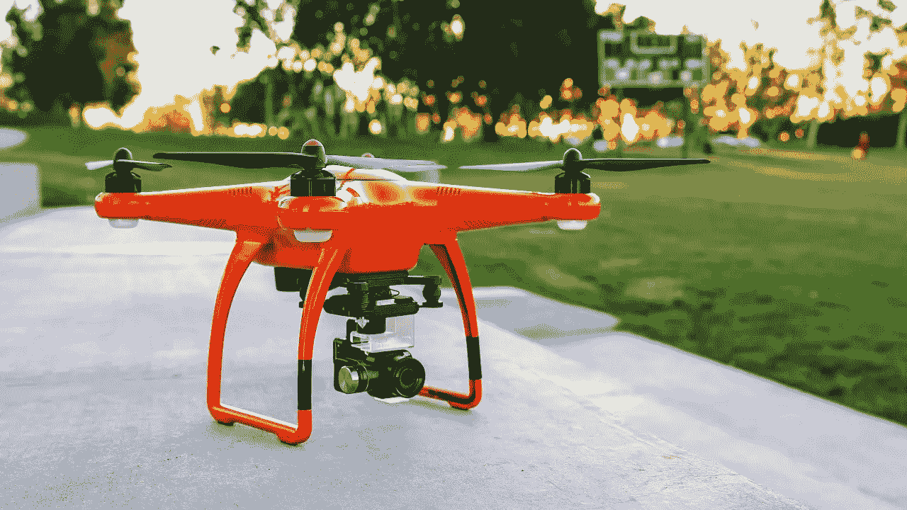

# 我在建造我的第一架四轴飞行器时学到的

> 原文：<https://medium.datadriveninvestor.com/what-i-learned-building-my-first-quadcopter-b1b531747e2d?source=collection_archive---------20----------------------->

我的四轴飞行器项目已经进行了一段时间，并在财务和时间方面投入了很多，也是我想继续推进的事情。这绝不是一条直路，从硬件故障到与专家交谈，每件事都对我产生了很大的影响，并证明和否定了我的许多假设。以下是我迄今为止学到的一些要点，以及它们是如何影响我的视角的。

# **3 的法则**

如果有一件事是今天的人们永远无法满足的，那就是“三法则”。生产力、市场营销、生存、数学，甚至像装修这样简单的事情都有一个 3 法则，但如果有一个我真正理解的，那就是你的期望的 3 法则。

无论你投入了多少努力，无论你为一个目标投入了多少计划或想法，每件事都将花费 3 倍的时间，3 倍的金钱和 3 倍的努力。

当我第一次寻找这个项目时，我订购的接收器没有及时送到，所以我不得不买一个新的。当我校准 ESCs 并准备好系统时，几乎每次它都不会响应我的输入。

当我把速度控制器连接到电池上时，一根电线烧断了，因为它无法承受电流。所有可能出错的地方都出错了，到目前为止，项目中最耗时的部分是反复试验，试图找到一种可行的方法。

# 消费电子行业已经崩溃

我已经在这个项目上工作了将近一个月。这似乎是一段很长的时间，但是我面临的最大的问题之一是在我需要的时候得到我需要的零件。

对于任何一种开源或消费类技术来说，在这么多地方生产它们的公司都是有限的。我的飞行控制器，我的电子稳定控制系统，我的马达甚至我的发射器都必须从中国采购，花了将近 2 个星期才到我这里。

问题不在于运费或时间太高，而在于**很多人因为这个原因不愿意做更多这样的项目。**

在过去的几年里，我看到无数的人，包括我自己，进入了一个真正具有潜在破坏性和复杂性的新技术领域，但最终放弃了，因为这是他们自己无法构建的东西。这种事情发生的频率比大多数人想象的要高得多，这也是我认为软件开发人员供过于求的原因。

如果我们想让各方面的技术真正发挥我们想要的潜力，我们需要让每个人都可以使用它，而不仅仅是那些有机会和负担得起的人。

# **不要抱有任何期望**

我看到任何类型的项目，不仅仅是无人机死亡，最常见的方式是因为他们背后的人没有控制他们的期望。他们变得如此兴奋，计划过程中的每一步，当它到来时，无法在事情变好之前处理好几百次错误。

我希望我的零件能准时发货。我以为配电系统会工作。当我第一次上传 Arduino 代码时，我希望它能正常工作。我的期望给我带来了最大的困扰，使整个过程比它需要的时间长得多，坦率地说，我看到几乎每个人在承担任何类型的新项目时都至少有一次这样的经历。

这肯定会帮助我前进，坦率地说，这也是我认为每个创始人或项目经理都需要保持头脑清醒的事情。很多人，甚至是科技界的人，都习惯于项目以正确的方式进行，这种心态真的阻碍了我们。这个项目还有很多我想做的改进，我敢打赌还有很多我需要学习的。