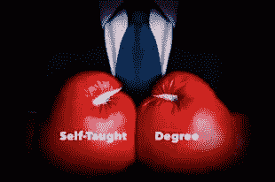

# 作为一名自学成才的软件开发人员，我学到了什么

> 原文：<https://medium.datadriveninvestor.com/what-i-learned-by-being-a-self-taught-software-developer-9362253845c1?source=collection_archive---------49----------------------->

Self Taught vs Degree in Software Development. Photo courtesy of OpenSesame.com

这篇文章完全基于我的经验，包含了我对标题主题的看法。许多概括是为了使文章更清晰，更容易被更多的读者理解。我理解，在这个问题上，如同在所有问题上一样，存在着不同的意见和情况，在这种情况下，我所说的一般理解会被某一具体情况推翻或变得没有实际意义。请允许我表达我的观点，因为我也会允许你表达你的观点，并理解这些概括是为了帮助提高流畅性、可读性和易于理解。

> **原载于编码鸭博客:**【ccstechme.com/coding-duck-blog】

**所以我们都听说过关于是否要在计算机科学领域接受高等教育的争论。随着新兵训练营、教程、聚会、会议、TED 演讲、免费和付费课程和班级数量的增加，为正规教育支付数万美元似乎有点愚蠢。请允许我澄清一下我对这件事的看法:**

**那个思路 100%正确。但是有一个问题，我将在下面解释。**

**就我个人而言，许多人也能理解，我将把这段经历与我学习自卫的经历相比较。**

**我小时候住在美国马萨诸塞州的波士顿。在那里，我的许多朋友都有他们喜欢的课外活动。我喜欢玩滑板，做运动，摆弄机器，你知道，小孩子的东西。**

**然而，我的几个朋友参加了武术训练，我认为这很酷，直到他们决定需要一个可以反击的训练假人。你好。**

**我有几个朋友练习不同类型的空手道，特别是 Shotokan 和 Kenpo，另一个练习跆拳道，还有一个喜欢李小龙电影，痴迷于他的传奇大师叶问，可以说是有史以来最伟大的咏春拳大师。**

**我从这次经历中学到的是，当我的朋友们穿着不同于过去的腰带或服装与我争吵时，我将开始受到更严重的伤害...又来了。但它给了我一些宝贵的经验，让我了解这些武术是如何接近格斗、身体力学、杠杆、支点、平衡的。**

**过了一段时间，我可以合理地保护自己不受大多数错误的影响(尽管我仍然总是很痛苦地迷失，只是随着时间的推移，我花了更长的时间)，所以我继续我的日常生活，认为我对事情有一个像样的判断。然后一个一直练 Kenpo 的朋友，在让我伤口愈合很久之后，又想在我身上“练”一次(爱你，罗德)。我见过他，他没穿什么特别的衣服。其实他是赤膊上阵，穿着运动裤，只是双手缠得很搞笑。那是我了解泰拳的一天。**

**这个特别的环节令人震惊的是，他的动作似乎没有任何韵律或理由。他不断地从一只脚换到另一只脚，他的时间安排很奇怪，除了他的腿，没有什么真正移动。直到他用刺拳攻击我，然后用膝盖、胳膊肘、脚和手攻击我。当我把他绑起来的时候，他会把他的胳膊伸到我的怀里，隔离我的头，然后不停地打我。如果我把他扔出去，他会踢我的小腿，膝盖，或者四头肌，然后飞回来。**

**一切都结束后，我问他“你是什么腰带？！？那是我这辈子挨的最狠的一顿揍！”**

**他的回答让我印象深刻，成了我生活中的一句口头禅，也毫不含糊地说服我和他一起去他去的健身房:“在那里，我知道没有腰带或特殊的衣服或任何东西。在泰拳中，我们不用等级标记。我们的老师督促我们学习他认为我们有能力学习的东西，然后让我们与他认为我们可以带的人争吵，或者在不被杀死的情况下从他们那里学习一些东西。”**

**软件开发非常非常相似。学位会给你非凡的训练和对算法设计、软件设计、系统架构、编程语言设计、编译器设计、数据类型和结构以及许多其他类似事物的深刻理解。但是它也会给你一个对你在学校学到的规则的硬性偏见，这些规则是基于当天的景观。回到武术，合气道是一种日本武术，它源于一种战斗风格，这种风格在被擅长用剑的人攻击时非常有价值。不幸的是，这门艺术本身的实践仍然严重依赖于孤立手腕和投掷你的对手，就好像他们挥舞着一把剑，这很可能不再相关。**

**从“街头战士”的角度学习软件开发和工程艺术的好处在于，你愿意并且有能力适应当今技术领域的任何变化。你会接受学习这种方法的挑战吗？绝对的。这条道路将充满比你在学校学到的更多的痛苦和挫折。冒名顶替综合症将很难处理，你会不断地质疑自己，因为你的墙上没有挂着院长签名的东西。但是我向你保证，当你所有的同事都在嘀咕一个问题“没有任何意义”的时候。这只是它不可能这样做……”，你将是第一个抓住这个项目的耳朵并认为“可能或不可能，它正在做，我们将挖掘代码架构而不是我们的参考书来找出原因。然后我们要去解决它。”你也将是这个房间里最坚强的开发人员，能够比你同时代的人更好地跟踪和修复一个“不可能”的问题。**

**但是记住这一点，永远记住这一点，那些受过正规教育的人仍然可以在高度技术化的环境中把你踢得屁滚尿流，在这种环境中，既定的规则是终极目标。总是愿意向他们学习，扩展你的技巧、诀窍和理解，因为虽然 80k 美元的教育价格过高，但它离无用有数百万英里远。如果你是编程的泰斗，要意识到你的力量来自于用无情的效率和无情的追求来处理非常规的事情，让产品做它需要做的事情。然而，你必须接受这样一个事实，你的力量和韧性并不总是必要的或合适的。是的，用你的额头撞穿一堵砖墙更令人印象深刻，但对所有相关人员来说，走进门**总是**更好。谦虚地承认，CS 学位让你的同事有能力看到你没有意识到的门。但也要相信，你的培训给了你一种不受既定规则和参数束缚的视角，而是一种对“寻找更好方式”的不懈追求。所以，训练勇士们，无论你是追求一条“腰带”还是在下一个重量级的“冠军争夺战”，你都做到了，这个世界真诚地需要你。**